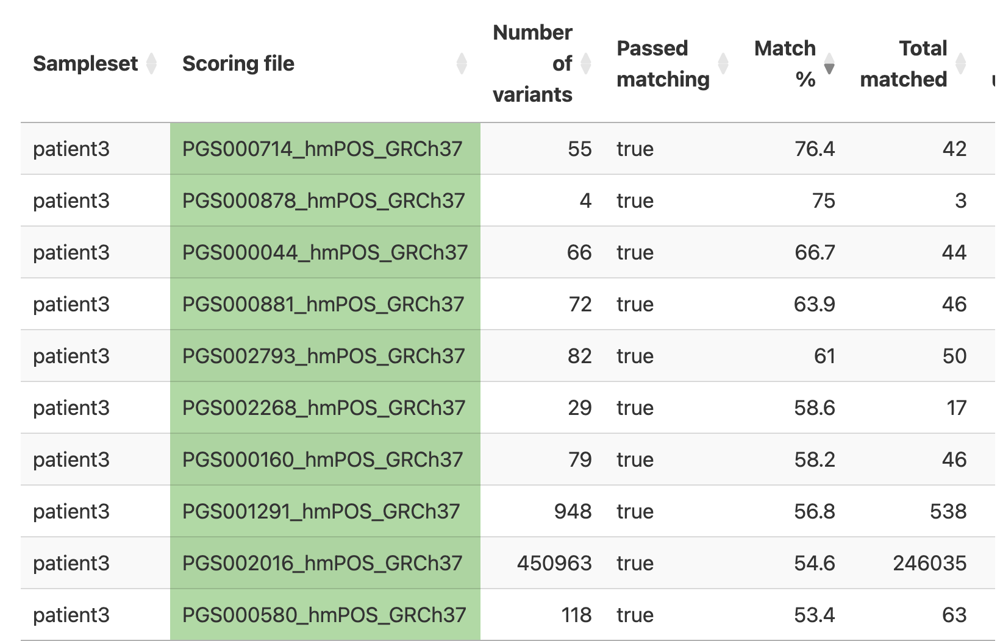
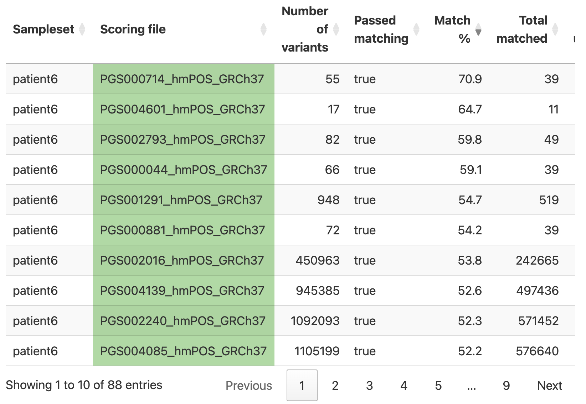

BMEG 424/525 Assignment 6 - SepehrNouri
================

- [BMEG 424/525 Assignment 6: GWAS and Polygenic Risk Scores (25
  points)](#bmeg-424525-assignment-6-gwas-and-polygenic-risk-scores-25-points)
  - [Introduction:](#introduction)
    - [Goals and Objectives](#goals-and-objectives)
    - [Data](#data)
    - [Software and Tools:](#software-and-tools)
    - [Other notes:](#other-notes)
    - [Submission:](#submission)
  - [Experiment and Analysis:](#experiment-and-analysis)
    - [1. General QC of the GWAS Mini-Cohort Data (1
      pts)](#1-general-qc-of-the-gwas-mini-cohort-data-1-pts)
    - [2. Imputation of Genotypes from 1000 Genomes Data (11.5
      pts)](#2-imputation-of-genotypes-from-1000-genomes-data-115-pts)
      - [a. Linkage Disequilibrium](#a-linkage-disequilibrium)
      - [b. PCA Computation](#b-pca-computation)
      - [c. Visualization of the PCA
        results](#c-visualization-of-the-pca-results)
      - [d. Imputation](#d-imputation)
    - [3. Calculating Polygenic Scores (manual approach)
      (1.5pts)](#3-calculating-polygenic-scores-manual-approach-15pts)
    - [4. Calculating Polygenic Scores (automated approach) (2
      pts)](#4-calculating-polygenic-scores-automated-approach-2-pts)
      - [a. Setting up the pgsc_calc
        pipeline](#a-setting-up-the-pgsc_calc-pipeline)
      - [b. Running the pipeline](#b-running-the-pipeline)
  - [Discussion (9 pts)](#discussion-9-pts)
  - [Contribution: *This assignment was done
    individually!*](#contribution-this-assignment-was-done-individually)

# BMEG 424/525 Assignment 6: GWAS and Polygenic Risk Scores (25 points)

## Introduction:

### Goals and Objectives

The goal of this assignment is to teach you about the basics of working
with GWAS data, including imputation of genotypes, QC, and using
polygenic scores. Polygenic scores (PRSs) can be useful for predicting
disease susceptibility. This is essential for complex diseases which are
not monogenic (i.e. caused by a single gene).

Our goal for this assignment will be to produce a PRS for a complex
trait using two different approaches; a manual approach to teach you the
basics of how PRSs are calculated from GWAS data, and a more automated
(and more accurate) approach using the `PRSc_calc` pipeline.

### Data

We will be using three different datasets during this assignment:

- Mini Cohort of samples from the 1000 Genomes Project contain in the
  `MiniCohort` folder. Each dataset is in the “bfile” format used by
  blink which is in fact three different files: `*.bed`, `*.bim`, and
  `*.fam`. The `*.bim` file contains the SNP information, the `*.fam`
  file contains the sample information, and the `*.bed` file contains
  the genotype information (NOTE: this `.bed` file is NOT the same as
  the binary file format used by the `bedtools` package). There is also
  a reference 1KGP dataset which we will use for imputation.

- A simulated dataset in the `Tapas` folder. This dataset is in the same
  format as the 1000 Genomes data.

- A pair of simulated patient data files in the `VCF` folder. These
  files are in the VCF format which you used in your very first
  assignment.

All of the data is located in `/projects/bmeg/A6`.

### Software and Tools:

We will be using a few new tools in this assignment:

1.  `plink` is a tool for working with GWAS data. It is a command line
    tool, so you will need to use it from the terminal. You can find the
    documentation for `plink`
    [here](https://www.cog-genomics.org/plink/1.9/). `plink` can be
    installed from the bioconda channel using the command
    `conda install -c bioconda plink`. You can create a new environment
    for plink, but make sure you do not try to install nextflow in the
    same environment.

2.  `nextflow` is a tool for running workflows/pipelines. It is a
    command line tool, so you will need to use it from the terminal. You
    can find the documentation for `nextflow`
    [here](https://www.nextflow.io/). NOTE: Nextflow is already
    installed on the server but **we will install it via conda, ensure
    you are using the correct version.**

### Other notes:

- As always you must cite any sources you use in your assignment (class
  slides are exempted). This includes any code you use from
  StackOverflow, ChatGPT, Github, etc. Failure to cite your sources will
  result in (at least) a zero on the assignment.

- When you begin your assignment do not copy the data from
  `/projects/bmeg/A6/` to your home directory. You can use the files in
  the projects folder without modifying them. Remember to output any
  files you create in your home directory *and not in the projects
  directory*. You should gzip files while you are working on the
  assignment and remember to delete files you no long need. If you take
  up too much space in your home directory which will cause issues as
  we’ve seen already.

- **The nextflow portion of the assignment (part 4) can take 3 hours to
  run, you should get this running ASAP.**

### Submission:

Submit your assignment as a knitted RMarkdown document. *Remember to
specify the output as github_document*. You will push your knitted
RMarkdown document to your github repository (one for each group).
Double check that all files (including figures) necessary for your
document to render properly are uploaded to your repository.

You will then submit the link, along with the names and student numbers
of all students who worked on the assignment to the assignment 3 page on
Canvas. Your assignment should be submtited, and your last commit should
be made, before 11:59pm on the day of the deadline. Late assignments
will be deducted 10% per day late. Assignments will not be accepted
after 3 days past the deadline.

## Experiment and Analysis:

### 1. General QC of the GWAS Mini-Cohort Data (1 pts)

Before we can start working on the genetic data, we need to ensure that
the quality is adequate. Thus, we are gonna check the following
measuring for our MiniCohort:

1.  **SNP call rate:** The call rate represents the percentage of
    participants with non-missing data for that SNP. Removing variants
    with a call rate lower than 95% avoids potential wrong calls to be
    included in further analysis. Therefore we would like to *remove all
    SNPs with more than 5% missingness*

2.  **Minor Allele Frequency:** The minor allele frequency (MAF) echoes
    the less common allele frequency across the population. The MAF
    estimates tend to be more accurate for higher MAFs and the
    population sample size the MAF was based on. If there are too few
    samples representing the rare-allele, is hard to distinguish between
    a true rare-allele and sequencing errors. For our data we would like
    to *remove all SNPs with a MAF lower than 1%*.

3.  **Sample call rate:** Similar to SNP call rate, it allows to filter
    out all samples exceeding 98% missing genetic variants out of all
    the calls. Four our data we would like to *remove all samples with
    more than 2% missingness*.

You can perform all of these filters using a single command calling
`plink`. Take a look at the plink documentation and add the arguments to
the command below to perform the QC.

``` bash
#?# 1. Fill in the following command and use it to perform the QC on the Mini-Cohort data. Read the instructions above carefully to get the right values for each argument. (1 pt)

# we want 3 filters that will:
# 1. remove SNPS with >5% missingness (incomplete data)
# 2. remove SNPS with MAF < 1%
# 3. remove samples with >2% missingness

plink --bfile /projects/bmeg/A6/MiniCohort/Mini_cohort \
      --geno 0.05 \
      --mind 0.02 \
      --maf 0.01 \
      --make-bed \
      --out /home/snouri_bmeg25/A6/MiniCohort/Mini_cohort_QCed
```

### 2. Imputation of Genotypes from 1000 Genomes Data (11.5 pts)

As you learned in class, most GWAS studies are performed using a
case-control design. In this design, the frequency of a genetic variant
is compared between individuals with a disease and individuals without
the disease. The frequency of the variant is then compared between the
two groups to determine if the variant is associated with the disease.
This produces the GWAS summary statistics which can be used to calculate
a polygenic score.

However, in order to calculate the polygenic score, we need to have the
genotypes for all of the variants in the GWAS summary statistics. This
is where imputation comes in. Because most GWAS studies are performed
using a SNP array, we only have data for a subset of the variants in the
genome. Imputation is the process of using the data from the SNP array
to infer the genotypes for the rest of the variants in the genome using
a matched population of fully genotyped individuals.

We will use the 1000 Genomes Project reference data (located in
`/projects/bmeg/A6/1000G/`) to impute the genotypes for the Mini Cohort.
This dataset has genetic information of major continental populations:
Admixed American (AMR), European (EU), Asian (AS) and African (A).

#### a. Linkage Disequilibrium

As you learned in class, linkage disequilibrium (LD) is the non-random
association of alleles at different loci. This means that if you know
the genotype of one SNP, you can make an educated guess about the
genotype of another SNP. This is a problem for PCA because it will add
redundancy to the data which means those regions will dominate the top
PCs and obscure the true data structure. Therefore, we need to remove
SNPs in high LD before performing the PCA.

We have curated a list of high LD regions for you located in
`/projects/bmeg/A6/high_LD_regions_hg19.txt` which you can use to remove
the SNPs in high LD using `plink`. You can use the `--exclude` argument
to remove the SNPs in high LD.

We will also want to perform *dynamic* LD pruning which is available to
us through `plink`. This will remove SNPs which are in high LD with one
another *but are not in a known region of high LD*. This is important
because the high LD regions are not necessarily exhaustive of all SNPs a
patient may have. You can see how to do this in the following
[documentation](https://www.cog-genomics.org/plink/1.9/ld).

``` bash
# Using only one run of plink 1.9 (with different flags)
# Filter out the high-LD regions contained in the --high_LD_regions_hg19.txt-- file, located in /projects/bmeg/A6/
# Use the --indep-pairwise to do LD pruning with the following parameters:
## - Window size: 200, 
## - Variant Count: 100 
## - VIF (variance inflation factor): 0.2 
#?# 2. Type the command you use to create the Mini Cohort PCA-QCed bfile below (1pt)

plink --bfile /home/snouri_bmeg25/A6/MiniCohort/Mini_cohort_QCed \
      --exclude /projects/bmeg/A6/high_LD_regions_hg19.txt \
      --indep-pairwise 200 100 0.2 \
      --out /home/snouri_bmeg25/A6/MiniCohort/Mini_cohort_PCA_QCed
```

You should have a new file called `plink.prune.in` which you can use to
extract only the SNPs which passed the LD pruning. You can use the
`--extract` argument to do this.

``` bash
#?# 3. Use plink to extract the SNPs which passed the LD pruning from the QC'd minicohort file you created in Q1. (1pt)
plink --bfile /home/snouri_bmeg25/A6/MiniCohort/Mini_cohort_QCed \
      --extract /home/snouri_bmeg25/A6/MiniCohort/Mini_cohort_PCA_QCed.prune.in \
      --make-bed \
      --out /home/snouri_bmeg25/A6/MiniCohort/Mini_cohort_LDPruned

#?# 4. Do the same on the 1KGP_reference bfile which is located in /projects/bmeg/A6/1000G/ (1pt)
plink --bfile /projects/bmeg/A6/1000G/1kgp_reference \
      --extract /home/snouri_bmeg25/A6/MiniCohort/Mini_cohort_PCA_QCed.prune.in \
      --make-bed \
      --out /home/snouri_bmeg25/A6/MiniCohort/1KGP_reference_LDPruned
```

#### b. PCA Computation

In order to enhance imputation accuracy when dealing with ethnically
diverse cohorts is important to understand the genetic ancestries of the
cohort’s participants. Knowing the ancestral populations will ensure
that the most closely related population is used as a reference for the
imputation. For instance, one would not want to impute haplotypes of an
individual of Yoruban ancestry with a population of East Asians because
many of the haplotypes will differ between the two ancestries, leading
to imputing the wrong variants for the Yoruban person. Hence, we will
analyze the global ancestry of our cohort using Principal Component
Analysis (PCA). As you will remember from the last assignment PCA is an
unsupervised way to reduce the complexity of multidimensional data.

You can create a merged bfile (containing a .fam, .bed and .bim file)
from your Mini_Cohort (containing our GWAS data) and the 1000G_reference
(containing the reference data) using the `--bmerge` argument.

``` bash
#?# 5.  Merge your pruned bfiles of the Mini_cohort and the 1KGP created on the previous step (0.5pts)
## NOTE: Remember to create a new bfile (.fam, .bed and .bim files) that contains the merged data.
## IMPORTANT TIME CONSTRAINT: This step can take ~15 minutes, so make sure to check the server status before you run it!
plink --bfile /home/snouri_bmeg25/A6/MiniCohort/Mini_cohort_LDPruned \
      --bmerge /home/snouri_bmeg25/A6/MiniCohort/1KGP_reference_LDPruned \
      --make-bed \
      --out /home/snouri_bmeg25/A6/MiniCohort/Merged_Cohort

# this process only took 1 second...
```

You can now perform a PCA on the merged bfile you output in the last
step:

``` bash
#?# 6. Using plink, perform a PCA analysis in plink on the merged set (0.5pts)

plink --bfile /home/snouri_bmeg25/A6/MiniCohort/Merged_Cohort \
      --pca 20 'header' 'tabs' \
      --out /home/snouri_bmeg25/A6/MiniCohort/PCA_Results
```

#### c. Visualization of the PCA results

You PCA computation should have output a `.eigenvec` file. Copy this
file, and the `samples_info.txt` file which is located in
`/projects/bmeg/A6/MiniCohort/` to your local machine. You can use the
`samples_info.txt` file to color the PCA plot by population.

First you will want to load your `.eigenvec` and `samples_info.txt` file
into R. You can use the `read.table` function to do this. Set the column
names for the `.eigenvec` file to change the column names to: FID, IID,
PC1, PC2, PC3, …, PC20. Set the column names to: FID, IID,
SuperPopulation, Population.

\#?# 7. Load the `.eigenvec` and `samples_info.txt` file into R and set
the column names as described above. (0.25 pts)

``` r
eigenvec <- read.table("PCA_Results.eigenvec", header=FALSE)
colnames(eigenvec) <- c("FID", "IID", paste0("PC", 1:20))
eigenvec <- eigenvec[-1, ] # first row was colnames

samples_info <- read.table("samples_info.txt", header=TRUE)
colnames(samples_info) <- c("IID", "FID", "SuperPopulation", "Population")

head(eigenvec)
```

    ##   FID     IID        PC1       PC2       PC3       PC4         PC5        PC6
    ## 2   0 HG00096  -0.011561 0.0260549 0.0120821 0.0193929  -0.0015444  0.0133982
    ## 3   0 HG00097 -0.0115371 0.0256343 0.0102058 0.0181401  -0.0041758  0.0120167
    ## 4   0 HG00099 -0.0116357 0.0251335 0.0134208 0.0183402 0.000345299  0.0132756
    ## 5   0 HG00100 -0.0116479 0.0256273 0.0114527 0.0200354  0.00384672 0.00160826
    ## 6   0 HG00101 -0.0113807 0.0256749 0.0122255 0.0179854 -9.7406e-06   0.018155
    ## 7   0 HG00102 -0.0119065 0.0258258 0.0117821 0.0192727 -0.00240712  0.0172843
    ##            PC7          PC8        PC9        PC10       PC11        PC12
    ## 2   0.00082052  -0.00424644 0.00571915  0.00594862 -0.0428676 -0.00441848
    ## 3 -0.000585331  -0.00436593  0.0102671   0.0170205 -0.0330301  0.00719917
    ## 4   0.00253249  -0.00769426 -0.0055157  0.00505043 -0.0475219 -0.00941999
    ## 5    0.0024418  -0.00853701 0.00101814 7.76628e-05  -0.035788 -0.00194117
    ## 6   0.00132793 -0.000411318 0.00651908  0.00128678 -0.0389168  -0.0122788
    ## 7 -0.000170639  -0.00240866 0.00429231  0.00404665 -0.0418939   0.0103397
    ##         PC13        PC14        PC15        PC16      PC17         PC18
    ## 2   0.011367 0.000916686  0.00168227   0.0248373 0.0383179 -0.000986993
    ## 3   0.015194  -0.0106503 -0.00232844   0.0161255 0.0388369   -0.0182195
    ## 4  0.0111754  -0.0168391 -0.00340576 -0.00121601 0.0296616   0.00679008
    ## 5 0.00631717  -0.0169556  0.00720649   0.0160742 0.0484066   -0.0101251
    ## 6  0.0131904  -0.0124786  0.00995069   0.0317875 0.0323655  -0.00103527
    ## 7 0.00854187  -0.0211185  0.00835681  0.00977929 0.0458007  -0.00649437
    ##          PC19         PC20
    ## 2  -0.0160138  0.000173853
    ## 3 -0.00887372   0.00133516
    ## 4  0.00391975   0.00648122
    ## 5  -0.0172939 -0.000222273
    ## 6  -0.0153417    0.0136987
    ## 7  -0.0125939 -2.60539e-05

``` r
head(samples_info)
```

    ##       IID FID SuperPopulation Population
    ## 1 HG00097   2             EUR        GBR
    ## 2 HG00099   2             EUR        GBR
    ## 3 HG00100   2             EUR        GBR
    ## 4 HG00101   1             EUR        GBR
    ## 5 HG00102   2             EUR        GBR
    ## 6 HG00103   1             EUR        GBR

\#?# 8. Merge the two dataframes using the IID column (look at the merge
function documentation by typing `?merge` in the R console). (0.25 pts)

``` r
# if the columns are different data types, the merging won't include column values
class(eigenvec$IID)  
```

    ## [1] "character"

``` r
class(samples_info$IID)
```

    ## [1] "character"

``` r
merged_data <- merge(eigenvec, samples_info, by="IID")
head(merged_data)
```

    ##       IID FID.x        PC1       PC2       PC3       PC4         PC5        PC6
    ## 1 HG00097     0 -0.0115371 0.0256343 0.0102058 0.0181401  -0.0041758  0.0120167
    ## 2 HG00099     0 -0.0116357 0.0251335 0.0134208 0.0183402 0.000345299  0.0132756
    ## 3 HG00100     0 -0.0116479 0.0256273 0.0114527 0.0200354  0.00384672 0.00160826
    ## 4 HG00101     0 -0.0113807 0.0256749 0.0122255 0.0179854 -9.7406e-06   0.018155
    ## 5 HG00102     0 -0.0119065 0.0258258 0.0117821 0.0192727 -0.00240712  0.0172843
    ## 6 HG00103     0 -0.0114018 0.0258474 0.0109302 0.0187135  0.00169503  0.0108261
    ##            PC7          PC8        PC9        PC10       PC11        PC12
    ## 1 -0.000585331  -0.00436593  0.0102671   0.0170205 -0.0330301  0.00719917
    ## 2   0.00253249  -0.00769426 -0.0055157  0.00505043 -0.0475219 -0.00941999
    ## 3    0.0024418  -0.00853701 0.00101814 7.76628e-05  -0.035788 -0.00194117
    ## 4   0.00132793 -0.000411318 0.00651908  0.00128678 -0.0389168  -0.0122788
    ## 5 -0.000170639  -0.00240866 0.00429231  0.00404665 -0.0418939   0.0103397
    ## 6  -0.00230305 -0.000185409 -0.0147849  0.00669958 -0.0478592 -0.00751085
    ##         PC13       PC14        PC15        PC16      PC17        PC18
    ## 1   0.015194 -0.0106503 -0.00232844   0.0161255 0.0388369  -0.0182195
    ## 2  0.0111754 -0.0168391 -0.00340576 -0.00121601 0.0296616  0.00679008
    ## 3 0.00631717 -0.0169556  0.00720649   0.0160742 0.0484066  -0.0101251
    ## 4  0.0131904 -0.0124786  0.00995069   0.0317875 0.0323655 -0.00103527
    ## 5 0.00854187 -0.0211185  0.00835681  0.00977929 0.0458007 -0.00649437
    ## 6  0.0170508 -0.0122339  0.00429261   0.0219144 0.0378961  0.00161866
    ##          PC19         PC20 FID.y SuperPopulation Population
    ## 1 -0.00887372   0.00133516     2             EUR        GBR
    ## 2  0.00391975   0.00648122     2             EUR        GBR
    ## 3  -0.0172939 -0.000222273     2             EUR        GBR
    ## 4  -0.0153417    0.0136987     1             EUR        GBR
    ## 5  -0.0125939 -2.60539e-05     2             EUR        GBR
    ## 6  -0.0222058    0.0121621     1             EUR        GBR

\#?# 9. Using ggplot create a scatterplot, using: - x-axis: PC1 -
y-axis: PC2 - color: SuperPopulation - use the Population information to
color the samples and be able to appreciate population structure. (0.5
pts)

``` r
# include the code used to generate the plot below, when you knit your Rmd file verify that the plot is displayed
# Load ggplot2 library
library(ggplot2)

ggplot(merged_data, aes(x = PC1, y = PC2, color = SuperPopulation)) +
  geom_point(alpha = 0.5, size = 0.6) +
  theme_minimal() +
  labs(title = "PCA Plot of Mini-Cohort's Genetic Ancestry",
       x = "PC1",
       y = "PC2",
       color = "SuperPopulation") +
  theme(
    legend.position = "right",
    axis.text.x = element_blank(),
    axis.text.y = element_blank())
```

<!-- -->

\#?# 10. Where do the cohort samples fall? (0.5 pts)

    Mini-cohort samples fall amongst SAS (south-asian) and AMR (admixed american).

\#?# 11. Which population would you use as a reference for
imputation?Why? (1.5 pts)

    using AMR for reference. Looking at PCA clusters, there are two AMR regions, 
    with both regions having Mini-Cohort samples. Although Mini-Cohort is also
    within the SAS cluster, they are mainly located at the region that has both
    SAS and AMR populations. 

#### d. Imputation

Imputation of genetic data is a very computationally intensive analysis,
that can take a long time. So we have performed it for you. Using the
chromosome 17 imputation information located in
`/projects/bmeg/A6/MiniCohort` under the
`Mini_cohort_chr17_imputation_results.info` we will calculate some
post-imputation metrics.

Load the imputation.info file into your R environment using `read.table`
and then calculate the average imputation quality for each population.

\#?# 12. What is the percentage of imputed SNPs? (1 pt)

    Percentage of imputed SNPs: 99.3 %

``` r
imputed_snps <- read.table("Mini_cohort_chr17_imputation_results.info", header = TRUE)

# num of imputed SNPS
count_imputedSNP <- sum(imputed_snps$Genotyped == "Imputed")

# percentage of imputed snps vs total
percent_imputed <- count_imputedSNP / nrow(imputed_snps) * 100
print(paste("Percentage of imputed SNPs:", round(percent_imputed, 2), "%"))
```

    ## [1] "Percentage of imputed SNPs: 99.3 %"

The metric of imputation quality is Rsq, this is the estimated value of
the squared correlation between imputed and true genotypes. Since true
genotypes are not available, this calculation is based on the idea that
poorly imputed genotype counts will shrink towards their expectations
based on allele frequencies observed in the population
(<https://genome.sph.umich.edu/wiki/Minimac3_Info_File#Rsq>). An Rsq \<
0.3 is often used to flag poorly imputed SNPs.

\#?# 13. What is the percentage of poorly imputed SNPs? (1 pt)

    Percentage of poorly imputed SNPs: 63.86 %

``` r
# num of poorly imputed SNPs
num_poorly_imputed <- sum(imputed_snps$Rsq < 0.3, na.rm = TRUE)

# percentage of poorly imputed SNPs
percent_poorly_imputed <- (num_poorly_imputed / count_imputedSNP) * 100
print(paste("Percentage of poorly imputed SNPs:", round(percent_poorly_imputed, 2), "%"))
```

    ## [1] "Percentage of poorly imputed SNPs: 63.86 %"

\#?# 14. Visualize the distribution of the MAF in your imputed data (0.5
pts)

``` r
# creating histogram
ggplot(imputed_snps, aes(x = MAF)) +
  geom_histogram(binwidth = 0.02, fill = "orange", color = "black") +
  scale_x_continuous(name = "Minor Allele Frequency (MAF)",
                     breaks = seq(0, 0.5, by = 0.02),  # More x-axis ticks
                     labels = seq(0, 0.5, by = 0.02)) +
  theme_minimal() +
  labs(title = "Distribution of Minor Allele Frequency (MAF) in Imputed Data",
       y = "Count") +
  theme(axis.text = element_text(size = 6),
        axis.title = element_text(size = 14, face = "bold"))
```

<!-- -->

\#?# 15. Analyze the plot above, what do you notice? Justify your
observations. (2 pts)

    in assignment description, it says "The MAF estimates tend to be more accurate
    for higher MAFs". we removed MAFs with scores <1%. 

    However the plot above is based on imputation snps, were the majority of inputed
    snps have MAF < 1%. I think this makes sense, because we used SNP array of
    Mini-Cohort to do imputation on the entire population samples of GWAS. 

    As we saw from our PCA, the Mini-Cohort samples are only visible in the AMR and
    SAS populations, and non-existent in AFR, EUR, and EAS populations. 

    Because most of the population of GWAS doesn't include Mini-Cohort samples, we 
    would expect the minor-alleles to NOT be widely seen in these populations,
    thats why their frequency is so low. The histogram above supports this claim,
    given ~1million of the imputed_snp counts are <1% MAF.

    I think the minor-alleles with frequencies greater than 5% represent 
    Minor-Cohort's minor-allele counts that were also observed in 
    SAS and AMR populations.

### 3. Calculating Polygenic Scores (manual approach) (1.5pts)

For this section we will calculate the polygenic scores for a complex
trait; enjoyment of the Spanish snack “tapas”. A GWAS was performed and
199 SNPs were found to be significantly associated with tapas enjoyment.

The significant SNPs and their associated effect sizes (GWAS summary
statistics) are found in the `tapas` folder in the
`Tapas_enjoyability_GWAS_sumStats.txt` file.

Thanks to our imputation, we were able to impute the genotypes for the
199 significant SNPs in our Mini Cohort. The imputed genotypes are
located in the `tapas` folder in named `MiniCohort_Tapas_SNPdosages.txt`
They take the form of gene dosage (double risk alleles=2, one risk
allele=1, no risk alleles=0) for SNPs 1-199.

PRS are calculated by multiplying the effect size of each SNP by the
gene dosage (in an individual) and summing the results. Mathematically
this is represented as:

$$PRS = \sum_{i=1}^{n} \beta_{i} * G_{i}$$

Where:

- $PRS$ is the polygenic score

- $n$ is the number of SNPs

- $\beta_{i}$ is the effect size of the $i^{th}$ SNP

- $G_{i}$ is the gene dosage of the $i^{th}$ SNP

\#?# 16. Using the above information, calculate the PRS for each
individual in the Mini Cohort and plot them using a histogram (1.0 pts).

``` r
# Tip: You only need the files in the tapas directory to complete this question
## compute PRSs
## plot histogram

effect_size <- read.table("tapas/Tapas_enjoyability_GWAS_sumStats.txt", header = TRUE)
gene_dosage <- read.table("tapas/MiniCohort_Tapas_SNPdosages.txt", header = TRUE)

head(gene_dosage) # 1st 2nd columns aren't SNPs
```

    ##       IID Tapas_enjoyability rs58108140 rs189107123 rs180734498 rs144762171
    ## 1 NA19649                0.9          1           1           1           0
    ## 2 NA19651                0.7          2           2           0           0
    ## 3 NA19652                0.4          1           1           1           0
    ## 4 NA19654                1.0          2           0           1           1
    ## 5 NA19655                0.3          0           0           1           2
    ## 6 NA19657                0.6          0           0           1           0
    ##   rs151276478 rs140337953 rs187298206 rs116400033 rs185832753 rs62637813
    ## 1           1           0           1           2           1          1
    ## 2           2           2           2           1           2          1
    ## 3           2           2           0           1           2          0
    ## 4           2           2           1           2           2          1
    ## 5           2           2           0           1           0          2
    ## 6           1           2           0           0           2          1
    ##   rs190291950 rs150021059 rs140052487 rs146477069 rs141149254 rs2462492
    ## 1           1           2           0           2           2         2
    ## 2           1           0           2           1           1         0
    ## 3           0           2           2           2           1         1
    ## 4           1           1           1           1           0         1
    ## 5           1           0           0           1           2         2
    ## 6           2           0           0           1           0         2
    ##   rs143174675 rs3091274 rs10399749 rs3107975 rs190850374 rs2949420 rs193242050
    ## 1           1         0          1         0           2         1           2
    ## 2           2         0          0         2           0         1           2
    ## 3           2         0          1         1           0         0           0
    ## 4           2         1          1         2           1         0           2
    ## 5           2         1          2         0           2         1           2
    ## 6           0         1          1         0           0         2           1
    ##   rs187434873 rs191890754 rs184233019 rs143342222 rs189727433 rs114420996
    ## 1           2           2           0           2           1           0
    ## 2           1           2           1           1           2           0
    ## 3           0           2           1           1           1           0
    ## 4           0           1           0           0           1           2
    ## 5           0           1           2           0           0           2
    ## 6           0           2           1           2           0           2
    ##   rs149755937 rs192328835 rs74970982 rs56992750 rs184286948 rs76735897
    ## 1           2           0          0          2           2          0
    ## 2           1           2          0          2           2          2
    ## 3           0           1          2          2           2          1
    ## 4           0           0          2          2           2          0
    ## 5           1           0          2          2           2          0
    ## 6           0           2          0          1           1          1
    ##   rs77573425 rs190553843 rs10399597 rs140556834 rs116440577 rs181431124
    ## 1          0           0          1           0           0           2
    ## 2          0           1          1           1           1           1
    ## 3          0           2          1           2           1           2
    ## 4          0           2          2           2           2           0
    ## 5          0           2          0           1           0           0
    ## 6          2           0          1           1           0           1
    ##   rs62639105 rs28552463 rs181028663 rs186063952 rs192044252 rs13328655
    ## 1          2          0           2           1           0          1
    ## 2          1          0           0           1           0          2
    ## 3          1          1           0           2           1          1
    ## 4          1          2           1           1           1          2
    ## 5          1          1           2           2           1          2
    ## 6          0          0           1           0           1          2
    ##   rs12401368 rs149952626 rs77662731 rs75062661 rs143773730 rs188023513
    ## 1          0           1          0          1           1           0
    ## 2          0           1          0          1           2           2
    ## 3          2           0          1          0           2           0
    ## 4          2           0          1          1           1           0
    ## 5          2           1          0          2           1           0
    ## 6          1           1          0          2           2           0
    ##   rs184538873 rs78385339 rs62641298 rs62641299 rs143777184 rs184768190
    ## 1           2          2          1          0           0           0
    ## 2           0          1          1          2           0           1
    ## 3           2          2          0          0           1           0
    ## 4           2          2          1          1           1           2
    ## 5           1          1          1          0           1           0
    ## 6           1          1          1          2           2           1
    ##   rs147215883 rs189224661 rs139113303 rs1851945 rs149189449 rs185237834
    ## 1           2           1           1         2           1           0
    ## 2           1           1           2         2           0           0
    ## 3           2           2           2         2           1           0
    ## 4           1           0           1         1           2           0
    ## 5           2           1           0         1           0           2
    ## 6           1           0           0         1           0           2
    ##   rs4030331 rs189774606 rs181193408 rs189906733 rs28850140 rs186443818
    ## 1         2           1           1           2          0           1
    ## 2         2           2           1           1          2           0
    ## 3         1           0           1           0          1           0
    ## 4         0           2           0           1          2           1
    ## 5         0           0           1           1          0           1
    ## 6         1           1           0           1          1           0
    ##   rs190867312 rs183605470 rs188652299 rs191297051 rs183209871 rs183470350
    ## 1           0           2           2           2           0           2
    ## 2           1           0           2           0           1           1
    ## 3           1           0           2           2           2           0
    ## 4           1           2           2           0           0           1
    ## 5           0           2           1           1           2           2
    ## 6           1           2           1           0           0           1
    ##   rs187802690 rs192472955 rs185273034 rs147185795 rs140628094 rs142878000
    ## 1           0           1           2           2           2           0
    ## 2           0           1           1           2           0           1
    ## 3           1           1           1           1           2           1
    ## 4           0           1           1           2           2           2
    ## 5           2           2           0           2           0           1
    ## 6           2           0           2           1           1           0
    ##   rs114608975 rs116504101 rs192830046 rs2949417 rs115209712 rs188486692
    ## 1           2           2           1         2           1           2
    ## 2           2           0           2         0           2           1
    ## 3           0           0           0         1           1           2
    ## 4           1           2           0         1           2           0
    ## 5           1           0           2         0           0           1
    ## 6           2           0           0         2           2           0
    ##   rs1524602 rs180907504 rs139490478 rs185279164 rs146836579 rs140735660
    ## 1         2           0           1           0           0           0
    ## 2         1           2           1           0           2           1
    ## 3         1           1           2           2           0           2
    ## 4         1           1           2           1           0           1
    ## 5         2           1           2           1           0           2
    ## 6         0           0           1           0           2           0
    ##   rs59529791 rs940550 rs940551 rs143215837 rs148331237 rs186918018 rs113759966
    ## 1          1        2        0           2           1           0           2
    ## 2          1        2        2           0           0           0           2
    ## 3          0        2        2           2           1           1           0
    ## 4          1        0        1           2           2           0           2
    ## 5          2        1        0           2           1           0           2
    ## 6          0        0        1           2           0           1           2
    ##   rs55700207 rs185487977 rs146027550 rs186575039 rs138808727 rs143856811
    ## 1          0           0           1           2           1           2
    ## 2          2           1           1           2           0           1
    ## 3          0           0           0           0           2           2
    ## 4          0           2           2           2           2           2
    ## 5          1           0           1           0           0           0
    ## 6          0           2           0           2           0           2
    ##   rs139873689 rs77418980 rs151118460 rs141083882 rs149776517 rs147061536
    ## 1           0          0           0           0           0           2
    ## 2           1          2           2           0           1           0
    ## 3           2          0           1           2           0           1
    ## 4           1          2           0           0           2           1
    ## 5           2          2           2           1           0           2
    ## 6           2          2           2           2           1           0
    ##   rs193157612 rs185004859 rs188832636 rs141344361 rs12184306 rs191775802
    ## 1           1           0           0           2          0           0
    ## 2           1           2           0           1          1           1
    ## 3           1           0           2           2          0           1
    ## 4           2           1           1           0          2           1
    ## 5           1           2           0           0          2           0
    ## 6           1           1           2           2          0           2
    ##   rs12184307 rs146209971 rs139153227 rs183898652 rs188226172 rs142403309
    ## 1          1           0           1           0           2           0
    ## 2          2           1           1           2           2           2
    ## 3          0           1           0           2           1           1
    ## 4          2           0           1           2           2           0
    ## 5          2           2           1           1           1           2
    ## 6          1           1           0           2           2           1
    ##   rs180741296 rs187571096 rs147538909 rs190211768 rs182017058 rs4117992
    ## 1           0           0           0           1           1         1
    ## 2           2           2           2           1           0         0
    ## 3           1           1           2           2           0         0
    ## 4           1           2           2           0           0         0
    ## 5           0           0           0           2           2         2
    ## 6           0           0           0           1           1         2
    ##   rs182468771 rs1851943 rs146756510 rs79114531 rs149496965 rs148209574
    ## 1           0         0           1          1           2           2
    ## 2           1         1           1          0           2           0
    ## 3           2         2           2          2           2           2
    ## 4           2         0           0          2           2           0
    ## 5           2         0           2          1           1           2
    ## 6           0         1           1          2           1           0
    ##   rs141523926 rs147502335 rs147252685 rs189086610 rs193081027 rs143399298
    ## 1           1           1           2           0           2           1
    ## 2           1           0           2           2           0           1
    ## 3           2           1           0           0           1           0
    ## 4           2           0           1           1           0           2
    ## 5           1           2           1           1           0           2
    ## 6           1           0           2           2           2           0
    ##   rs183198872 rs187450123 rs191891026 rs184235219 rs187071114 rs192722547
    ## 1           0           2           2           1           0           0
    ## 2           0           0           1           0           1           2
    ## 3           1           1           2           0           2           1
    ## 4           2           2           2           1           0           2
    ## 5           1           2           0           1           0           0
    ## 6           2           1           0           0           0           0
    ##   rs184145725 rs190807317 rs115354837 rs8179455 rs184451216 rs147589465
    ## 1           0           1           2         0           2           2
    ## 2           2           1           0         0           1           2
    ## 3           0           0           2         1           0           2
    ## 4           1           0           2         0           2           0
    ## 5           0           1           0         1           1           0
    ## 6           2           0           2         0           1           1
    ##   rs79974410 rs115018998 rs148663102 rs181053586 rs140435168 rs143738566
    ## 1          2           2           0           2           1           1
    ## 2          2           2           0           1           0           0
    ## 3          2           1           0           1           2           1
    ## 4          0           1           0           0           2           2
    ## 5          0           2           2           2           2           1
    ## 6          0           0           0           1           0           0
    ##   rs192416692 rs187762289 rs190726048 rs182870673 rs138802168 rs150426163
    ## 1           0           1           0           1           1           2
    ## 2           0           2           2           0           0           0
    ## 3           1           2           0           1           1           2
    ## 4           2           1           1           1           0           1
    ## 5           0           2           1           1           2           0
    ## 6           0           0           2           2           2           0
    ##   rs192687139 rs2808353 rs141459107 rs143629215 rs140972083 rs192574259
    ## 1           1         1           0           1           2           0
    ## 2           1         2           2           0           1           0
    ## 3           1         2           2           2           1           1
    ## 4           2         2           1           2           1           2
    ## 5           1         2           0           0           1           0
    ## 6           1         1           1           2           0           2
    ##   rs60396226 rs60791385 rs189135631 rs143773298 rs111227194 rs112901516
    ## 1          2          0           1           0           0           2
    ## 2          0          0           2           2           0           2
    ## 3          2          2           0           0           2           1
    ## 4          1          0           2           1           0           2
    ## 5          2          0           2           0           0           2
    ## 6          1          1           0           1           2           0
    ##   rs181574093 rs144425991 rs184296032 rs190029356 rs181202492 rs112369404
    ## 1           0           0           2           1           1           1
    ## 2           0           0           2           1           0           0
    ## 3           2           0           1           1           1           2
    ## 4           1           1           2           0           0           2
    ## 5           1           2           1           1           2           2
    ## 6           1           0           0           0           2           1
    ##   rs114617477 rs111501994 rs190848289 rs78497331 rs6680723 rs6680725 rs6702333
    ## 1           0           0           0          2         1         1         1
    ## 2           1           2           1          1         0         1         0
    ## 3           0           2           2          0         2         1         0
    ## 4           1           0           1          0         1         1         1
    ## 5           0           2           2          2         1         0         1
    ## 6           1           1           0          0         2         2         0
    ##   rs183186584 rs145971835 rs188376087 rs151048542 rs80246094 rs188144421
    ## 1           2           1           0           1          1           1
    ## 2           2           0           1           0          1           2
    ## 3           1           2           2           2          2           1
    ## 4           1           1           0           0          2           2
    ## 5           1           2           0           0          1           2
    ## 6           0           1           0           1          2           1

``` r
# we need to perform weighted sum using col(2) in effect_size
# and col (3:201) in gene_dosage
beta_vals <- effect_size[, 2]
snp_matrix <- as.matrix(gene_dosage[, 3:201])

# compute PRS using matrix multiplication
prs_scores <- snp_matrix %*% beta_vals

library(dplyr)
```

    ## 
    ## Attaching package: 'dplyr'

    ## The following objects are masked from 'package:stats':
    ## 
    ##     filter, lag

    ## The following objects are masked from 'package:base':
    ## 
    ##     intersect, setdiff, setequal, union

``` r
# adding PRS as a new column to gene_scores
gene_dosage <- gene_dosage %>% mutate(PRS = prs_scores)
gene_dosage <- gene_dosage %>% select(IID, PRS, everything())
head(gene_dosage)
```

    ##       IID      PRS Tapas_enjoyability rs58108140 rs189107123 rs180734498
    ## 1 NA19649 24.84181                0.9          1           1           1
    ## 2 NA19651 29.43423                0.7          2           2           0
    ## 3 NA19652 12.72804                0.4          1           1           1
    ## 4 NA19654 24.56438                1.0          2           0           1
    ## 5 NA19655 12.78852                0.3          0           0           1
    ## 6 NA19657  8.35869                0.6          0           0           1
    ##   rs144762171 rs151276478 rs140337953 rs187298206 rs116400033 rs185832753
    ## 1           0           1           0           1           2           1
    ## 2           0           2           2           2           1           2
    ## 3           0           2           2           0           1           2
    ## 4           1           2           2           1           2           2
    ## 5           2           2           2           0           1           0
    ## 6           0           1           2           0           0           2
    ##   rs62637813 rs190291950 rs150021059 rs140052487 rs146477069 rs141149254
    ## 1          1           1           2           0           2           2
    ## 2          1           1           0           2           1           1
    ## 3          0           0           2           2           2           1
    ## 4          1           1           1           1           1           0
    ## 5          2           1           0           0           1           2
    ## 6          1           2           0           0           1           0
    ##   rs2462492 rs143174675 rs3091274 rs10399749 rs3107975 rs190850374 rs2949420
    ## 1         2           1         0          1         0           2         1
    ## 2         0           2         0          0         2           0         1
    ## 3         1           2         0          1         1           0         0
    ## 4         1           2         1          1         2           1         0
    ## 5         2           2         1          2         0           2         1
    ## 6         2           0         1          1         0           0         2
    ##   rs193242050 rs187434873 rs191890754 rs184233019 rs143342222 rs189727433
    ## 1           2           2           2           0           2           1
    ## 2           2           1           2           1           1           2
    ## 3           0           0           2           1           1           1
    ## 4           2           0           1           0           0           1
    ## 5           2           0           1           2           0           0
    ## 6           1           0           2           1           2           0
    ##   rs114420996 rs149755937 rs192328835 rs74970982 rs56992750 rs184286948
    ## 1           0           2           0          0          2           2
    ## 2           0           1           2          0          2           2
    ## 3           0           0           1          2          2           2
    ## 4           2           0           0          2          2           2
    ## 5           2           1           0          2          2           2
    ## 6           2           0           2          0          1           1
    ##   rs76735897 rs77573425 rs190553843 rs10399597 rs140556834 rs116440577
    ## 1          0          0           0          1           0           0
    ## 2          2          0           1          1           1           1
    ## 3          1          0           2          1           2           1
    ## 4          0          0           2          2           2           2
    ## 5          0          0           2          0           1           0
    ## 6          1          2           0          1           1           0
    ##   rs181431124 rs62639105 rs28552463 rs181028663 rs186063952 rs192044252
    ## 1           2          2          0           2           1           0
    ## 2           1          1          0           0           1           0
    ## 3           2          1          1           0           2           1
    ## 4           0          1          2           1           1           1
    ## 5           0          1          1           2           2           1
    ## 6           1          0          0           1           0           1
    ##   rs13328655 rs12401368 rs149952626 rs77662731 rs75062661 rs143773730
    ## 1          1          0           1          0          1           1
    ## 2          2          0           1          0          1           2
    ## 3          1          2           0          1          0           2
    ## 4          2          2           0          1          1           1
    ## 5          2          2           1          0          2           1
    ## 6          2          1           1          0          2           2
    ##   rs188023513 rs184538873 rs78385339 rs62641298 rs62641299 rs143777184
    ## 1           0           2          2          1          0           0
    ## 2           2           0          1          1          2           0
    ## 3           0           2          2          0          0           1
    ## 4           0           2          2          1          1           1
    ## 5           0           1          1          1          0           1
    ## 6           0           1          1          1          2           2
    ##   rs184768190 rs147215883 rs189224661 rs139113303 rs1851945 rs149189449
    ## 1           0           2           1           1         2           1
    ## 2           1           1           1           2         2           0
    ## 3           0           2           2           2         2           1
    ## 4           2           1           0           1         1           2
    ## 5           0           2           1           0         1           0
    ## 6           1           1           0           0         1           0
    ##   rs185237834 rs4030331 rs189774606 rs181193408 rs189906733 rs28850140
    ## 1           0         2           1           1           2          0
    ## 2           0         2           2           1           1          2
    ## 3           0         1           0           1           0          1
    ## 4           0         0           2           0           1          2
    ## 5           2         0           0           1           1          0
    ## 6           2         1           1           0           1          1
    ##   rs186443818 rs190867312 rs183605470 rs188652299 rs191297051 rs183209871
    ## 1           1           0           2           2           2           0
    ## 2           0           1           0           2           0           1
    ## 3           0           1           0           2           2           2
    ## 4           1           1           2           2           0           0
    ## 5           1           0           2           1           1           2
    ## 6           0           1           2           1           0           0
    ##   rs183470350 rs187802690 rs192472955 rs185273034 rs147185795 rs140628094
    ## 1           2           0           1           2           2           2
    ## 2           1           0           1           1           2           0
    ## 3           0           1           1           1           1           2
    ## 4           1           0           1           1           2           2
    ## 5           2           2           2           0           2           0
    ## 6           1           2           0           2           1           1
    ##   rs142878000 rs114608975 rs116504101 rs192830046 rs2949417 rs115209712
    ## 1           0           2           2           1         2           1
    ## 2           1           2           0           2         0           2
    ## 3           1           0           0           0         1           1
    ## 4           2           1           2           0         1           2
    ## 5           1           1           0           2         0           0
    ## 6           0           2           0           0         2           2
    ##   rs188486692 rs1524602 rs180907504 rs139490478 rs185279164 rs146836579
    ## 1           2         2           0           1           0           0
    ## 2           1         1           2           1           0           2
    ## 3           2         1           1           2           2           0
    ## 4           0         1           1           2           1           0
    ## 5           1         2           1           2           1           0
    ## 6           0         0           0           1           0           2
    ##   rs140735660 rs59529791 rs940550 rs940551 rs143215837 rs148331237 rs186918018
    ## 1           0          1        2        0           2           1           0
    ## 2           1          1        2        2           0           0           0
    ## 3           2          0        2        2           2           1           1
    ## 4           1          1        0        1           2           2           0
    ## 5           2          2        1        0           2           1           0
    ## 6           0          0        0        1           2           0           1
    ##   rs113759966 rs55700207 rs185487977 rs146027550 rs186575039 rs138808727
    ## 1           2          0           0           1           2           1
    ## 2           2          2           1           1           2           0
    ## 3           0          0           0           0           0           2
    ## 4           2          0           2           2           2           2
    ## 5           2          1           0           1           0           0
    ## 6           2          0           2           0           2           0
    ##   rs143856811 rs139873689 rs77418980 rs151118460 rs141083882 rs149776517
    ## 1           2           0          0           0           0           0
    ## 2           1           1          2           2           0           1
    ## 3           2           2          0           1           2           0
    ## 4           2           1          2           0           0           2
    ## 5           0           2          2           2           1           0
    ## 6           2           2          2           2           2           1
    ##   rs147061536 rs193157612 rs185004859 rs188832636 rs141344361 rs12184306
    ## 1           2           1           0           0           2          0
    ## 2           0           1           2           0           1          1
    ## 3           1           1           0           2           2          0
    ## 4           1           2           1           1           0          2
    ## 5           2           1           2           0           0          2
    ## 6           0           1           1           2           2          0
    ##   rs191775802 rs12184307 rs146209971 rs139153227 rs183898652 rs188226172
    ## 1           0          1           0           1           0           2
    ## 2           1          2           1           1           2           2
    ## 3           1          0           1           0           2           1
    ## 4           1          2           0           1           2           2
    ## 5           0          2           2           1           1           1
    ## 6           2          1           1           0           2           2
    ##   rs142403309 rs180741296 rs187571096 rs147538909 rs190211768 rs182017058
    ## 1           0           0           0           0           1           1
    ## 2           2           2           2           2           1           0
    ## 3           1           1           1           2           2           0
    ## 4           0           1           2           2           0           0
    ## 5           2           0           0           0           2           2
    ## 6           1           0           0           0           1           1
    ##   rs4117992 rs182468771 rs1851943 rs146756510 rs79114531 rs149496965
    ## 1         1           0         0           1          1           2
    ## 2         0           1         1           1          0           2
    ## 3         0           2         2           2          2           2
    ## 4         0           2         0           0          2           2
    ## 5         2           2         0           2          1           1
    ## 6         2           0         1           1          2           1
    ##   rs148209574 rs141523926 rs147502335 rs147252685 rs189086610 rs193081027
    ## 1           2           1           1           2           0           2
    ## 2           0           1           0           2           2           0
    ## 3           2           2           1           0           0           1
    ## 4           0           2           0           1           1           0
    ## 5           2           1           2           1           1           0
    ## 6           0           1           0           2           2           2
    ##   rs143399298 rs183198872 rs187450123 rs191891026 rs184235219 rs187071114
    ## 1           1           0           2           2           1           0
    ## 2           1           0           0           1           0           1
    ## 3           0           1           1           2           0           2
    ## 4           2           2           2           2           1           0
    ## 5           2           1           2           0           1           0
    ## 6           0           2           1           0           0           0
    ##   rs192722547 rs184145725 rs190807317 rs115354837 rs8179455 rs184451216
    ## 1           0           0           1           2         0           2
    ## 2           2           2           1           0         0           1
    ## 3           1           0           0           2         1           0
    ## 4           2           1           0           2         0           2
    ## 5           0           0           1           0         1           1
    ## 6           0           2           0           2         0           1
    ##   rs147589465 rs79974410 rs115018998 rs148663102 rs181053586 rs140435168
    ## 1           2          2           2           0           2           1
    ## 2           2          2           2           0           1           0
    ## 3           2          2           1           0           1           2
    ## 4           0          0           1           0           0           2
    ## 5           0          0           2           2           2           2
    ## 6           1          0           0           0           1           0
    ##   rs143738566 rs192416692 rs187762289 rs190726048 rs182870673 rs138802168
    ## 1           1           0           1           0           1           1
    ## 2           0           0           2           2           0           0
    ## 3           1           1           2           0           1           1
    ## 4           2           2           1           1           1           0
    ## 5           1           0           2           1           1           2
    ## 6           0           0           0           2           2           2
    ##   rs150426163 rs192687139 rs2808353 rs141459107 rs143629215 rs140972083
    ## 1           2           1         1           0           1           2
    ## 2           0           1         2           2           0           1
    ## 3           2           1         2           2           2           1
    ## 4           1           2         2           1           2           1
    ## 5           0           1         2           0           0           1
    ## 6           0           1         1           1           2           0
    ##   rs192574259 rs60396226 rs60791385 rs189135631 rs143773298 rs111227194
    ## 1           0          2          0           1           0           0
    ## 2           0          0          0           2           2           0
    ## 3           1          2          2           0           0           2
    ## 4           2          1          0           2           1           0
    ## 5           0          2          0           2           0           0
    ## 6           2          1          1           0           1           2
    ##   rs112901516 rs181574093 rs144425991 rs184296032 rs190029356 rs181202492
    ## 1           2           0           0           2           1           1
    ## 2           2           0           0           2           1           0
    ## 3           1           2           0           1           1           1
    ## 4           2           1           1           2           0           0
    ## 5           2           1           2           1           1           2
    ## 6           0           1           0           0           0           2
    ##   rs112369404 rs114617477 rs111501994 rs190848289 rs78497331 rs6680723
    ## 1           1           0           0           0          2         1
    ## 2           0           1           2           1          1         0
    ## 3           2           0           2           2          0         2
    ## 4           2           1           0           1          0         1
    ## 5           2           0           2           2          2         1
    ## 6           1           1           1           0          0         2
    ##   rs6680725 rs6702333 rs183186584 rs145971835 rs188376087 rs151048542
    ## 1         1         1           2           1           0           1
    ## 2         1         0           2           0           1           0
    ## 3         1         0           1           2           2           2
    ## 4         1         1           1           1           0           0
    ## 5         0         1           1           2           0           0
    ## 6         2         0           0           1           0           1
    ##   rs80246094 rs188144421
    ## 1          1           1
    ## 2          1           2
    ## 3          2           1
    ## 4          2           2
    ## 5          1           2
    ## 6          2           1

``` r
# plotting histogram 
ggplot(gene_dosage, aes(x = PRS, fill = after_stat(count))) +
  geom_histogram(binwidth = 2, color = "black", alpha = 1) +
  scale_fill_gradient(low = "lightblue", high = "darkblue") +
  scale_x_continuous(name = "Polygenic Risk Score (PRS)",
                     breaks = seq(-10, 40, by = 2),  # More x-axis ticks
                     labels = seq(-10, 40, by = 2)) +
  theme_minimal() +
  labs(title = "Distribution of PRS for Tapas Enjoyability",
       y = "Count",
       fill = "Count") +
  theme(axis.text = element_text(size = 8),
        axis.title = element_text(size = 14, face = "bold"))
```

<!-- -->

``` r
ggplot(gene_dosage, aes(x = reorder(IID, PRS), y = PRS, fill = PRS)) +
  geom_bar(stat = "identity", color = "black") +
  scale_fill_gradient(low = "pink", high = "red") +
  theme_minimal() +
  labs(title = "PRS per Individual",
       x = "IID",
       y = "PRS",
       fill = "PRS") +
  theme(axis.text.x = element_text(angle = 90, hjust = 1, vjust = 0.5, size = 8),
        axis.ticks.x = element_blank(),
        axis.title = element_text(size = 14, face = "bold"))
```

<!-- -->

\#?# 17. What do you notice about the distribution of the PRSs? (0.5 pt)

    looks like a left-skewed distribution. with peak count of 8 at RPS 24.  

### 4. Calculating Polygenic Scores (automated approach) (2 pts)

#### a. Setting up the pgsc_calc pipeline

`pgsc_calc` is a pipeline that automates the calculation of polygenic
scores given a set of genotypes in bfile format. It uses the PGS
catalog’s GWAS summary statistics compiled over many experiments for
many traits to calculate the PRS.

The pipeline primarily uses nextflow and docker to operate. Installing
docker and nextflow on our system is not easy and so we have done it for
you. You can find a yaml file to install a conda environment with
nextflow and all its requirements already installed at
`/projects/bmeg/A6/nextflow.yaml`. You can install this environment
using the command
`conda env create <env_name> -f /projects/bmeg/A6/nextflow.yaml`. **Do
not try to install in an existing environment.**

Once you have created your environment, you can run the pipeline using
the command `nextflow run pgscatalog/pgsc_calc -profile test,conda`. The
pipeline will perform a test run using dummy data to ensure your
installation is correct.

**Important: Nextflow has to install the pipeline and all it’s (many)
dependencies the first time you run it. This can take a long time (up to
30 minutes). Running the pipeline after can take 1-2 hours.**

#### b. Running the pipeline

You will need to run the pipeline on the bfile files located in
`/projects/bmeg/A6/pgsc_calc/`. You cannot pass these directly to
`pgsc_calc` but instead must use a sample sheet which you can find in
the same directory (# Tip:
<https://pgsc-calc.readthedocs.io/en/latest/how-to/prepare.html>).

Now that we have our sample sheet set up, we need to find our other
input to pgsc_calc; the scoring files. The scoring files used by
pgsc_calc come from the Polygenic Score (PGS) catalog and contain
variant associations/effect sizes determined through GWAS. This large
public repository makes things much easier for researchers like us.

The PGS catalog groups all score files associated with a particular
trait under a specific EFO id. The EFO id we will be using today is
MONDO_0008315.

\#?# 18. What is the trait associated with the EFO id MONDO_0008315? (1
pt)

    https://www.pgscatalog.org/trait/MONDO_0008315/
    Trait: Prostate Cancer
    PGS ID: PGS000030

    used this link for downloading 'PGS scoring file'
    https://ftp.ebi.ac.uk/pub/databases/spot/pgs/scores/PGS000030/ScoringFiles/

``` bash
#?# 19. Use nextflow to run the pgsc_calc pipeline on the bfile files located in /projects/bmeg/A6/pgsc_calc/. (1 pt) Remember to use:
# - the sample sheet mentioned in the previous paragraph
# - the EFO id mentioned in the paragraph
# - the hg19 (GRCh37) reference genome
# - the conda profile
# - a minimum overlap of 0.45

# netflow on patient3 (version1 code - failed!)
#nextflow run pgscatalog/pgsc_calc \
#    -profile conda \
#    --input /projects/bmeg/A6/pgsc_calc/samplesheet_bfile_p3.csv \
#    --scorefile /home/snouri_bmeg25/A6/PGS000030.txt \
#    --target_build GRCh37 \
#    --efo_id MONDO_0008315 \
#    --pgs_id PGS000030 \
#    --min_overlap 0.45 \
#    --outdir /home/snouri_bmeg25/A6

#nextflow on patient3 (removed pgs_id, scorefile)
nextflow run pgscatalog/pgsc_calc \
    -profile conda \
    --input /projects/bmeg/A6/pgsc_calc/samplesheet_bfile_p3.csv \
    --target_build GRCh37 \
    --efo_id MONDO_0008315 \
    --min_overlap 0.45 \
    --outdir /home/snouri_bmeg25/A6
    
#nextflow on patient6 (removed pgs_id, scorefile)
nextflow run pgscatalog/pgsc_calc \
    -profile conda \
    --input /projects/bmeg/A6/pgsc_calc/samplesheet_bfile_p6.csv \
    --target_build GRCh37 \
    --efo_id MONDO_0008315 \
    --min_overlap 0.45 \
    --outdir /home/snouri_bmeg25/A6
```

## Discussion (9 pts)

\#?# 20. What assumption of PCA is violated by the presence of SNPs in
LD with one another? (1pt)

    in LD, we have correlation of SNPs (features of our PCA). When conduscing a PCA, 
    it assumes the input features to be independent of one another to prevent any bias.
    In the presence of LD SNPs, PCA will result in putting more bias towards LD regions,
    which leads to misrepresentation of the genetic ancestory.

\#?# 21. Do you think looking at the top two PCs for our Mini Cohort was
enough to determine the ancestry of the samples? Why or why not? (3 pts)

    Yes they were sufficient. The top 2 PCA's showed adequate variation in the
    merged data that helped us clearly see the mini-cohort samples falling within only
    2 primary genetic ancestory regions: AMR and SAS.

    Although we concluded with AMR representing the mini-cohort, having a 3D (3 component)
    PCA could have helped us better distinguish how clustered Mini-cohort samples are
    relative to AMR and SAS, to help us solidify our conclusion.

\#?# 22. Examine the report generated by pgsc_calc. Also look at the
aggregated_scores.txt.gz (remember to unzip the file!). Summarize the
results for both patients with regards to both conditions. (3 pts)




    PGS scores for Trait: MONDO_0008315 | Prostate Cancer
    ---patient3 results
    49 out of 88 of the scoring files had >45% of their SNPs matching patient3's SNPs. 
    Some of the matched cases had variants greater
    than 1million, where half of them had matching SNP to patient3.
    The highest match was with PGS000714 (76.4%) with 42/55 total variants matched.
    The 9th match has quite a large number of variants (~450k) where 54.6% are matched.

    ---patient6 results
    35 out of 88 of the scoring files had >45% of their SNPs matching patient6's SNPs. 
    Clearly patient6 has less SNPs matching to Prostate Cancer compared to patient3.
    However when analyzing the Scoring_files one by one, the majority of Catalog
    files that matched and passed for patient6, also passed for patient3. with
    top score being PGS000714, which is same with patient3.

    ---Comparing the aggregated scores of two patients
    for pateint3, the top 3 RPS scores were:
    PGS000793, score: 0.000305
    PGS000160, score: 0.0000198
    PGS000084, score: 0.00000502

    for patient6, the top3 RPS scores were:
    PGS002799, score: 0.000003533
    PGS004599, score: 0.00000327
    PGS002791, score: 0.000002285

    clearly, patient3 and patient6 have different genetic risk profiles
    that dictate their prevalence for Prostate Cancer. for Patient3, the strongest
    genetic association is PGS000793, looking it up in PGS catalogue:
    https://www.pgscatalog.org/score/PGS002793/
    with 91% ancestory being European distribution.
    whereas for patient6, PGS002799:
    https://www.pgscatalog.org/score/PGS002793/
    70% ancestory being European
    both of which are prostate cancer traits.

\#?# 23. Can you say with certainty which patient is at higher risk for
the disease analyzed in section 4, based on the PRSs? Why or why not?
(1pts)

    We cannot say with certainy which patient is at higher risk. The two patient's
    top PRS from aggregated scores are two different scoring models. Since they are
    from different PRS catalogue models, we can't directly compare them. However,
    patient3 did have more SNPs matching to the GWAS databse compared to patient6,
    however on some of the matching scoring files, patient6 had higher match than patient3,
    vice versa, on some files, patient3 had higher match. 

\#?# 24. If we were to repeat our PRS analysis for 4 different complex
traits, would we be able to tell which trait each patient is at higher
risk for? Why or why not? (1 pts)

    We will have 4 different PRS scoring reports for each trait. We can't 
    infer results of one trait to another; the analysis should be independent. 
    But if we are in a scenario were one trait has relatively much higher PRS scores for
    one patient compared to other, then we can say that the patient is at a higher risk
    for that trait compared to the patient who shows little to no high PRS scores
    for that same trait.

## Contribution: *This assignment was done individually!*

<https://chatgpt.com/share/67d27b24-6a3c-8006-bba0-2affa5ca6adb>
