```{r setup, include=FALSE}
knitr::opts_chunk$set(echo = TRUE)
```
# BMEG 424 Assignment 1: Introduction and Pipelines - SEPEHR NOURI ID97912356

### Data 
The data for this assignment is located at `/projects/bmeg/assignments/A1/`. You will be working with a subset of sequencing data from a patient. The data is in the fastq format.

### Software 
Before you begin working on this assignment, you'll need to create a conda environment with all of the relevant software tools installed. You can do this by locating the yaml file in `/projects/bmeg/A1/` and running `conda env create -f /projects/bmeg/A1/A1_environment.yaml --prefix <path_to_your_env>`. You can then activate your environment by running `conda activate <path_to_your_env>`.

The tools you will be using for this assignment are:
- fastQC (https://www.bioinformatics.babraham.ac.uk/projects/fastqc/): comprehensive quality control measures of sequencing data.
- bowtie2 (http://bowtie-bio.sourceforge.net/bowtie2/index.shtml): alignments of sequencing data.
- htop & screen: bash system tools to visualize the server capacity and to run commands in the background, respectively
- samtools (http://www.htslib.org/): manipulation of sequencing data.
- mpileup: a part of samtools which is used for variant calling from sequencing data. Will be installed with samtools.
- bcftools (http://www.htslib.org/): a part of samtools which is used for variant calling from sequencing data. Will be installed with samtools.


### Goal
The purpose of this assignment is to introduce you to the tools (command line and R) and concepts (reproducibility, parallelization, data manipulation etc.) that you will use throughout the course. This assignment focuses on the construction of pipelines, which are useful for ensuring your analysis is reproducible and efficient. 

For this assignment we will be working with patient samples, and using Snakemake to build a pipeline for calling variants from sequencing data. Note that you really don't need any understand of what variant calling is to complete this assignment, and we will cover it in more detail later in the course. 

## Experiment and Analysis (20.75 pts):
### Part 1: Pipelines
Pipelines are a useful way to organize and automate your analysis of data. They allow you to set up a series of steps in a predefined and predictable order. This may seem like a waste of time on these assignments where you are only analyzing a single or a handful of samples, but it will be essential when you are analyzing hundreds or thousands of samples.

#### a. Setting up a pipeline
For this course we will be using a pipeline manager called Snakemake (https://snakemake.readthedocs.io/en/stable/). Snakemake is a python based pipeline manager which will easily interface with conda and your various software tools installed thereby. Snakemake also handles many of the common issues in pipeline management like parallelization, dependency management, error handling, and run configuration/customization.

First we'll need to add snakemake to our conda environment. You can do this by typing `conda install -c bioconda snakemake` into the command line. 
 
First create a directory within your A1 directory called "pipeline". Then create a file called "Snakefile" within the pipeline directory. 

Snakemake uses a python based syntax to define the steps in your pipeline, these steps are called "rules". Each rule has a set of inputs, and a set of outputs. Rule are dependent on one another based on their inputs and outputs. For example, if rule A has an output which is the input for rule B, then rule B will not run until rule A has completed. Rules which are not dependent on one another will run in parallel. 

Create your Snakefile in the pipeline directory.

#### b. Running the pipeline
Our pipeline will consist of the following steps:
- Quality control of the raw sequencing data (fastqc)
- Alignment of the sequencing data to the reference genome (bowtie2, paired-end using both forward and reverse reads and the hg38 genome)
- Sorting the aligned data (samtools)
- Variant calling (bcftools; installed with samtools)

It is up to you to implement the remaining steps:
```
#?# 1. Fill in the rest of the Snakefile to include rules for sorting the aligned data, indexing the sorted data, and calling variants. (5 pts)

#SepehrNouri97912356
configfile: "config.yaml"

rule all:
    input:
        expand("fastqc/{sample}_1_fastqc.html", sample=config['samples']),
        expand("fastqc/{sample}_2_fastqc.html",sample=config['samples']),
        expand("aligned/{sample}.sam", sample=config['samples']),
        expand("sorted/{sample}.bam", sample=config['samples']),
        expand("sorted/{sample}.bam.bai", sample=config['samples']),
        expand("variants/{sample}.vcf", sample=config['samples'])

rule fastqc:
    input:
        "/home/snouri_bmeg25/A1/{sample}_1.fastq.gz",
        "/home/snouri_bmeg25/A1/{sample}_2.fastq.gz"
    output:
        "fastqc/{sample}_1_fastqc.html",
        "fastqc/{sample}_2_fastqc.html"
    shell:
        "fastqc {input} --outdir fastqc"

rule align:
    input:
        fastq1 = "/home/snouri_bmeg25/A1/{sample}_1.fastq.gz",
        fastq2 = "/home/snouri_bmeg25/A1/{sample}_2.fastq.gz"
    output:
        sam = "aligned/{sample}.sam"
    shell:
        "bowtie2 -x /projects/bmeg/indexes/hg38/hg38_bowtie2_index -1 {input.fastq1} -2 {input.fastq2} -S {output.sam}"

rule samtools_sort:
    input:
        sam = "aligned/{sample}.sam"
    output:
        bam = "sorted/{sample}.bam"
    shell:
        "samtools sort -o {output.bam} {input.sam}"

rule samtools_index:
    input:
        bam = "sorted/{sample}.bam"
    output:
        bai = "sorted/{sample}.bam.bai"
    shell:
        "samtools index {input.bam}"

rule bcftools_call:
    input:
        genome="/projects/bmeg/indexes/hg38/hg38.fa",
        bam= "sorted/{sample}.bam",
        bai= "sorted/{sample}.bam.bai"
    output:
        vcf = "variants/{sample}.vcf"
    shell:
        "samtools mpileup -uf {input.genome} {input.bam} | "
        "bcftools call -mv -Ov -o {output}"

```

Before you start running your snakefile you will need to make sure it is set up correctly. You can type `snakemake -np` into the command line to check that your snakefile is set up correctly. Note this will only work if your snakefile is called "Snakefile" and is in your current working directory. You should also check to see that the dependency map of your snakefile is correct. Once you have confirmed that your snakefile is set up correctly you can type `snakemake --dag | dot -Tsvg > dag.svg` into the command line to generate a dependency map of your snakefile. You can view the dependency map by typing `eog dag.svg` into the command line. 


**2. Include the dependency map of your Snakefile below using Rmarkdown syntax (1 pts)**
*The correct Rmarkdown syntax is *

SEPEHR Note: in orca1 server, I have the dag.svg located in /home/snouri_bmeg25/A1/pipeline/dag.svg, but the linux venv does not have 
eog image viewer package (nor is downloadable). So I SCP the dag.svg from remote to local (macOS) then displayed it and took screenshot.


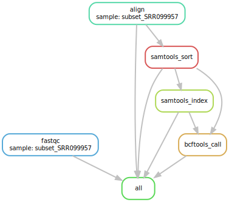
**3. Explain what the dependency map is showing and whether or not you think it is correct. (1 pts)**
Answer: the dependency map shows our variant calling and read alignment pipeline, with the workflow starting at the top and proressing downwards. The first task is align > followed by samtool_sorting > then samtool_indexing > and bcftools_call. The "all" represents the last step which depends on the completion of fastqc, bcftools_call and its dependencies. The gray arrows visualize the dependencies, for example samtools_index is dependent on samtools_sort output. bcftools_call is dependent on samtools_index and samtools_sort outputs.
the dependency chart makes sense because in our snamefile, align is not dependent on fastqc's output. fastqc's output is just html files of the fastqc.gz files, which are not dependency of any of the subsequent rules (steps).


Run your pipeline on the sequence data provided. You can do this by typing `snakemake --use-conda --cores=1 --resources mem_mb=4000` into the command line. You can use screen and htop to check the server usage and determine the correct number of resources to allocate (NOTE: If you don't pass any resources to snakemake it will use all available resources on the server, which is very inconsiderate to your classmates). **Please do not exceed 4GB of memory per job or a single core**, use less if you think it's necessary. 

```{bash, eval=FALSE}
#?# 4. Paste the output of snakemake here (0.25 pts)

Building DAG of jobs...
Using shell: /bin/bash
Provided cores: 4
Rules claiming more threads will be scaled down.
Provided resources: mem_mb=4000
Job stats:
job               count
--------------  -------
align                 1
all                   1
bcftools_call         1
fastqc                1
samtools_index        1
samtools_sort         1
total                 6

Select jobs to execute...
Failed to solve scheduling problem with ILP solver. Falling back to greedy solver. Run Snakemake with --verbose to see the full solver output for debugging the problem.

[Mon Jan 20 22:50:16 2025]
rule fastqc:
    input: /home/snouri_bmeg25/A1/subset_SRR099957_1.fastq.gz, /home/snouri_bmeg25/A1/subset_SRR099957_2.fastq.gz
    output: fastqc/subset_SRR099957_1_fastqc.html, fastqc/subset_SRR099957_2_fastqc.html
    jobid: 1
    reason: Missing output files: fastqc/subset_SRR099957_1_fastqc.html, fastqc/subset_SRR099957_2_fastqc.html
    wildcards: sample=subset_SRR099957
    resources: tmpdir=/tmp


[Mon Jan 20 22:50:18 2025]
rule align:
    input: /home/snouri_bmeg25/A1/subset_SRR099957_1.fastq.gz, /home/snouri_bmeg25/A1/subset_SRR099957_2.fastq.gz
    output: aligned/subset_SRR099957.sam
    jobid: 2
    reason: Missing output files: aligned/subset_SRR099957.sam
    wildcards: sample=subset_SRR099957
    resources: tmpdir=/tmp

[Mon Jan 20 22:50:34 2025]
Finished job 1.
1 of 6 steps (17%) done
[Mon Jan 20 22:54:23 2025]
Finished job 2.
2 of 6 steps (33%) done
Select jobs to execute...

[Mon Jan 20 22:54:23 2025]
rule samtools_sort:
    input: aligned/subset_SRR099957.sam
    output: sorted/subset_SRR099957.bam
    jobid: 3
    reason: Missing output files: sorted/subset_SRR099957.bam; Input files updated by another job: aligned/subset_SRR099957.sam
    wildcards: sample=subset_SRR099957
    resources: tmpdir=/tmp

[Mon Jan 20 22:54:38 2025]
Finished job 3.
3 of 6 steps (50%) done
Select jobs to execute...

[Mon Jan 20 22:54:38 2025]
rule samtools_index:
    input: sorted/subset_SRR099957.bam
    output: sorted/subset_SRR099957.bam.bai
    jobid: 4
    reason: Missing output files: sorted/subset_SRR099957.bam.bai; Input files updated by another job: sorted/subset_SRR099957.bam
    wildcards: sample=subset_SRR099957
    resources: tmpdir=/tmp

[Mon Jan 20 22:54:40 2025]
Finished job 4.
4 of 6 steps (67%) done
Select jobs to execute...

[Mon Jan 20 22:54:40 2025]
rule bcftools_call:
    input: /projects/bmeg/indexes/hg38/hg38.fa, sorted/subset_SRR099957.bam, sorted/subset_SRR099957.bam.bai
    output: variants/subset_SRR099957.vcf
    jobid: 5
    reason: Missing output files: variants/subset_SRR099957.vcf; Input files updated by another job: sorted/subset_SRR099957.bam, sorted/subset_SRR099957.bam.bai
    wildcards: sample=subset_SRR099957
    resources: tmpdir=/tmp

[Mon Jan 20 22:58:54 2025]
Finished job 5.
5 of 6 steps (83%) done
Select jobs to execute...

[Mon Jan 20 22:58:54 2025]
localrule all:
    input: fastqc/subset_SRR099957_1_fastqc.html, fastqc/subset_SRR099957_2_fastqc.html, aligned/subset_SRR099957.sam, sorted/subset_SRR099957.bam, sorted/subset_SRR099957.bam.bai, variants/subset_SRR099957.vcf
    jobid: 0
    reason: Input files updated by another job: sorted/subset_SRR099957.bam, variants/subset_SRR099957.vcf, fastqc/subset_SRR099957_2_fastqc.html, aligned/subset_SRR099957.sam, fastqc/subset_SRR099957_1_fastqc.html, sorted/subset_SRR099957.bam.bai
    resources: tmpdir=/tmp

[Mon Jan 20 22:58:54 2025]
Finished job 0.
6 of 6 steps (100%) done
Complete log: .snakemake/log/2025-01-20T225010.522127.snakemake.log

```

### Part 2: Quality Control
#### a. Quality Control of raw sequencing data
Download the fastqc reports from the fastqc directory and include each of the graphs in your Rmarkdown file the same way you included the dependency map. 


**5. Include the fastqc graphs from the QC on the forward read (read 1) file in your Rmarkdown file below this block. For each graph include a brief description of what the graph is showing and whether or not you think the data passed the quality control. (5 pts) **
*Please try to separate your descriptions by including an text block between for description.*


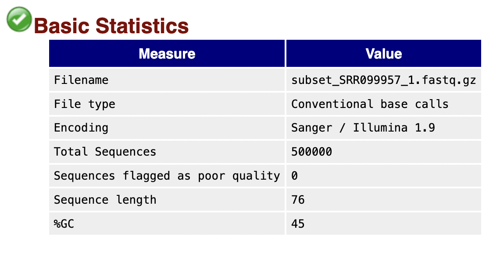

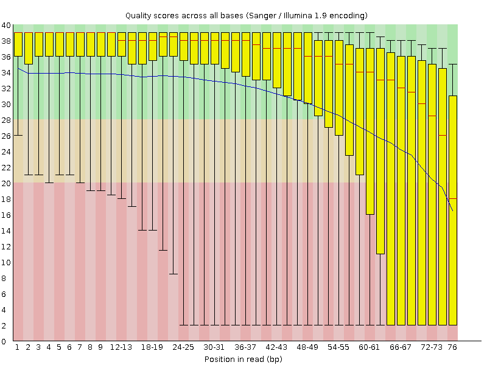
this is fastQC of read1 mapped to reference genome hg38. Honestly the QC is not great. we can see the median score across bases (blue line) deviates by a large margin relative to the median of IQR of box plots (red line). We can also see a large Q0->Q1 score distribution.
Our reads are 76bp long (ideal for bowtie2). However the quality dramatically diminishes from approximately bp 50 onward. 


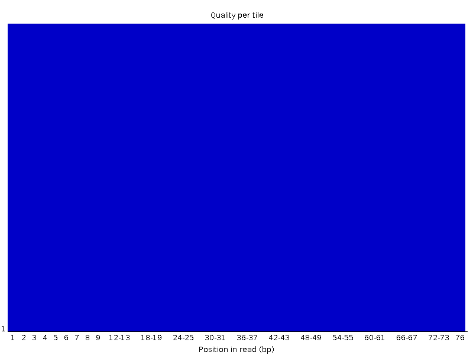
the per-tile-sequence quality shows a uniform quality score (consistent) across all tiles. I guess this suggests our sequence analysis ran well. 


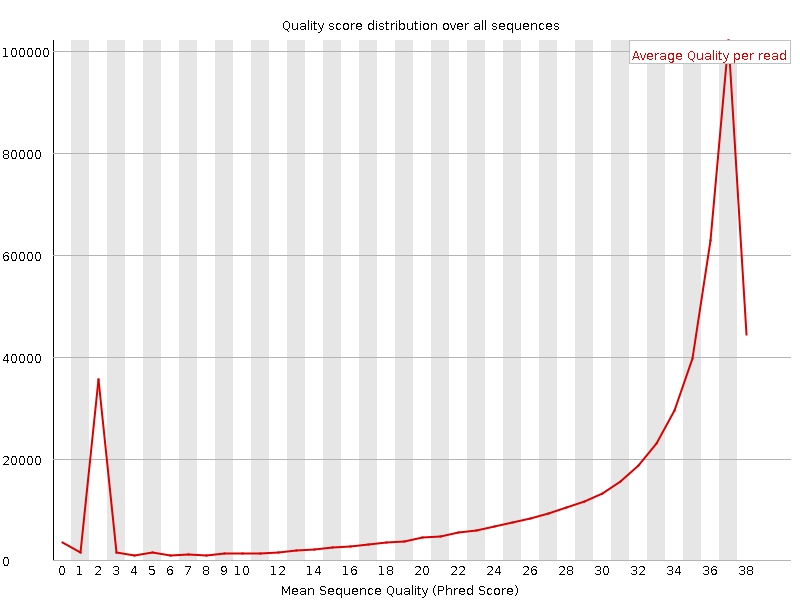
our per-sequence-quality-score chart helps us understand the quality score across all reads. We can see our largest peak is around quality score of 37. Basically we have close to 1,000,000 reads with average quality score of 37.


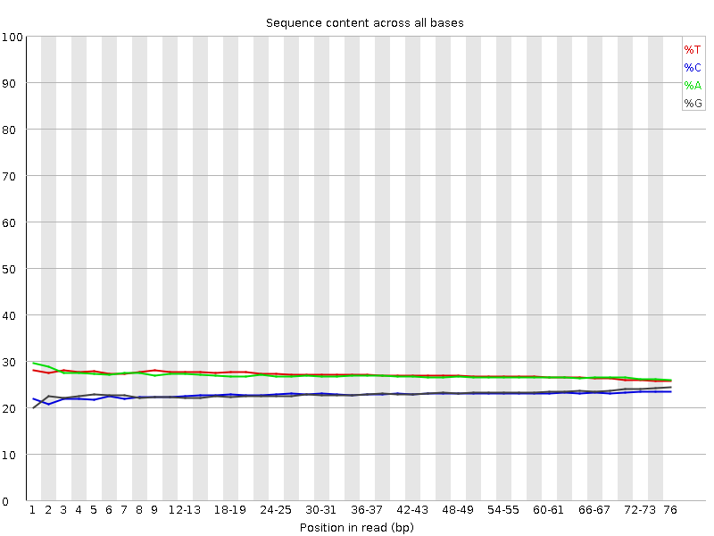
Our per-base-sequence-content helps us understand the average distribution of ATCG bps across our reads at each bp index.
From bp indices 0->50, we can expect 28% of bases to be A, 28% T, 22% C and 22% G. This distribution becomes more similar (some-what more equal distribution of bases) as we move the bp indices to 51->76. 


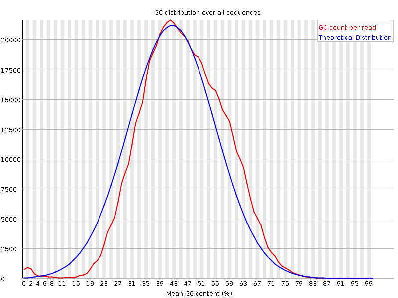
The per-sequence-CG-content chart shows that our calculated GC-count per read is not much skewed from the theoretical (expected) distribution; which suggests our sequencing pipeline was not biased. Both lines do peak around 43% mean GC content across +20,000 reads. 


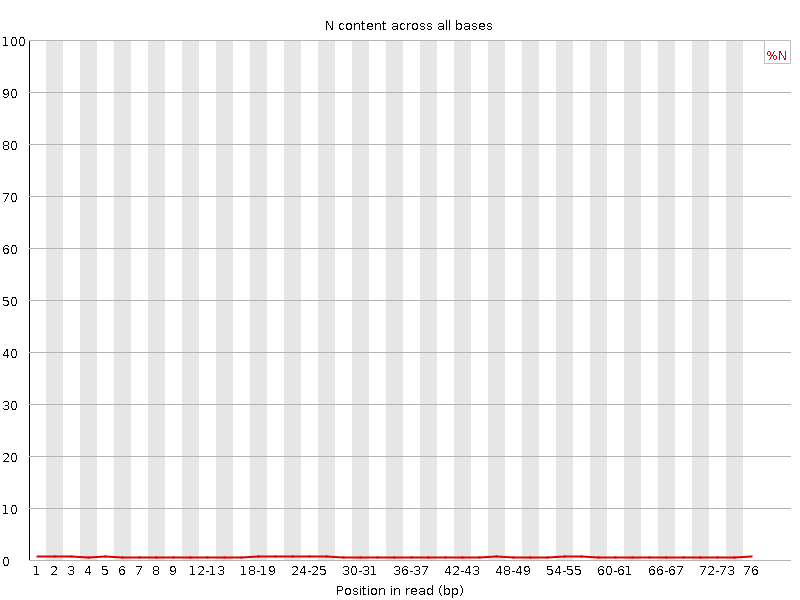
the per-base-N-content chart shows that there is close to no N content across all reads at each bp index.


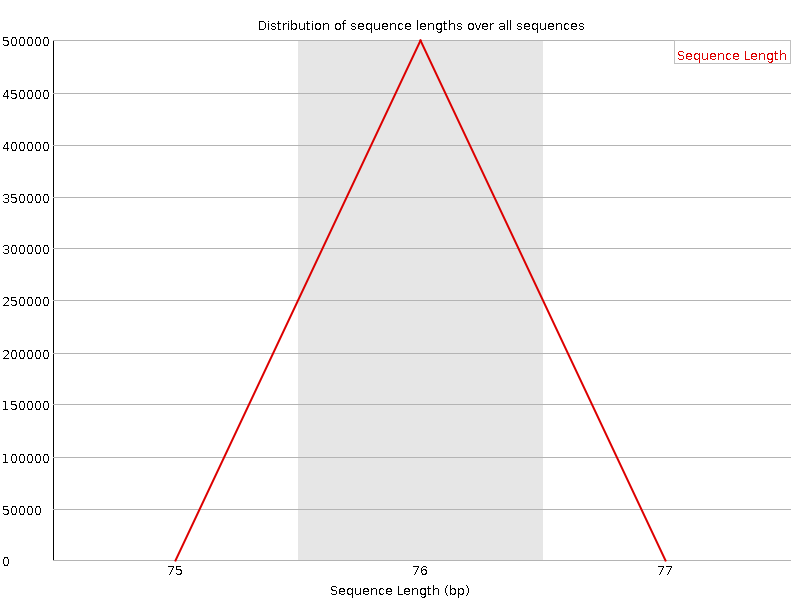
This chart highlights that most reads sequenced (50,000) had sequence length of 76 base pairs. 


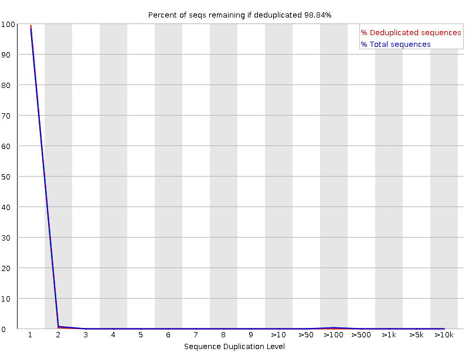
The sequence duplication chart shows that if we remove sequences that occure only once or (close to twice), we lose 98.84% of our sequence count! This indicates that most our sequences have no duplicates!


... 

### b. Quality control of the alignment
For this section we will be using samtools to check the alignment of our data.


**6. Use samtools flagstat to check the alignment rate of the sample you ran. Paste the output below (0.5 pts) and explain what the output means (1.5 pts)**

*Command: (base) snouri_bmeg25@orca01:~/A1/pipeline/sorted$ samtools flagstat subset_SRR099957.bam *
```
1000000 + 0 in total (QC-passed reads + QC-failed reads)
0 + 0 secondary
0 + 0 supplementary
0 + 0 duplicates
924585 + 0 mapped (92.46% : N/A)
1000000 + 0 paired in sequencing
500000 + 0 read1
500000 + 0 read2
898442 + 0 properly paired (89.84% : N/A)
914236 + 0 with itself and mate mapped
10349 + 0 singletons (1.03% : N/A)
3180 + 0 with mate mapped to a different chr
1857 + 0 with mate mapped to a different chr (mapQ>=5)
```

Interpretation: the results say that 1,000,000 reads were processed, with 92.46% of reads
successfully mapping to a part of the reference genome. 100% of the reads are paired-end reads, half
from read1, half from read2. Also 89.84% of both reads mapped to expected locations on the reference genome and
1.03% of the reads did have a match to reference genome, but their counterpart pair didn't map to the reference genome.
also 3180 reads had their pair match to a different region in reference genome whereas 1857 of them had mapping quality of
greater than 5.


### Part 3: Visualization and Downstream Analysis
#### a. Setting up a reproducible analysis in R
**Reminder that you will be doing your analysis in RStudio on your local computer.**

```{r, eval=FALSE}
install.packages("renv")
```
Once you have renv installed you can create a new library by typing `renv::init()` into your R interpreter. This will create a new library in your current working directory. You can then install packages into this library by typing `renv::install()` into your R interpreter. You can also install packages from a specific repository by typing `renv::install("package_name", repos = "https://cran.rstudio.com")` into your R interpreter. Because renv doesn't interfere with existing package management workflows you can still use `install.packages() ` and `BiocManager::install()` to install packages into your project library so long as you've initialized renv in your project.

#### b. Basics of R Analysis
For this section you will want to install tidyverse (https://www.tidyverse.org/), a collection of packages for data manipulation and visualization. We will need it for the ggplot2 package which it includes. 

**7. Below is an R function for reading a VCF file and counting the number of occurrences of each unique ref-alt pair in all of the SNPs present in the VCF file. There are a few bugs in the code. Debug the function (2 pts) and add comments to explain what each line of code is doing (1 pts). **
```{r}
count_SNPs <- function(file_path) {
  
  # read the subset_SRR099957.vcf. We have 32425 variants with 10 columns (labeled V1->V10)
  # looking at https://en.wikipedia.org/wiki/Variant_Call_Format we can identify what each column is!
  # our columns of interest are V4 and V5
  vcf_data <- read.table(file_path, header = FALSE, stringsAsFactors = FALSE)
  
  # make new array by selecting REF (V4) ALT (V5) columns 
  ref_alt_data <- vcf_data[c("V4", "V5")]
  colnames(ref_alt_data) <- c("REF", "ALT")
  
  # keeping rows where REF,ALT have length 1 (i.e., looking for SNPS)
  ref_alt_data <- ref_alt_data[apply(ref_alt_data, 1, function(x) all(nchar(x) == 1)), ]
  
  # count occurance of REF,ALT SNPS
  counts <- table(ref_alt_data$REF, ref_alt_data$ALT)
  
  # converting from table format to data frame
  result_df <- data.frame(
    REF = rep(rownames(counts), each = ncol(counts)),
    ALT = rep(colnames(counts), times = nrow(counts)),
    COUNT = as.vector(counts)
    )
  return(result_df) #return data with SNP count
}
```

**8. Use the returned data frame to plot the ref-alt pairs for all SNPs as a bar plot (1 pts)**
```{r}
# Include the code you used to generate the plot in this block. When you knit your document the plot will be generated and displayed below.
file_path <- "/Users/sepehrnouri/BMEG424/A1/pipeline/variants/subset_SRR099957.vcf"
snp_counts <- count_SNPs(file_path)
renv::install("ggplot2")
library(ggplot2)

# Create the bar plot
ggplot(snp_counts, aes(x = paste(REF, "->", ALT), y = COUNT, fill = paste(REF, "->", ALT))) +
  geom_bar(stat = "identity") +
  labs(
    title = "SNP Counts of Unique Variants",
    x = "Ref-Alt Allele Pairs",
    y = "Count"
  ) +
  theme(axis.text.x = element_text(angle = 45, hjust = 1),   # we can rotate the x-axis labels to make them less congested
        plot.title = element_text(hjust=0.5)                 # centering title
        )
```
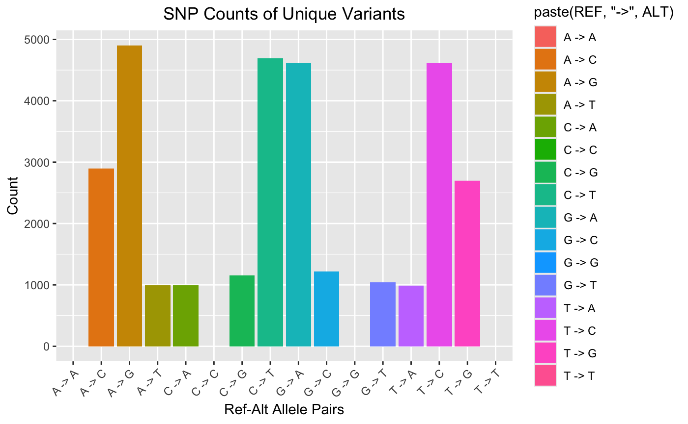
**9. Included in the assignment repo is a plot which shows the distribution of variants across the genome. You can download and view this plot manually. Recreate this plot using the data from your sample. Include the original svg and your recreation in your submission. (4 pts)**
```{r}
# HINT: You'll want to start by looking at the documentation for the GenomicRanges and GenomicDistributions packages.
# We know this question requires a deep dive into the documentation, this is by design as learning how to implement novel tools/packages is a key skill in bioinformatics.
if (!require("BiocManager", quietly = TRUE))
  install.packages("BiocManager")
BiocManager::install(version = "3.20")

BiocManager::install("GenomicRanges", ask = FALSE, update = TRUE)
library(GenomicRanges)         # renv::install("GenomicRanges", repos = "https://bioconductor.org/packages/GenomicRanges")
BiocManager::install("GenomicDistributions", ask = FALSE, update = TRUE)
BiocManager::install("GenomicDistributionsData",ask=FALSE, update=TRUE) # for knitting purposes, need to install
library(GenomicDistributions)  # renv::install("GenomicDistributions", repos = "http://code.databio.org/GenomicDistributions")

```

```{r}
vcf_file_path <- "/Users/sepehrnouri/BMEG424/A1/pipeline/variants/subset_SRR099957.vcf"
vcf_data <- read.table(file_path, header = FALSE, stringsAsFactors = FALSE)
vcf_data2 <- vcf_data
colnames(vcf_data2) <- c("CHROM", "POS", "ID", "REF", "ALT", "QUAL", "FILTER","INFO","FORMAT", "SAMPLES")

unique_vals <- unique(vcf_data2$CHROM)
print(unique_vals) #we have some odd chromosomes (chr14_KI27....), we will eliminate them to only have Chrom1->ChromM

# defining the chromosomes we want to keep (to match the variants plot given in assignment)
chroms_to_keep <- c("chr1","chr2","chr3","chr4","chr5","chr6","chr7","chr8","chr9","chr10","chr11","chr12","chr13","chr14","chr15","chr16",
                    "chr17","chr18","chr19","chr20","chr21","chr22","chrX","chrY", "chrM")

vcf_filtered <- vcf_data2[(vcf_data2$CHROM %in% chroms_to_keep), ]

# creating GRanges object from vcf SNP data
snp_granges <- GRanges(
  seqnames = vcf_filtered$CHROM, 
  ranges = IRanges(start = vcf_filtered$POS, end = vcf_filtered$POS) 
)
# Calculate the distribution of SNPs across the genome
# NOTE: aggregateOverGenomeBins function is now calcChromBins!
snp_distribution <- calcChromBinsRef(snp_granges, "hg38")
plotChromBins(snp_distribution)
```
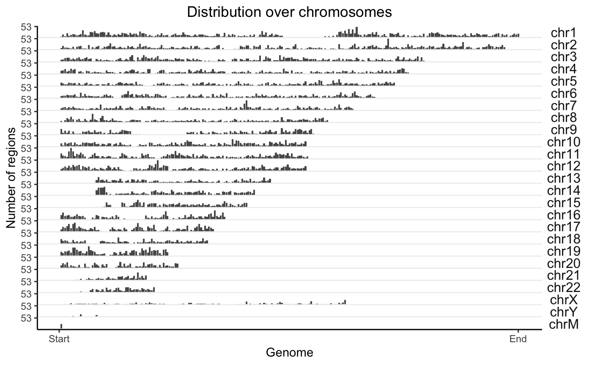


#### c. Interactively viewing our variants in IGV
You can download the IGV viewer from here: https://software.broadinstitute.org/software/igv/home. IGV is an interactive tool to visualize different data types of genetic information (e.g. bam, bed files). You will install this tool to your **local computer**. To visualize where the reads of our ChIP analysis mapped in the genome. 

Once you boot up IGV select your reference genome and load your VCF file. Zoom into this position: `chr1: 1,000,000-1,100,000`. 
```
#?# 10. Post a screenshot of your IGV window below (1pts)
```

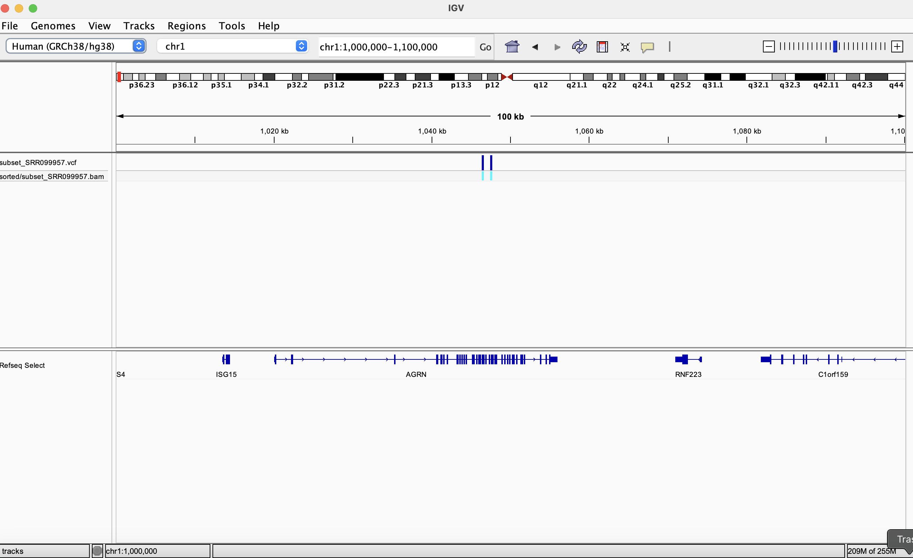

## Discussion (6 pts)
**11. Do you think the subset of sequence data you analyzed was from Whole Genome Sequencing or Whole Exome Sequencing? Justify your response with evidence. (4 pts)**

I think we did Exome Genome Sequencing. Couple reasons for this. 
1. looking at the variant IGV image above, zooming across 100k bps, we only have 2 regions of sequencing coverage that have variants, and zooming in on these variants, we see they are within a couple exons that code for specific genes. 

2. furthermore, analyzing the 'Distribution over genome' chart we generated, we don't see a uniform distribution of variants across the genome of each chromosomes. We can clearly spot 'blank' regions for each chromosome that has no variant being recorded, and conjested regions in the genome that have peak variants.

3. Also, although we got a high per-sequency quality score, the QC across all bases doesn't look good. I think because we focused on sequencing coding regions, those regions maped well to reference genome, so they got high QC, but because we don't have decent intron mapping, the overall QC for our bases are not great.


**12. Assuming your snakemake run was supposed to process 1000 samples instead of 1 sample. How would you go about checking the quality of all the samples? (1 pts)**

1. first we make sure the config.yaml file has all sample names (currently one 1 sample name)
2. Now running the current Snakefile only has rule to produce fastqc files, this means we have to manually open the fastqc.html file for each sample to analyze their QC, 
3. so instead, we can make a new rule (instruction) in Snakefile for handling multiqc reports:
rule multiqc:
    input:
        expand("fastqc/{sample}_1_fastqc.html", sample=config['samples']),
        expand("fastqc/{sample}_2_fastqc.html", sample=config['samples'])
    output:
        "multiqc_report.html"
    shell:
        "multiqc {input} -o {output}"


**13. If the run crashed on sample 500, how would you go about restarting the run? (1 pts)**
we discussed this in class. Basically when we restart, we don't want to re-do the samples 1->499,
we need to program our pipeline so that it checkes outputs for which samples are already pressent, and resume from there. I believe Snakemake has a command 'snakemake -j' which automately restarts from where we left off. 
At the end, it will be useful to double check inside our output directory to ensure we have the correct number of files. 


## Contributions
Please note here the team members and their contributions to this assignment.

## THIS ASSIGNMENT WAS DONE BY MYSELF ALONE (took me two full days ;_;) 
given the final exam can include the content of assignments, I prefer to all all alone to learn everything.

Link to chatgpt: https://chatgpt.com/share/678f2a96-758c-800f-aadd-de60976f100f
other useful websites I used:
https://en.wikipedia.org/wiki/Variant_Call_Format
https://code.databio.org/GenomicDistributions/articles/01-intro.html
https://hbctraining.github.io/Intro-to-ChIPseq-flipped/lessons/04_alignment_using_bowtie2.html


