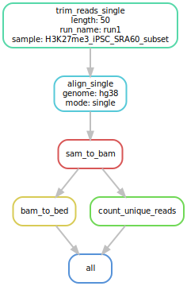
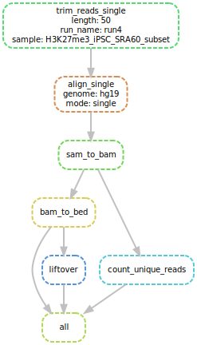
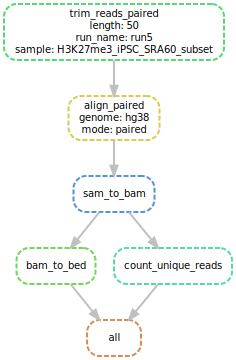

BMEG 424/524 Assignment 2
================
Sepehr Nouri 97912356

- [BMEG 424 Assignment 2:
  Mappability](#bmeg-424-assignment-2-mappability)
  - [Introduction:](#introduction)
    - [Software and Tools:](#software-and-tools)
    - [Data:](#data)
    - [Goals and Objectives:](#goals-and-objectives)
    - [Submission:](#submission)
  - [Experiment and Analysis:](#experiment-and-analysis)
    - [1. Creating a modular mapping pipeline (7
      pts)](#1-creating-a-modular-mapping-pipeline-7-pts)
    - [a. Building the basic rules](#a-building-the-basic-rules)
    - [b. Read length](#b-read-length)
    - [c. Reference genome](#c-reference-genome)
    - [d. Paired vs. Single End
      Alignment](#d-paired-vs-single-end-alignment)
    - [2. Testing factors affecting mappability (4.5
      pts)](#2-testing-factors-affecting-mappability-45-pts)
    - [3. Analyzing the results (18
      pts)](#3-analyzing-the-results-18-pts)
      - [a. Effect of read length on
        mappability](#a-effect-of-read-length-on-mappability)
      - [b. Effect of reference genome on
        mappability](#b-effect-of-reference-genome-on-mappability)
      - [c. Effect of alignment mode on
        mappability](#c-effect-of-alignment-mode-on-mappability)
  - [Discussion (8 pts):](#discussion-8-pts)
- [Contributions](#contributions)

``` r
knitr::opts_chunk$set(echo = TRUE)
```

# BMEG 424 Assignment 2: Mappability

## Introduction:

### Software and Tools:

In this assignment we will be using the following tools: -
[bowtie2](http://bowtie-bio.sourceforge.net/bowtie2/index.shtml) -
[samtools](http://www.htslib.org/doc/samtools.html) -
[sambamba](http://lomereiter.github.io/sambamba/docs/sambamba-view.html) -
[trimmomatic](http://www.usadellab.org/cms/uploads/supplementary/Trimmomatic/TrimmomaticManual_V0.32.pdf) -
[liftover](https://genome.ucsc.edu/cgi-bin/hgLiftOver) -
[bedtools](https://bedtools.readthedocs.io/en/latest/) -
[conda](https://conda.io/docs/) -
[snakemake](https://snakemake.readthedocs.io/en/stable/)

### Data:

Your data is located in the following directory: `/projects/bmeg/A2/`.
You have been provided with 2 fastq files (forward and reverse reads)
named `H3K27me3_iPSC_SRA60_subset_<1/2>.fastq.gz` These files contain a
subset of the reads from a H3K27me3 ChIP-seq experiment performed on
human iPSCs. Don’t worry about what ChIP-seq experiments are or what
they measure, that will be the topic of next weeks assignment.

### Goals and Objectives:

In this assignment you will be using the concepts you learned in class
to investigate the effect of various factors on mappability. You will be
using the snakemake workflow management system to create a modular
mapping pipeline. You will then use this pipeline to test the effect of
read length, reference genome, and alignment mode on mappability.
Finally, you will analyze the results of your experiments and discuss
your findings.

### Submission:

Submit your assignment as a knitted RMarkdown document. You will push
your knitted RMarkdown document to your github repository (one for each
group). You will then submit the link to your repo, along with the names
and student numbers of all students who worked on the assignment to the
assignment 2 page on Canvas. Your assignment should be submitted, and
your last commit should be made, before 11:59pm on the day of the
deadline. Late assignments will will be deducted 10% per day late.
Assignments will not be accepted after 3 days past the deadline.

## Experiment and Analysis:

### 1. Creating a modular mapping pipeline (7 pts)

**A snakemake file is provided in Part 2. Simply update the shell
portions which you will complete below.** If you are stuck on running
snakemake, simply execute the commands individually in the terminal
manually and proceed to perform your analysis in Part 3 and Discussion
questions.

### a. Building the basic rules

Our mapping rule will be similar to the rule you used in the last
assignment for mapping reads to the genome using bowtie2. For your
convenience, a correct single-ended mapping rule has been provided
below. Reference it as necessary in the rules you write.

``` r
install.packages("reticulate", repos = "https://cloud.r-project.org")
```

    ## Installing package into '/Users/sepehrnouri/Library/R/arm64/4.4/library'
    ## (as 'lib' is unspecified)

    ## 
    ## The downloaded binary packages are in
    ##  /var/folders/w8/zzk892tn2rgd227608lgjqrr0000gq/T//RtmpXVCBYC/downloaded_packages

``` r
library(reticulate)
```

``` python
rule align:
    input:
        fastq = "path/to/data/{sample}.fastq.gz",
    output:
        sam = "aligned/{sample}.sam"
    shell:
        "bowtie2 -x /projects/bmeg/indexes/hg38/hg38_bowtie2_index "
        "-U {input.fastq} -S {output.sam}"
```

We’ll also have to convert the aligned sam files to bam format (binary
sam). As before you can do this using samtools. You can install samtools
into your A2 conda environment with
`conda install -c bioconda samtools`. The samtools manual can be found
[here](http://www.htslib.org/doc/samtools.html). For your convenience, a
correct conversion rule has been provided below:

``` python
rule sam_to_bam:
    input:
        sam = "aligned/{sample}.sam"
    output: 
        bam = "aligned/{sample}.bam"
    shell:
        "samtools view -h -S -b -o {output.bam} {input.sam}"
```

We will also need a rule that will count the number of uniquely mapped
reads in our sam file generated by bowtie2. In order to do this we will
use a useful multipart tool called sambamba. Sambamba is a tool for
working with sam and bam files. You can install sambamba into your A2
conda environment with `conda install -c bioconda sambamba`. The
sambamba manual can be found
[here](http://lomereiter.github.io/sambamba/docs/sambamba-view.html).

``` python
#?# 1. Fill in (where it says <complete command>) the following rule which will count the number of uniquely mapped reads in a sam file. (0.5 pts)

rule count_unique_reads:
    input:
        bam = "aligned/{sample}_CROP{length}_{genome}_{mode}.bam"
    output:
        counts = "counts/{sample}_CROP{length}_{genome}_{mode}_nReads.txt"
    shell:
        "sambamba view -F \"[XS] == null and not unmapped\" --count {input.bam} > {output.counts}"
```

### b. Read length

The first factor affecting mappability which we will test in this
assignment is read length. In order to test this variable we will have
to trim our reads to different lengths before aligning them. We will use
the trimmomatic tool to trim our reads. You can install trimmmomatic
into your A2 conda environment with
`conda install -c bioconda trimmomatic`.

We will want to use the SE option for single end reads. The trimmomatic
manual can be found
[here](http://www.usadellab.org/cms/uploads/supplementary/Trimmomatic/TrimmomaticManual_V0.32.pdf).

``` python
#?# 2. Fill in the rule (where it says <complete command>) such that you can dynamically trim reads to different lengths BEFORE mapping. (1 pts)

rule trim_reads_single:
    input:
        read_1 = "/projects/bmeg/A2/{sample}_1.fastq.gz",
    output:
        read_1 = "trimmed/{sample}_CROP{length}_1.fastq.gz",
    params:
        length = config["length"]
    shell:
        """
        trimmomatic SE {input.read_1} {output.read_1} CROP:{params.length}
        """

rule trim_reads_paired:
    input:
        read_1 = "/projects/bmeg/A2/{sample}_1.fastq.gz",
        read_2 = "/projects/bmeg/A2/{sample}_2.fastq.gz"
    output:
        read_1 = "trimmed/{sample}_CROP{length}_1.fastq.gz",
        read_2 = "trimmed/{sample}_CROP{length}_2.fastq.gz",
        unpaired_1 = "trimmed/{sample}_CROP{length}_1_unpaired.fastq.qz"
        unpaired_2 = "trimmed/{sample}_CROP{length}_2_unpaired.fastq.gz"
    params:
        length = config["length"]
    shell:
        """
        trimmomatic PE {input.read_1} {input.read_2} \
        {output.read_1} {output.unpaired_1} {output.read_2} {output.unpaired_2} \
        CROP:{params.length}
        """
```

### c. Reference genome

Next we will see if mapping to different reference genomes affects
mappability. We will use both the hg19 and hg38 reference genomes. Both
genomes are available, indexed, at
`/projects/bmeg/genomes/<genome>/indexes/`

To compare reads mapped to different genomes we will need to use the
ucsc-liftover tool to convert the hg19 coordinates to hg38 coordinates.
You can install the liftover tool into your A2 conda environment with
`conda install ucsc-liftover`. You will also need to use
`/projects/bmeg/A2/hg19ToHg38.over.chain.gz` for conversion of hg19 to
hg38 coordinates.

``` python
#?# 3. Complete the following rules' shell portion to dynamically map reads to different reference genomes. All resulting alignments should have hg38 coordinates irrespective of which genome was used. (1 pts)

rule align_single: 
    input:
        fastq1 = "trimmed/{sample}_CROP{length}_1.fastq.gz",
    output:
        sam = "aligned/{sample}_CROP{length}_{genome}_{mode}.sam"
    params:
        genome = config["genome"]
    shell:
        """
        if [ {params.genome} == "hg19" ]; then
            bowtie2 -x /projects/bmeg/indexes/hg19/hg19_bowtie2_index \
            -U {input.fastq1} -S {output.sam}
        elif [ {params.genome} == "hg38" ]; then
            bowtie2 -x /projects/bmeg/indexes/hg19/hg19_bowtie2_index \
            -U {input.fastq1} -S {output.sam}
        else
            echo "Invalid genome"
        fi
        """

rule bam_to_bed:
    input:
        bam = "aligned/{sample}_CROP{length}_{genome}_{mode}.bam"
    output:
        bed = "bed/{sample}_CROP{length}_{genome}_{mode}.bed"
    shell:
        "<bedtools bamtobed -i {input.bam} {output.bed}"

rule liftover:
    input:
        bed = "bed/{sample}_CROP{length}_{genome}_{mode}.bed", 
        chain = "/projects/bmeg/A2/hg19ToHg38.over.chain.gz"
    output:
        bed = "bed/{sample}_CROP{length}_{genome}_{mode}_lifted_hg38.bed",
        unlifted = "bed/{sample}_CROP{length}_{genome}_{mode}_unlifted.bed",
        confirmation = "aligned/lifted_over_{sample}_CROP{length}_{genome}_{mode}.done"
    params:
        genome = config["genome"]
    shell:
        """
        if [ {params.genome} == "hg19" ]; then
            liftOver {input.bed} {input.chain} {output.bed} {output.unlifted}
            touch {output.confirmation}
        elif [ {params.genome} == "hg38" ]; then
            echo "No need to lift over"
        else
            echo "Invalid mode"
        fi
        """
```

### d. Paired vs. Single End Alignment

The files you have been using so far have been single end reads.
However, paired end reads are also commonly used in sequencing. In
paired end sequencing, the same DNA fragment is sequenced from both
ends. This allows us to get information about the distance between the
two ends of the fragment. This information can be used to improve the
accuracy of the alignment.

``` python
#?# 4. Update the rule from Part a. to do paired-end alignment. (1 pts)
rule align_paired:
    input:
        fastq1 = "trimmed/{sample}_CROP{length}_1.fastq.gz",
        fastq2 = "trimmed/{sample}_CROP{length}_2.fastq.gz",
    output:
        sam = "aligned/{sample}_CROP{length}_{genome}_{mode}.sam"
    params:
        genome = config["genome"]
    shell:
        """
        if [ {params.genome} == "hg19" ]; then
            bowtie2 -x /projects/bmeg/indexes/hg19/hg19_bowtie2_index \
            -1 {input.fastq1} -2 {input.fastq2} -S {output.sam}
        elif [ {params.genome} == "hg38" ]; then
            bowtie2 -x /projects/bmeg/indexes/hg38/hg38_bowtie2_index \
            -1 {input.fastq1} -2 {input.fastq2} -S {output.sam}
        else
            echo "Invalid mode"
        fi
        """
```

### 2. Testing factors affecting mappability (4.5 pts)

In order to keep track of the experiments we are running we should
modify our pipeline to use a config file. This will allow us to easily
change the parameters of our pipeline without having to modify the
pipeline itself.

``` python
#?# 5. Create a config file which will allow you to easily change the parameters of your pipeline. Paste the file (without parameter values) below. (0.5 pts)

# config.yaml
length:
genome:
mode:
runID:
```

Now we are going to run our pipeline with different parameters in order
to test the effect of the various factors on mappability. Use the
following parameters:

    Length: 50, 100, 150
        While testing length, use only the hg38 genome and single end mode (on read 1)
    Genome: hg19, hg38
        While testing genome, use only the 50bp read length and single end mode (on read 1)
    Alignment mode: paired, single
        While testing alignment mode, use only the 50bp read length and hg38 genome.

``` python
#?# 6. Paste your complete snakefile and include a visualization of the DAG below (include the settings on your config file as part of the filename for the DAG image). (3 pts)
# snakemake --dag | dot -Tsvg > dag.svg
# HINT: You'll want to look at the ruleorder directive in the snakemake documentation.

#Snakefile - SepehrNouri - 97912356

configfile: "config.yaml"
LENGTH = config["length"]
GENOME = config["genome"]
MODE = config["mode"]
RUN_NAME = config["runID"]

SAMPLES = ["H3K27me3_iPSC_SRA60_subset"]

rule all:
    input:
        expand("bed/{run_name}/{sample}_CROP{length}_{genome}_{mode}.bed", run_name = RUN_NAME, length = LENGTH, genome = GENOME, mode = MODE, sample = SAMPLES),
        expand("counts/{run_name}/{sample}_CROP{length}_{genome}_{mode}_nReads.txt",run_name = RUN_NAME, length = LENGTH, genome = GENOME, mode = MODE, sample = SAMPLES),
        expand("aligned/{run_name}/lifted_over_{sample}_CROP{length}_hg19_{mode}.done", run_name = RUN_NAME, length = LENGTH, genome = GENOME, mode = MODE, sample = SAMPLES) if GENOME == "hg19" else []

if MODE=="single":
    ruleorder: trim_reads_single > trim_reads_paired
    ruleorder: align_single > align_paired
elif MODE=="paired":
    ruleorder: trim_reads_paired > trim_reads_single
    ruleorder: align_paired > align_single
else:
    print("Invalid mode")
    exit(1)

rule trim_reads_single:
    input:
        read_1 = "/projects/bmeg/A2/{sample}_1.fastq.gz",
    output:
        read_1 = "trimmed/{run_name}/{sample}_CROP{length}_1.fastq.gz",
    params:
        length = config["length"]
    shell:
        """
        trimmomatic SE {input.read_1} {output.read_1} CROP:{params.length}
        """

rule trim_reads_paired:
    input:
        read_1 = "/projects/bmeg/A2/{sample}_1.fastq.gz",
        read_2 = "/projects/bmeg/A2/{sample}_2.fastq.gz"
    output:
        read_1 = "trimmed/{run_name}/{sample}_CROP{length}_1.fastq.gz",
        read_2 = "trimmed/{run_name}/{sample}_CROP{length}_2.fastq.gz",
        unpaired_1 = "trimmed/{run_name}/{sample}_CROP{length}_1_unpaired.fastq.qz",
        unpaired_2 = "trimmed/{run_name}/{sample}_CROP{length}_2_unpaired.fastq.gz"
    params:
        length = config["length"]
    shell:
        """
        trimmomatic PE {input.read_1} {input.read_2} \
        {output.read_1} {output.unpaired_1} {output.read_2} {output.unpaired_2} \
        CROP:{params.length}
        """

rule align_single: 
    input:
        fastq1 = "trimmed/{run_name}/{sample}_CROP{length}_1.fastq.gz",
    output:
        sam = "aligned/{run_name}/{sample}_CROP{length}_{genome}_{mode}.sam"
    params:
        genome = config["genome"]
    shell:
        """
        if [ {params.genome} == "hg19" ]; then
            bowtie2 -x /projects/bmeg/indexes/hg19/hg19_bowtie2_index \
            -U {input.fastq1} -S {output.sam}
        elif [ {params.genome} == "hg38" ]; then
            bowtie2 -x /projects/bmeg/indexes/hg19/hg19_bowtie2_index \
            -U {input.fastq1} -S {output.sam}
        else
            echo "Invalid genome"
        fi
        """

rule align_paired:
    input:
        fastq1 = "trimmed/{run_name}/{sample}_CROP{length}_1.fastq.gz",
        fastq2 = "trimmed/{run_name}/{sample}_CROP{length}_2.fastq.gz",
    output:
        sam = "aligned/{run_name}/{sample}_CROP{length}_{genome}_{mode}.sam"
    params:
        genome = config["genome"]
    shell:
        """
        if [ {params.genome} == "hg19" ]; then
            bowtie2 -x /projects/bmeg/indexes/hg19/hg19_bowtie2_index \
            -1 {input.fastq1} -2 {input.fastq2} -S {output.sam}
        elif [ {params.genome} == "hg38" ]; then
            bowtie2 -x /projects/bmeg/indexes/hg38/hg38_bowtie2_index \
            -1 {input.fastq1} -2 {input.fastq2} -S {output.sam}
        else
            echo "Invalid mode"
        fi
        """

rule sam_to_bam:
    input:
        sam = "aligned/{run_name}/{sample}_CROP{length}_{genome}_{mode}.sam"
    output: 
        bam = "aligned/{run_name}/{sample}_CROP{length}_{genome}_{mode}.bam"
    shell:
        "samtools view -h -S -b -o {output.bam} {input.sam}"

rule bam_to_bed:
    input:
        bam = "aligned/{run_name}/{sample}_CROP{length}_{genome}_{mode}.bam"
    output:
        bed = "bed/{run_name}/{sample}_CROP{length}_{genome}_{mode}.bed"
    shell:
        "bedtools bamtobed -i {input.bam} > {output.bed}"

rule liftover:
    input:
        bed = "bed/{run_name}/{sample}_CROP{length}_{genome}_{mode}.bed", 
        chain = "/projects/bmeg/A2/hg19ToHg38.over.chain.gz"
    output:
        bed = "bed/{run_name}/{sample}_CROP{length}_{genome}_{mode}_lifted_hg38.bed",
        unlifted = "bed/{run_name}/{sample}_CROP{length}_{genome}_{mode}_unlifted.bed",
        confirmation = "aligned/{run_name}/lifted_over_{sample}_CROP{length}_{genome}_{mode}.done"
    params:
        genome = config["genome"]
    shell:
        """
        if [ {params.genome} == "hg19" ]; then
            liftOver {input.bed} {input.chain} {output.bed} {output.unlifted}
            touch {output.confirmation}
        elif [ {params.genome} == "hg38" ]; then
            echo "No need to lift over"
        else
            echo "Invalid mode"
        fi
        """

rule count_unique_reads:
    input:
        bam = "aligned/{run_name}/{sample}_CROP{length}_{genome}_{mode}.bam"
    output:
        counts = "counts/{run_name}/{sample}_CROP{length}_{genome}_{mode}_nReads.txt"
    shell:
        "sambamba view -F \"[XS] == null and not unmapped\" --count {input.bam} > {output.counts}"
```





### 3. Analyzing the results (18 pts)

#### a. Effect of read length on mappability

Download the count files generated by your various runs onto your
*local* computer into your A2 project folder. Once you have downloaded
the files you can begin your analysis in R.

``` r
#?# 7. Plot the number of uniquely mapped reads for each read length (1 pt).
# Include the code you used to generate the plot in this block. When you knit your document the plot will be generated and displayed below.
#install.packages("ggplot2")
library(ggplot2)

base_path <- "/Users/sepehrnouri/BMEG424/A2/counts"

# define the subfolders corresponding to each sequence length
subfolders <- c("run1", "run2", "run3")  # Corresponding to 50bp, 100bp, 150bp
seq_lengths <- c("50bp", "100bp", "150bp")  # Row names

# read values from the .txt files inside each subfolder
read_counts <- function(folder) {
  txt_files <- list.files(file.path(base_path, folder), pattern = "\\.txt$", full.names = TRUE)
  value <- as.numeric(read.table(txt_files[1], header = FALSE)$V1)
  return(value)
}

count_data <- data.frame(
  Length = seq_lengths,
  Count = sapply(subfolders, read_counts)
)
count_data$Length <- factor(count_data$Length, levels = c("50bp", "100bp", "150bp"))

ggplot(count_data, aes(x = Length, y = Count, fill = Length)) +
  geom_bar(stat = "identity", width = 0.6) + 
  geom_text(aes(label = Count), vjust = -0.3) +
  labs(title = "Unique Sequence Counts w.r.t Read Length", x = "Sequence Length", y = "Unique Sequence Counts") +
  theme_minimal() +
  theme(legend.position = "none")
```

<!-- -->

``` r
## mathematically graphing and showing the relationship between Mapability and Length
mapability_length <- data.frame(
  x = c(50, 100, 150),
  y = c(1408007, 1512148, 1579467)
)

ggplot(mapability_length, aes(x = x, y = y)) +
  geom_point(color = "blue", size = 3) +  # Scatter plot points
  geom_smooth(method = "lm", formula = y ~ x, se = FALSE, color = "red") +  # Linear fit
  labs(title = "Linear Fit of Data Points",
       x = "X Value",
       y = "Y Value") +
  theme_minimal()
```

<!-- -->

``` r
# fitting a linear model
model <- lm(y ~ x, data = mapability_length)
eq <- paste0("y = ", round(coef(model)[2], 2), "x + ", round(coef(model)[1], 2))
print(eq)
```

    ## [1] "y = 1714.6x + 1328414"

\#?# 8. Based on the results of your analysis, what is the relationship
between read length and mappability? Define the relationship
mathematically. (1 pts) the results above prove that as we increase
sequence length, we have more unique reads. This matches the genome
length vs sequence length chart we discussed in lecture 6. Furthermore,
the 2nd chart is a linear regression fit in our data that defines the
relationship between mapability and length as: **y = 1714.6x + 1328414**

\#?# 9. What would you predict the number of uniquely mapped reads would
be for a 25bp read? What assumptions are you making in your prediction?
(2 pt) \# HINT: Think about what the result above would indicate for the
mapping rate of a 0bp read.

Ok, since we reducing sequence read length, we should definetly have
less unique reads than 50bp read length. our equaiton: y = 1714.6x +
1328414, says that at read length 0, we have 1,328,414 reads; this is
basically our total reads for chr1-\>chr22. plugging (x = 25bp) yields
us a unique read count of 1,371,279.

#### b. Effect of reference genome on mappability

``` r
#?# 10. Plot the number of uniquely mapped reads for each reference genome (1 pt)
# Include the code you used to generate the plot in this block. When you knit your document the plot will be generated and displayed below.

subfolders <- c("run1", "run4")  # corresponding to 50bp-Hg38, 50bp-Hg19
ref_genomes <- c("hg38", "hg19")

# read values from the .txt files inside each subfolder
read_counts <- function(folder) {
  txt_files <- list.files(file.path(base_path, folder), pattern = "\\.txt$", full.names = TRUE)
  value <- as.numeric(read.table(txt_files[1], header = FALSE)$V1)
  return(value)
}

genome_count_data <- data.frame(
  Genome = ref_genomes,
  Count = sapply(subfolders, read_counts)
)

ggplot(genome_count_data, aes(x = Genome, y = Count, fill = Genome)) +
  geom_bar(stat = "identity", width = 0.6) + 
  geom_text(aes(label = Count), vjust = -0.3) +
  labs(title = "Unique Sequence Counts w.r.t Genome", x = "Reference Genome", y = "Unique Sequence Counts") +
  theme_minimal() +
  theme(legend.position = "none")
```

<!-- -->

\#?# 11. Interpret the plot above, what does it tell you about the the
hg19 and hg38 alignments? (1.5 pts) Considering a clipping length of 50
and single_paired reads for the both genomes, we have the same amount of
uniquely mapped reads for the two reference genomes after OverLifting
the reads on reference genome hg19 to match hg38’s coordinates. **Hence,
our analysis suggests that read mapability remains the same across
different reference genomes (although testing on more genomes will be
more robust) with no effect on read mapability**

Next we will check to see not whether the number of uniquely mapping
reads has changed, but whether the reads are mapping to the same
location after lifting over and whether the alignment *quality* has
changed. In order to compare the positions/scores of reads we will have
to extract the relevant information from the bed files generated by the
pipeline. You can use the `join` command to merge the hg19_lifted_over
and hg38 bed files together. *Make sure that you sort your bedfiles by
**read name** before merging*. You can sort the bedfiles using the
`sort` command.

You only want to include these columns in your merged bed file:
`read_ID,chr_hg38,start_hg38,end_hg38,score_hg38,chr_hg19,start_hg19,end_hg19,score_hg19`
(hg19 refers to the lifted over file though its start and end
coordinates are technically referring to hg38 as well.) You should have
each of these columns *in the order specified*. You can use arguments of
the `join` command to modify which columns end up in the output and in
which order.

``` r
#?# 12. Create a barchart illustrating the difference in mean alignment score between the hg19 (lifted-over) and hg38 alignments for each of the autosomal chromosomes (2 pts). 

# i understand i can create the merge bed using bedtools, but I can do it with R as well!
library(data.table)
hg38 <- fread("/Users/sepehrnouri/BMEG424/A2/bed/run1/H3K27me3_iPSC_SRA60_subset_CROP50_hg38_single.bed", header = FALSE)
hg19 <- fread("/Users/sepehrnouri/BMEG424/A2/bed/run4/H3K27me3_iPSC_SRA60_subset_CROP50_hg19_single_lifted_hg38.bed", header = FALSE)

# aligning column names and sorting by read name
colnames(hg38) <- c("chr_hg38", "start_hg38", "end_hg38", "read_ID", "score_hg38", "strand_hg38")
colnames(hg19) <- c("chr_hg19", "start_hg19", "end_hg19", "read_ID", "score_hg19", "strand_hg19")
setkey(hg38, read_ID)
setkey(hg19, read_ID)

# merging the two & keeping the required columns!
merged_bed <- merge(hg38, hg19, by = "read_ID", all = FALSE)
merged_bed <- merged_bed[, .(read_ID, chr_hg38, start_hg38, end_hg38, score_hg38, chr_hg19, start_hg19, end_hg19, score_hg19)]

fwrite(merged_bed, "merged_final.bed", sep = "\t", quote = FALSE, col.names = FALSE)

# filtering for Autosomal Chromosomes (chr1->chr22)
merged_bed <- merged_bed[chr_hg38 %in% paste0("chr", 1:22)]

# computing the mean alignment score / chromosome & their difference
mean_scores <- merged_bed[, .(mean_hg38 = mean(score_hg38), mean_hg19 = mean(score_hg19)), by = chr_hg38]
mean_scores[, diff_score := mean_hg38 - mean_hg19]

# Check if all differences are zero
if (all(mean_scores$diff_score == 0)) {
  print("No difference in mean alignment scores between hg19 and hg38.")
}
```

    ## [1] "No difference in mean alignment scores between hg19 and hg38."

``` r
# Create bar plot
ggplot(mean_scores, aes(x = chr_hg38, y = diff_score, fill = diff_score > 0)) +
  geom_bar(stat = "identity", width = 0.6) +  # Ensure bars are visible
  scale_fill_manual(values = c("gray"), labels = c("No Change")) +  # Gray color for zero bars
  labs(title = "Difference in Mean Alignment Score (hg38 - hg19)", 
        x = "Chromosome", 
        y = "Mean Score Difference",
        fill = "Alignment Score") +
  theme_minimal() +
  theme(axis.text.x = element_text(angle = 45, hjust = 1)) +
  ylim(-1, 1)  # Force a visible y-axis range
```

<!-- -->

\#?# 13. Interpret the plot you created in Q12 above. What do you
notice, explain why you think the plot looks the way it does. (3 pts)
Ok, looking at the merged_bed table of autosomal chromosomes, the
alignment scores were identical. I was rather skeptical about this, but
after double checking the snakefile outputs for run1 and run4, there was
no error in sequencing. **Hence, changing reference genome doesn’t
effect the alignment quality, there is no change in the difference of
the two genome’s mean quality scores, due to being identical values**.

``` r
#?# 14. Create a boxplot illustrating the *difference* in start position of reads between the hg19 (lifted-over) and hg38 alignments for each of the autosomal chromosomes (2 pts)

library(dplyr)
```

    ## 
    ## Attaching package: 'dplyr'

    ## The following objects are masked from 'package:data.table':
    ## 
    ##     between, first, last

    ## The following objects are masked from 'package:stats':
    ## 
    ##     filter, lag

    ## The following objects are masked from 'package:base':
    ## 
    ##     intersect, setdiff, setequal, union

``` r
# start position difference
merged_bed <- merged_bed %>%
  mutate(start_diff = start_hg38 - start_hg19)

# only keeping autosomal chromosome data
merged_bed <- merged_bed %>%
  filter(chr_hg38 %in% paste0("chr", 1:22))

# sorting merged table to have proper order of chromosomes
merged_bed$chr_hg38 <- factor(merged_bed$chr_hg38, levels = paste0("chr", 1:22))


ggplot(merged_bed, aes(x = chr_hg38, y = start_diff)) +
  geom_boxplot(fill = "lightblue", outlier.color = "red") +
  labs(title = "Difference in Start Positions (hg38 - hg19)", 
       x = "Chromosome", 
       y = "Start Position Difference") +
  theme_minimal() +
  theme(axis.text.x = element_text(angle = 45, hjust = 1))
```

<!-- -->

``` r
merged_bed_removeExtreme <- merged_bed %>% filter(abs(start_diff) < 5e+07)  # Removes extreme shifts

ggplot(merged_bed_removeExtreme, aes(x = chr_hg38, y = start_diff)) +
  geom_boxplot(fill = "lightblue", outlier.color = "red") +
  labs(title = "Difference in Start Positions (hg38 - hg19) Extremes Removed", 
       x = "Chromosome", 
       y = "Start Position Difference") +
  theme_minimal() +
  theme(axis.text.x = element_text(angle = 45, hjust = 1))
```

<!-- -->

\#?# 15. Which chromosomes have the smallest difference(s) in start
position between the hg19 and hg38 alignments? Why do you think this is?
(2.5 pts) from our plot, the chromosomes with the smallest differences
in start positions between hg19 and hg38 alignments appear to be chr3,
chr4, chr5, chr12, chr14, and chr20, as their boxplots are nearly
centered at zero with very few outliers. **I think the reason for that
is between Hg19 (aka GRCh37) and Hg38 (GRCh38), these chromosomes had
the least change/update**. The improvements in Hg38 reference genome are
perhaps focused more on the chromosomes that we are observing with more
outliers(chr1, chr9, chr10) in the read starting position.

#### c. Effect of alignment mode on mappability

``` r
#?# 16. Plot another barchart comparing the number of uniquely mapped reads for each alignment mode (1 pt)
subfolder <- c("run1", "run5")  # corresponding to 50bp-Hg38, 50bp-Hg19
read_mode <- c("single", "paired")

# read values from the .txt files inside each subfolder
read_counts <- function(folder) {
  txt_files <- list.files(file.path(base_path, folder), pattern = "\\.txt$", full.names = TRUE)
  value <- as.numeric(read.table(txt_files[1], header = FALSE)$V1)
  return(value)
}

readMode_count_data <- data.frame(
  Mode = read_mode,
  Count = sapply(subfolder, read_counts)
)

ggplot(readMode_count_data, aes(x = Mode, y = Count, fill = Mode)) +
  geom_bar(stat = "identity", width = 0.6) + 
  geom_text(aes(label = Count), vjust = -0.3) +
  labs(title = "Unique Sequence Counts w.r.t Read Mode", x = "Read Mode", y = "Unique Sequence Counts") +
  theme_minimal() +
  theme(legend.position = "none")
```

<!-- -->

\#?# 17. As we saw before, the read length was directly related to the
number of uniquely mapped reads in a single-end alignment. Do you expect
a *similar* relationship (i.e. direction and rough size of slope) exists
for paired-end alignments? Why or why not? (1 pt) The plot above
(length=50, genome=hg38) shows roughly double the number of uniquely
mapped reads on paired_alignment mode compared to single_alignment. i
think it makes sense to have more unique read count on paired_mode
alignment, we have increased mapablity, and also higher likelihood of
repeat elements. Also, I think we can assume a simialr relationship
(i.e., paired_mode, Lengths:50,100,150) to single_mode’s length vs count
chart. Although I hypothesize that the slope will be less steep. Because
in paired_aligment, unlike single-end reads, paired-end reads must align
in a way that maintains a reasonable insert size (distance between the
two read pairs). Also, in single-end reads, increasing read length has a
strong effect on unique alignment rates because each read is considered
independently! However, in paired-end mode, a moderate read length may
already be sufficient for one of the paired reads to anchor the other,
meaning that increasing read length further might have a less dramatic
impact on the number of uniquely mapped read.

## Discussion (8 pts):

\#?# 18. Assuming a background genome **composed randomly** (made of
randomly sampled bases, 0.25 probability for each base), derive a
relationship between the length of a read and the probability that it
will map to a unique location in the random-genome. Show your work. (1
pts) assume L = read-length, G = genome-length. 1. Since each base must
map independently P(sequence of length L matching) = (1/4)^L. 2. For a
genome with length G, the amount of possible starting points (assuming
single-paired reads) is G - L + 1. 3. So putting together (1) and (2),
the probablity that a sequence L maps to a unique location in
random-genome would be: \[G-L+1\]*(1/4)^L but in reality, G \>\> L. so
we can re-write the above equaiton using Euler’s approximation to be:
e^(-G*(1/4)^L)

\#?# 19. Would all 20bp sequences be expected to map to a random genome
(from Q18) with equal frequency? Why or why not? (1 pt) I don’t think
so. Its similar to flipping a coin. Here, each 20bp sequence has
probablity of uniquely matching to a random genome in G, but that
doesn’t guarantee they randomely match with equal frequency. For
example, you can toss a coin 5 times, and get 4 heads, 1 tail. Although
each scenario has the same probability, it doesn’t affect the frequency
of occurence.

\#?# 20. Would the difference between SE and PE alignment remain the
same if you had used the 150bp reads? Why or why not? (2 pts) Compared
to difference between SE/PE on 50bps, I hypothesize that the difference
for 150bp will be less, even though unique read counts for PE_L150 \>
SE_L150, the difference will be smaller, relative to 50bps. This is
because we cannot have too many repeat elements and unambigous mappings,
because in pair-mode reads, we need to make sure the read fits to the
reference genome with good alignment quality score. Its easier to fit
smaller sequences, compared to larger sequences.

\#?# 21. Trimmomatic can also be used to trim reads based on their
quality score. What impact will trimming reads according to read quality
to have on alignment/mapping? Use evidence from your data to test your
hypothesis. (4 pts) Some reads did have very low quality scores. I think
trimming them will give us more accurate sequencing. removing
low-quality bases, especially at the ends of reads, can reduce the
number of mismatches and errors that aligners need to handle. Thus, more
accurate mapping of reads to their correct locations in the genome.

# Contributions

This assignment was done Individually. I used ChatGPT to help with code
correction.

<https://chatgpt.com/share/679b29c3-1288-800f-9a43-c25e2f43f53e> I
wanted to share the link to a second chatgpt session I used. But its not
allowing me to share the link because “Sharing conversations with user
uploaded images is not yet supported”. I only upload a screesshot of
merged_bed R table to ask it something. But in that chat I had alot of
conversation about the Snakefile shells that we had to code, mainly to
double check if the code I wrote was right.
