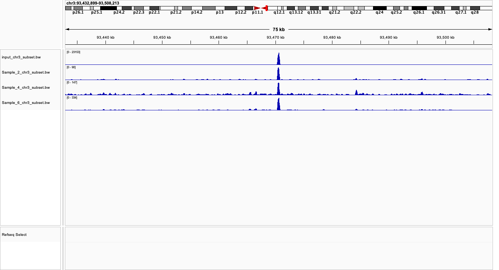
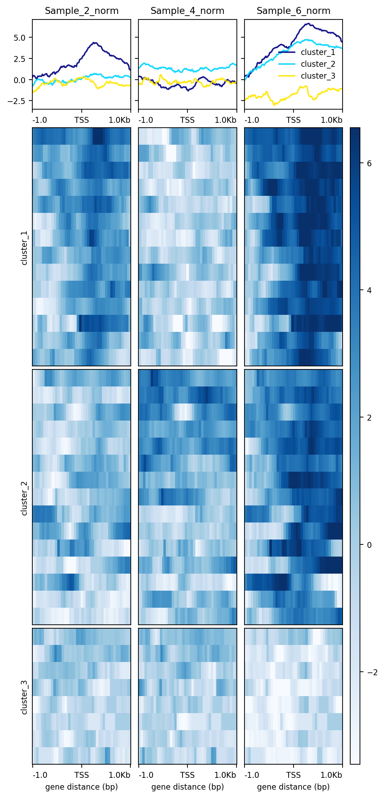
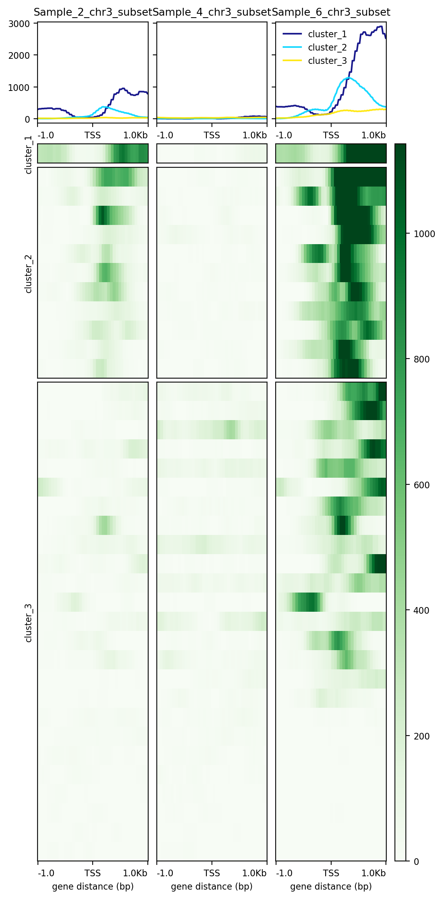
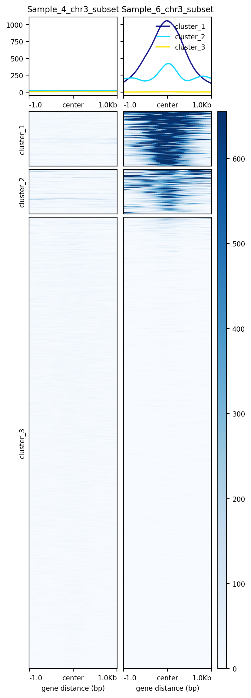
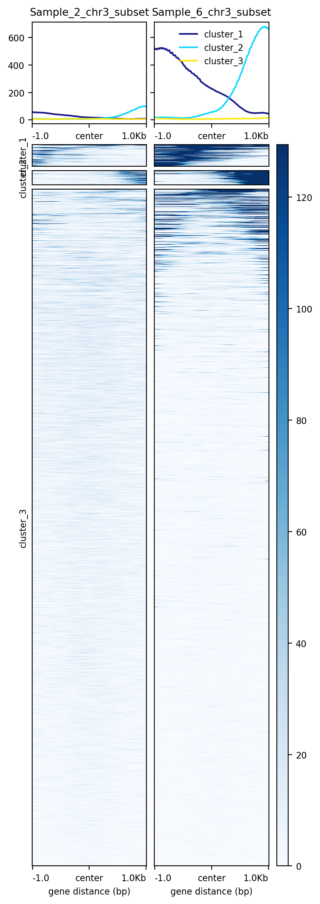
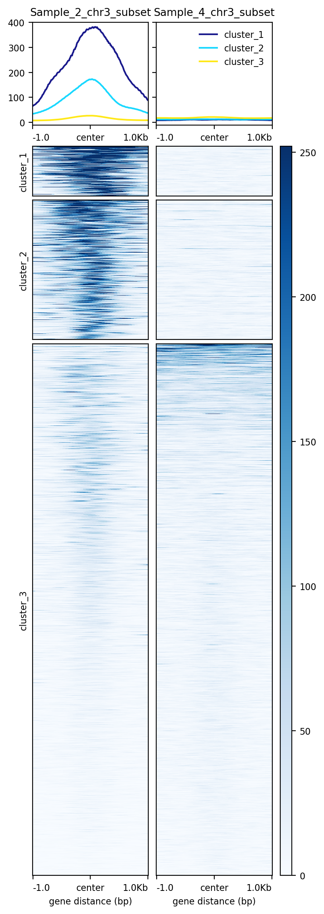

BMEG 424 Assignment 3
================
SepehrNouri - 97912356

- [BMEG 424 Assignment 3: ChIP-seq](#bmeg-424-assignment-3-chip-seq)
  - [Introduction:](#introduction)
    - [Goals and Objectives](#goals-and-objectives)
    - [Data](#data)
  - [Experiment and Analysis:](#experiment-and-analysis)
    - [1. ChIP-seq](#1-chip-seq)
    - [2. Exploratory analysis with IGV (8
      pts)](#2-exploratory-analysis-with-igv-8-pts)
    - [3. Peak calling (5.5 pts)](#3-peak-calling-55-pts)
      - [a. Peak calling with macs2](#a-peak-calling-with-macs2)
      - [b. Peak enrichments](#b-peak-enrichments)
- [Discussion (7 pts)](#discussion-7-pts)
- [Contributions](#contributions)

# BMEG 424 Assignment 3: ChIP-seq

## Introduction:

### Goals and Objectives

The aim of this assignment is to familiarize you with the processing and
analysis of ChIP-seq data. You worked on processing and aligning
ChIP-seq data in the previous assignment but you might be a little
confused about what to do after the alignment. This assignment’s main
aim is to walk you through a ChIP-seq pipeline **post-alignment**. You
will be analyzing 3 different histone modification marks (H3K27me3,
H3K4me3 and H3K27ac). In order to identify the enrichments for each
epigenetic mark, we also need to use the *input* which represents the
DNA content of the sheared chromatin sample prior to
immunoprecipitation.

### Data

All the files can be found under the following path:
**/projects/bmeg/A3/** . The files belong to one of four categories:

- H3K27me3 (associated with gene repression - inactive)
- H3K4me3 (associated with gene expression - active)
- H3K27ac (associated with active enhancer/promoter)
- input (input_chr3_subset.bam)

Unfortunately for you, as you can see from the file names (other than
input_chr3_subset.bam) the sequencing center has mixed up your samples,
they are labelled Sample_2, Sample_4 and Sample_6. As part of this
assignment you will work on identifying which sample corresponds to
which epigenetic mark is which by analyzing the files.

## Experiment and Analysis:

### 1. ChIP-seq

ChIP-seq experiments work by pulling down DNA fragments which are bound
by a particular protein. The DNA fragments are then sequenced and
aligned to the genome. The number of reads in a given position is
proportional to the amount of DNA that was pulled down with the protein
of interest (ex. H3K27me3). However, the number of reads is also
dependent on the amount of DNA that was sequenced at that locus. This
means that if you have a sample with a lot of DNA, you will have more
reads than a sample with less DNA. To account for this, we normalize the
ChIP signal by the input signal. This gives us a normalized ChIP signal
that we can use to perform analyses.

### 2. Exploratory analysis with IGV (8 pts)

These histone modifications mark states of active (H3K27ac, H3K4me3) or
inactive (H3K27me3) gene transcription and have different coverage of
the genomic region where they are located. To better visualize the
differences, we will create bigWig files from previously aligned,
filtered and indexed bam files. BigWig files are indexed, compressed
files that can be used to **visualize** signals across the genome. Here,
we will be using them to graph the coverage across the genome. We will
be creating our bigWig files using the bamCoverage tool from the
[deepTools
suite](https://deeptools.readthedocs.io/en/develop/content/tools/bamCoverage.html).

``` bash
Below is the command for converting the input DNA data into a bigWig file using the bamCoverage tool from the deepTools suite. 
"""
bamCoverage \
-b input_chr3_subset.bam -o \
input_chr3_subset.bw -p 2
"""

#?# 1. Create a generalized snakemake rule for converting any bam file into a bigWig file using the code above (0.25pts) and explain why we are including the -p 2 flag (0.25pts).

# -p 2 flag defines the numberOfProcessors (threads). When our system has multiple CPUs, we can allocate more resources
# and run our program more efficiently by defining -p {number of CPU used}

rule bam_to_bigwig:
    input:
        bam = "/projects/bmeg/A3/bam/{sample}_chr3_subset.bam"
    output:
        bigwig = "/home/snouri_bmeg25/A3/BW/{sample}_chr3_subset.bw"
    shell:
        "bamCoverage -b {input.bam} -o {output.bigwig} -p 2"
```

Process all of the bam files in the directory `/projects/bmeg/A3/bam/`
into bigWig files. Load all the bigwig signal track files (*Tip: you can
use the “File” tab to “load from file” option to choose the files from
your computer at once*) onto IGV on your local computer, select the
“autoscale” option for each file on their individual tracks. Use the
hg38 reference genome (selectable within IGV) to visualize the bigWig
files.

**The complete config.yaml & snakefile**

``` bash
#Snakefile - A3 - SepehrNouri - 97912356
configfile: "config.yaml"

SAMPLE = config["sample"]

rule all:
    input:
        expand("/home/snouri_bmeg25/A3/BW/{sample}_chr3_subset.bw", sample=SAMPLE)


rule bam_to_bigwig:
    input:
        bam = "/projects/bmeg/A3/bam/{sample}_chr3_subset.bam"
    output:
        bigwig = "/home/snouri_bmeg25/A3/BW/{sample}_chr3_subset.bw"
    shell:
        "bamCoverage -b {input.bam} -o {output.bigwig} -p 2"


# config.yaml
sample:
  - Sample_2
  - Sample_4
  - Sample_6
  - input
```

Navigate to the following region: `chr3:93,432,899-93,508,213` and take
a screenshot of your IGV session.

    #?# 2. Include your screenshot below using Rmarkdown syntax (0.5pts )

<figure>

<figcaption aria-hidden="true">igvSnapshot</figcaption>
</figure>

    Q3. What do you see? Is there anything peculiar about the signals at this locus? Explain what you think is causing the effect you see and how you could confirm your hypothesis (2pts)**

*HINT: Sometimes track signal will be truncated to a pre-set maximum. If
you right-click the track label (left) and select “autoscale”, it will
automatically adust the scales of the track to the range of your data.
Try playing around with the track settings to see their effect.*

**Histone marks show different enrichment levels (peaks) at different
genome locations. In our IGV plot above, we have 3 sampeles + input
(normalizer) enrichment data. From my prior knowledge:** **- H3K27me3 is
associated with gene repression and inactive sites; given the genome has
higher ratio of inactive:active regions, we should expect a more
distributed enrichment of peaks across the loci.** **- H3K27ac is an
active site for enhancers and active promoters; so we should expect
multiple sharp enrichment peaks along the loci.** **- H3K4me3 is also an
active site BUT ONLY for promoters; this histone mark will have similar
signal as H3K27ac, however the peaks should be more defined.**
**Hypothesis: looking at the peak-enrichment distribution of samples
relative to input, I hypothesize** **Sample_2=H3K4me3 (promoter),
Sample_4=H3K27me3 (inactive), Sample_6=H3K27ac (enhancer).**
**Confirming Hypothesis:** **1. we can check whether the peaks overlap
with any known gene annotations for promoter/enhancers.** **2. use macs2
to do PEAK CALLING to validate if our enriched peak signals correspond
to correct regions**

*For your convenience we normalized bigWig track files for each of the
histone modifications using the input. These files are located in the
directory `/projects/bmeg/A3/bigWig_norm`. We are going to use these
normalized bigWig files for most of our further analysis.* *While
exploring the bigwig files of the epigenetic marks on IGV, you probably
noticed that they can look very different from each other and some of
them resemble the input more closely than others. Different epigenetic
marks can have very different signatures based on their distribution
patterns across the genome.ChIP-seq reads cluster together in high
density regions called peaks. These peaks can look different depending
on what sort of protein you are pulling down in your experiment. Certain
well-characterized epigentic marks are broadly classified as either
active or repressive marks and we can differentiate them by visualizing
their peaks. The deepTools **computeMatrix scale-regions**command
calculates scores to represent the reads mapping to specified regions of
the genome across different files. We will use these matrices to compute
heatmaps which will allow us to visualize the peaks of each epigenetic
mark in our experiment at certain genes of interest.Specifically, we
will use the genes located in the `reference_genes.bed` file which is
located `project/bmeg/A3` directory. This file contains the coordinates
of genes for which we want to understand*

``` bash
#Q4. Use computeMatrix to compute a matrix for the signal tracks for each histone modification outlined above (which we will use to create a plot in the following step), with the following criteria: 

## - Use the regions in reference_genes.bed located under the /projects/bmeg/A3/ directory as the basis for the plot.
## - Include the surrounding regions; 1kb upstream and 1kb downstream
## - Use all 3 input-normalized bigWig files as signal tracks (i.e. one command for all 3 marks)
## - Ensure all regions in bigWig files are are size-equalized/scaled when computing the matrix 
Write the command you used to run it below (1 pts)

computeMatrix reference-point \
    -R /projects/bmeg/A3/reference_genes.bed \
    -S /projects/bmeg/A3/bigWig_norm/Sample_2_norm.bw \
       /projects/bmeg/A3/bigWig_norm/Sample_4_norm.bw \
       /projects/bmeg/A3/bigWig_norm/Sample_6_norm.bw \
    --referencePoint TSS \
    --beforeRegionStartLength 1000 \
    --afterRegionStartLength 1000 \
    --skipZeros \
    -o matrix_output.gz \
    -p 2\
    --outFileSortedRegions sorted_regions.bed
```

Now that the scores matrix has been computed we can use it to create a
heatmap to visualize the distribution of reads at our reference genes.
We will use the deepTools **plotHeatmap** function to create a heatmap
following this criteria:

``` bash
#Q5. Use the deepTools ** plotHeatmap ** function to create a heatmap following this criteria (1 pts) 
#- Use the matrix from the previous point
#- Use the Blues colourmap
#- Create 3 clusters within the heatmap according to the patterns of the reads distribution across the files using hierarchical clustering

plotHeatmap -m matrix_output.gz \
    --colorMap Blues \
    --hclust 3 \
    -o matrix_heatmap.png
```

    Q6. Explain what you are looking at (Axes, colours, curves) (1 pts)

**we have line plots and heatmap.Our heatmap and line chart have 3
clusters. I think these clusters mean that from looking at our
reference_gene file, we have 3 separate groups of genes. So each cluster
represets a group of them. Clusters are the y-axis of heatmap, and the
y-axis of line plot is the normalized signal. For both heatmap and line
plot, the x-axis is gene distance from TSS (transcription start cite).
The legend on right side (top dark blue to bottom light blue) represents
enrichment. Dark blue is high enrichment, light blue is low enrichment.
The curves correspond to enrichment level (signal) relative to the
position of TSS.**

    Q7. Is this plot helpful for distinguishing between the different epigenetic marks? Why or why not? (1.5 pts)

**Yes it is very helpful! Here is what we can interpret from them:**
**Looking at line plot of Sample_2 (top-left), we observe that cluster_1
has the highest enrichment value at TSS relative to cluster_2 &
cluster_3. This supports the heatmap as well, were the genes in
cluster_1 at TSS region have more dark blue color; suggesting an active
promoter site.** **Looking at line plot of Sample_4 (top-middle), we
observe all three clusters having relatively same levels of enrichment;
the heatmap for each cluster also has similar level of enrichment at
various locations along the loci. This suggests that Sample_4 has
relatively uniform enrichment across the gene given it has similar
enrichment levels for each cluster.** **Looking at line plot of Sample_6
(top-right), we observe high enrichment value at TSS, and its
upstream/downstream bases for gene’s associated with cluster_1,
cluster_2. This could suggest Sample_6 to have promoter (cluster_1
genes) and enhancer (cluster_2 genes) regions.** **So from this
analysis, we can support our hypothesis were: Sample_2=H3K4me3
(promoter), Sample_4=H3K27me3 (inactive), Sample_6=H3K27ac (enhancer)**

    Q8. Include the plot produced by plotHeatmap below using Rmarkdown syntax (0.5 pts)

<figure>

<figcaption aria-hidden="true">matrixHeatmap</figcaption>
</figure>

    Q9. The above heatmap was made with the ratio of ChIP to input. Repeat the process above, but this time using the raw bigwig files (not input-normalized). 
    Include a screenshot of this heatmap, below this code block. (0.25 pt)
    How does this compare to the input-normalized data? Why do you think this is? (1pt)

``` bash
computeMatrix reference-point \
    -R /projects/bmeg/A3/reference_genes.bed \
    -S /home/snouri_bmeg25/A3/BW/Sample_2_chr3_subset.bw \
       /home/snouri_bmeg25/A3/BW/Sample_4_chr3_subset.bw \
       /home/snouri_bmeg25/A3/BW/Sample_6_chr3_subset.bw \
    --referencePoint TSS \
    --beforeRegionStartLength 1000 \
    --afterRegionStartLength 1000 \
    --skipZeros \
    -o unormalized_matrix_output.gz \
    -p 2\
    --outFileSortedRegions unormalized_sorted_regions.bed
    
plotHeatmap -m unormalized_matrix_output.gz \
    --colorMap Greens \
    --hclust 3 \
    -o unorm_matrix_heatmap.png
```

 **its still
possible to arrive to same conclusions using the unnormalized bigWig
files, however because we haven’t normalized the reads, there is a clear
bias towards Cluster_1 genes, aka genes associated with H3K27me3. As
mentioned before,the number of reads in a given position is proportional
to the amount of DNA that was pulled down with the protein of interest +
dependent on the amount of DNA that was sequenced at that locus. This
means that if you have a sample with a lot of DNA, you will have more
reads than a sample with less DNA. Because of this, its harder to
analyze peak enrichment levels along cluster_2 cluster_3 due to having
relatively smaller DNA counts.**

### 3. Peak calling (5.5 pts)

#### a. Peak calling with macs2

Now we want to identify enriched regions of the genome for each of our
three histone marks. Instead of visualizing the simple distribution of
reads we want to quantitatively define enriched regions or “peaks”. In
order to get the enrichments, we will run the **macs2** program to call
the peaks for each epigenetic mark.

``` bash
#?# 10. Type a *generalized* command (note: not a snakemake rule) for calling peaks on your bam files using macs2, using the input file as a control (0.25 pts)
## Tip: Make sure to read the documentation (using the -h flag) for the *masc2 callpeak* command

macs2 callpeak -t /projects/bmeg/A3/bam/*.bam \
  -c /projects/bmeg/A3/bam/input_chr3_subset.bam \
  -f BAM \
  --outdir /projects/bmeg/A3/macs2_output \
  --name peak_calling
```

**This processing has already been completed for you.** The appropriate
peak files are at `/project/bmeg/A3/*.peak`. You do not need to run the
generalized command you wrote above.

#### b. Peak enrichments

For this assignment, we are working with 3 different epigenetic marks:
H3K4me3, H3K27me3 and H3K27ac. We want to differentiate between these
marks by comparing the relative position of the peaks called for each of
them. In order to do this we will be creating a similar heatmap to the
one we created above, but this time we will be visualizing the peaks
against the read distributions of the other marks, instead of a set of
reference genes. (i.e. H3K4me3 peaks vs H3K27me3 peaks vs H3K27ac
peaks).

``` bash
Create 3 heatmaps following the specifications you used on part 2. In each heat map, ONE of the samples .peak files should be used as the reference file while the bigWig files of the other two samples should be used as the score files. This way you get three matrices which compare the peaks of each epigenetic mark to the reads of the other two marks. 
#?# 11. Write the commands you used to compute the matrices: (0.75 pts)

# IMPORTANT: I thought i HAD to convert .peak -> .bed first, but apparently computeMatrix can still work with .peak for reference!

computeMatrix reference-point \
    -R /projects/bmeg/A3/peak/Sample_2_chr3_subset_ChIP_peaks.peak \
    -S /home/snouri_bmeg25/A3/BW/Sample_4_chr3_subset.bw \
       /home/snouri_bmeg25/A3/BW/Sample_6_chr3_subset.bw \
    --referencePoint center \
    --beforeRegionStartLength 1000 \
    --afterRegionStartLength 1000 \
    --skipZeros \
    -o peak2_matrix_output.gz \
    -p 2 \
    --outFileSortedRegions peak2_sorted_regions.bed

    
# comparing sample_4_peak
computeMatrix reference-point \
    -R /projects/bmeg/A3/peak/Sample_4_chr3_subset_ChIP_peaks.peak \
    -S /home/snouri_bmeg25/A3/BW/Sample_2_chr3_subset.bw \
       /home/snouri_bmeg25/A3/BW/Sample_6_chr3_subset.bw \
    --referencePoint center \
    --beforeRegionStartLength 1000 \
    --afterRegionStartLength 1000 \
    --skipZeros \
    -o peak4_matrix_output.gz \
    -p 2\
    --outFileSortedRegions peak4_sorted_regions.bed
    
# comparing sample_6_peak
computeMatrix reference-point \
    -R /projects/bmeg/A3/peak/Sample_6_chr3_subset_ChIP_peaks.peak \
    -S /home/snouri_bmeg25/A3/BW/Sample_2_chr3_subset.bw \
       /home/snouri_bmeg25/A3/BW/Sample_4_chr3_subset.bw \
    --referencePoint center \
    --beforeRegionStartLength 1000 \
    --afterRegionStartLength 1000 \
    --skipZeros \
    -o peak6_matrix_output.gz \
    -p 2\
    --outFileSortedRegions peak6_sorted_regions.bed
```

Next you’ll want to create the heatmaps using the matrices you just
created. You want three heatmaps (one for each matrix created in Q11).
Use the same parameters you used in Q5 (Part 2).

``` bash
#?# 12. Write the commands you used to create the heatmaps: (0.75 pts)

# Peak2 Heatmap
plotHeatmap -m peak2_matrix_output.gz \
    --colorMap Blues \
    --hclust 3 \
    -o peak2_matrix_heatmap.png

# Peak4 Heatmap
plotHeatmap -m peak4_matrix_output.gz \
    --colorMap Blues \
    --hclust 3 \
    -o peak4_matrix_heatmap.png

# Peak6 Heatmap
plotHeatmap -m peak6_matrix_output.gz \
    --colorMap Blues \
    --hclust 3 \
    -o peak6_matrix_heatmap.png
```

    Q13. Add screenshots of the 3 heatmaps you got using the epigenetic marks' peak files as reference files. Add them after this code chunk in the following order: sample_2, sample_4, sample_6 (the plot where sample_2 was used as the reference file is the sample_2 plot.) (0.75 pts)

**Add screenshot here:** 



    Q14. Do you see an overlap between the peaks of different epigenetic marks? Which epigenetic marks? (1 pt)

**yes, there seems to be an overlap of Sample_2_peaks with Sample_6
peaks and vice verca, this overlap is likely the promoter histone mark
H3K4me3. Sample_4_peaks (H3K27me3 mark) seems to have no overlap with
Sample_2 peak enrichment locations, however it does have some peak
overlap with Sample_6 peaks, especifically the regions to the upstream
and downstream of Sample_6 enrichment locations (signifying H3K27ac
enhancer mark).**

    Q15. Why do you think these epigenetic marks overlap? (2 pt)

**They overlap because Both samples, for example Sample_2 & Sample_6
have high enrichment reads at that particular TSS location. These two
samples as we identified before, correspond to H3K4me3 (promoter
epigenetic mark) and H3K27ac (enhancer/promoter epigenetic mark), so it
makes sense for them to have overlap. Similarly, Sample_4 which is an
inactive epigenetic mark (H3K27me3) will still have regions with similar
enrichment as Sample_6, given they are not purely promoter regions.**

# Discussion (7 pts)

`Q16. Based on the sum of your analyses which file do you believe is the H3K27me3 sample? Why? (1 pts)`
**H3K27me3 is Sample_4, aka the inactive histone epigenetic mark. Its
IGV has multiple peaks spread across the loci, which marks gene location
for inactive regions. Its heatmap and line-plot, the three gene clusters
have relatively same levels of enrichment (moderately low) across the
TSS location, hence it cannot be a promoter or enhancer region!**

`Q17. Can you distinguish between the H3K4me3 and H3K27ac samples from the analyses you did above? (1 pt)`
If yes, how can you tell? If not, describe (in detail) the analysis you
would perform on the files to determine which is which. Remember to cite
your sources (4 pts). **yes we can tell by multiple ways:** **(1) the
IGV for H3K4me3 is flat everywhere expect one location has strong sharp
peak, whereas H3K27ac also has that strong peak, but also the upstream
and downstream of that region we can observe few other
peaks/enrichments. This highlights the fact that H3K4me3 is only a gene
promoter region (sample2), whereas H3K27ac is both promoter and enhancer
(sample6). enhancers are shorter in bps relative to promoters, and
occure more in gene compared to promoters.** **(2) the peak-to-peak
macs2 of both H3K4me3 and H3K27ac had overlapping enrichment at the TSS
location. again, highlighting the fact that these histone marks are for
promoter regions.** **(3) the line plot of Sample_2 (H3K4me3), cluster_1
has the highest enrichment value at TSS relative to cluster_2 &
cluster_3. This supports the heatmap as well, were the genes in
cluster_1 at TSS region have more dark blue color; suggesting an active
promoter site. But line plot of Sample_6 (H3K27ac), we observe high
enrichment value at TSS, and its upstream/downstream bases for gene’s
associated with cluster_1, cluster_2. This could suggest Sample_6 to
have promoter (cluster_1 genes) and enhancer (cluster_2 genes)
regions.**

    Q18. For this analysis we used sheared DNA as the input/control. If we were targeting a more specific binding protein (ex. a Transcription Factor) would this still be an appropriate control? Why or why not? (1 pt)

**i don’t think so. because sheared DNA as a control doesn’t account for
the specific binding patterns of the TF. Sheared DNA represents random
genomic fragments, this can lead to either an
overestimation/underestimation of the TF’s specific binding.**

# Contributions

**THIS ASSIGNMENT WAS DONE INDIVIDUALLY** chatgpt link:
<https://chatgpt.com/share/67a4648e-6728-800f-b9c1-28e138a5b230> for
macs2 section, used this website:
<https://hbctraining.github.io/Intro-to-ChIPseq/lessons/05_peak_calling_macs.html>
Please note here the team members and their contributions to this
assignment.
