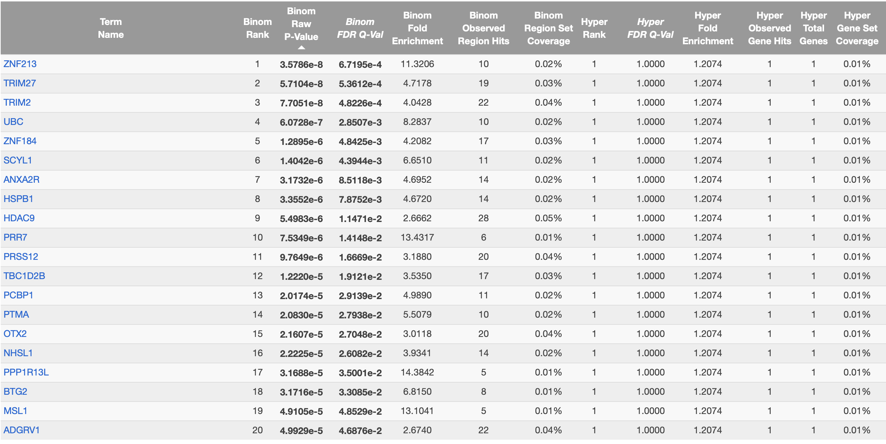
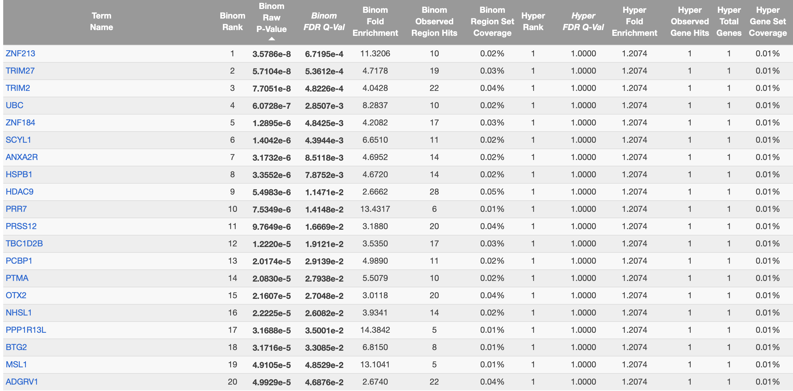
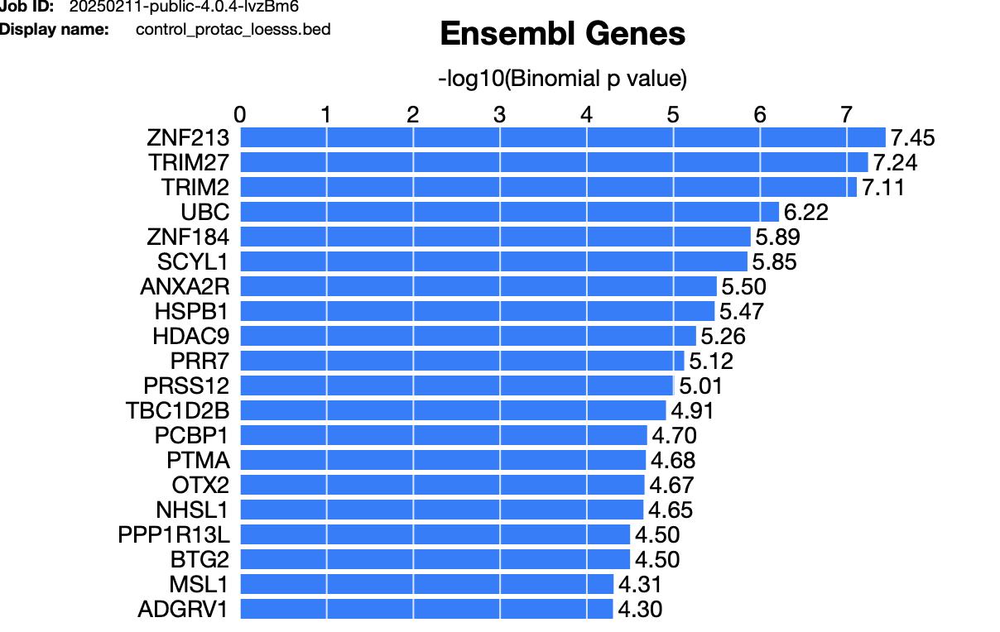

```{r setup, incldue=FALSE}
knitr::opts_chunk$set(echo = TRUE)
```

# BMEG 424 Assignment 4: ATAC-seq

## Introduction:
### Goals and Objectives

The goal of todays assignment is to familiarize you with ATAC-seq data.You recently learned about ATAC-seq in class and how it can be used to understand DNA accessibility across different genomic regions and under different conditions. In the last assignment we mainly focused on processing our ChIP-seq data (ex. calling peaks) and some simple analysis on processed data which could be used to understand the nature of the data and experiments they came from.

In this assignment we will be working with ATAC-seq data files which have been almost completely processed and will instead focus much more on the analysis of the data (instead of processing).

### Data

The data for todays assignments are located at `/projects/bmeg/A4/`. None of your processing needs to be done on the server today so you should be able to download the file (yes, singular!) directly to your local machine.

### Software and tools

As stated above, your data is already processed so you will not need to use any of the command line tools used in the previous assignments.
Instead, you will be using R and RStudio to perform your analysis.
You will need to install a few packages to your R environment to complete this assignment.
You may have some of these installed from previous assignments, if not install them now.
The packages are:

-   [tidyverse](https://www.tidyverse.org/) (includes tidyr, dplyr, ggplot2, etc.)

-   [edgeR](https://www.bioconductor.org/packages/devel/bioc/vignettes/edgeR/inst/doc/edgeRUsersGuide.pdf)

-   [GenomicRanges](https://bioconductor.org/packages/devel/bioc/vignettes/GenomicRanges/inst/doc/GenomicRangesIntroduction.html)

-   [Biostrings](https://bioconductor.org/packages/devel/bioc/manuals/Biostrings/man/Biostrings.pdf)

-   [csaw](https://bioconductor.org/packages/release/bioc/html/csaw.html)

-   [gridExtra](https://cran.r-project.org/web/packages/gridExtra/index.html) (only needed for the MA plots)


## Experiment and Analysis:

### 1. ATAC-seq

Our data for this assignment comes from a study which examined the effect of pharmacological inhibition of the BAF chromatin-remodelling complexes. Mutations in these complexes are often associated with drastic changes in chromatin accessibility and, as a result, cancer formation. In the study, the authors used drugs to mimic the effects of these cancer-associated mutations and measured the effect on chromatin accessibility using ATAC-seq.

### 2. Exploratory Data Analysis and QC

#### a. Load and reformat data

Download the data file from `/projects/bmeg/A4/` and load it into R using `read.table`, the code for this is provided below:

```{r}
# Read in gzipped file from working directory
downloaded_file_path <- "/Users/sepehrnouri/BMEG424/A4/count_matrix_raw_atac_BRM014_ACBI1.csv.gz"
atacSeqData <- read.table(gzfile(downloaded_file_path), sep = ",", stringsAsFactors = FALSE, header = TRUE)
```

You can use `head` and `tail` to look at the first and last few rows of the data.

```{r}
head(atacSeqData)
tail(atacSeqData)
```

You can use the `dim` function to see the dimensions of your data, and the `names` function to see the column names.

```{r}
dim(atacSeqData)
names(atacSeqData)
```

Assuming you have not somehow messed up the download, you should have a data frame with 25 columns and 56617 rows.
The first column is the genomic region while the other columns are different experiments that were carried out.
Your columns should be formatted like this:

```         
R1_24h_DMSO
```

Here, R1 represents the replicate number (each experiment was run in duplicate), 24h represents the time point (the effect of the different drugs tested was measured at multiple time points) and DMSO represents the drug used.
There are two different drugs used in this study, BRM014 (labelled "N" in our data file) and BI_protac, DMSO is one of the control conditions (there is another control condition with no drug added labelled "control").
This means that there are 4 different conditions in this study: BRM014, BI_protac, DMSO and control.
**You'll want to rename all of your columns which currently include "N" to include "BRM014" instead, as it will make the rest of this assignment a lot less confusing.** Another good idea is to **rename "BI_protac" to "BI-protac"** to avoid confusion with the "\_" delimiter that separates the replicate, timepoint and treatment.

```{r}
# rename rows with "N" to "BRM014"
colnames(atacSeqData) <- gsub("N", "BRM014", colnames(atacSeqData))
# rename rows with "BI_protac" to "BI-protac" to avoid confusion with the "_" delimiter
colnames(atacSeqData) <- gsub("BI_protac", "BI-protac", colnames(atacSeqData))
```

As you can see, the data are currently stored in "wide" format, where each column represents a different experiment. While this format is pretty intuitive for humans to read, it is not ideal for analysis. We will want to convert our data to "tidy" format where each row represents an individual observation (currently a single row in our data represents 24 different data points/observations).
Our data will become much "longer" as we will have 24 rows for each row in our current data frame.
After reshaping our current data frame, we will have 56617\*24 = 1,358,808 rows and 5 columns.
The data should look something like this:

```{bash, eval=FALSE}
region,replicate,timepoint,treatment,read_count
chr1:181169-181759,R1,24h,DMSO, 32
chr1:181169-181759,R1,24h,BRM014, 18
...
```

#?# 1. Format your data into tidy format like the example above (0.5 pts)

```{r}
install.packages("tidyverse")
library(tidyverse)
# converting from wide to long format
atacSeqData_long <- atacSeqData %>%
  pivot_longer(cols = -region,
               names_to = "experiment",       # original column names "R1_24h_BRM014" become new column "experiment"
               values_to = "read_count") %>%  # data values for each experiment will be placed in a new column called "read-count"
  separate(experiment,                         # 
           into = c("replicate", "timepoint", "treatment"), # divide "experiment" to x3 new columns
           sep = "_")

```

#### b. Exploratory Data Analysis

#?# 2. In order to understand your data better create a heatmap of the read counts for each condition. (0.5 pts) 
Have one subplot for each replicate, with timepoints on the y-axis, treatments on the x-axis, and tiles coloured by read count. You should include the number of reads on each tile as well. Note that your heat-map should plot ALL possible permutations of replicate-timepoint-treatment, even if missing from the data file.
(Example: There is no R1_6h_DMSO column in the original data but that tile should exist in your plot)

```{r}
library(tidyverse)
library(ggplot2)

# using expand.grid to make dataframe of all possible (x,y)axis combinations 
# in total we should have 24 combinations for each Replicate
all_combinations <- expand.grid(
  replicate = unique(atacSeqData_long$replicate),
  timepoint = unique(atacSeqData_long$timepoint),
  treatment = unique(atacSeqData_long$treatment)
)

# merge with the actual data to get missing combinations
atacSeqData_long_complete <- all_combinations %>%
  left_join(atacSeqData_long, by = c("replicate", "timepoint", "treatment"))

# replacing missing read_counts (for non-existent experiments) with 'NA'
atacSeqData_long_complete$read_count[is.na(atacSeqData_long_complete$read_count)] <- NA

# creating a new variant where read_count is the sum of all read counts for each treatments and timepoints
atacSeqData_long_sum <- atacSeqData_long_complete %>%
  group_by(replicate,treatment, timepoint) %>%
  summarise(read_count = sum(read_count, na.rm = TRUE)) %>%
  ungroup()

# heatmap using the sum of atac-seq reads for each treatment & timepoint tile
ggplot(atacSeqData_long_sum, aes(x = treatment, y = timepoint, fill = read_count)) +
  geom_tile(color = "white") +
  geom_text(aes(label = ifelse(read_count > 0, format(read_count), "")), 
            color = "white", size = 3) +
  facet_wrap(~ replicate) +
  scale_fill_viridis_c(option = "D", na.value = "white", limits = c(0, NA)) +
  labs(title = "Heatmap of Read Counts for Each Condition",
       x = "Treatment",
       y = "Timepoint",
       fill = "Read Count") +
  theme_minimal() +
  theme(axis.text.x = element_text(angle = 45, hjust = 1),  # Rotate x-axis labels for better readability
        strip.text = element_text(size = 12),
        plot.title = element_text(hjust = 0.5))


```

#?# 3. Interpret the plot above, what do you notice about the data? (1 pts)
```
To analyze the heatmap data, we can compare the read-count over time of BAF complex mutator drgus (BI-protac, BRM014) to the baseline (DMSO) and control. If any treatment shows a significant difference in read counts compared to these controls, it could indicate that the treatment has a significant effect on chromatin accessibility.

Before analyzing the effect of mutator drgus, we must decide if the results above are robust by assessing the consistency between the replicates. If the patterns in the two panels (R1 and R2) are similar, this suggests that the experiment is reproducible; however for us, thats not the case!

--R1 Drug by Drug Effect Comparrison on Chromatin Accessibility
BRM014: the read count at timepoints 24h, 6h, closely matches the control group. therefore we cannot deduce it effect's chromatin accessiblity. 
BI-protac: the read count at timepoints 24,6h closely matches the control group. same conclusion as BRM014.

--R2 Drug by Drug Effect Comparrison on Chromatin Accessibility
BRM014: compared to control, at 6hr, it does show a lower -18% read-count, this might suggest that while this drug stay active for 6hrs, it could effect BAF complex and chromatin positioning, such that we have LOWER accessiblity.
BI-protac: compared to control, at 6hr we see a higher +35% read-count. This can suggest that while this drug stay active for 6hrs, it can effect BAF complex such that we see an INCREASE in chromatin accessibility.

```

For the rest of this assignment we are only interested in the BRM014, BI_protac and control conditions.
We will only compare them at the 24h timepoint (this is the only timepoint where all three conditions were measured).
Using the tidy-formatted data you generated in above (in the format like shown on lines 88-92):

#?# 4. Filter your data to only include the BRM014, BI_protac and control conditions at the 24h timepoint. **Keep both replicates**. (0.5 pts)

```{r}
# filtering to only include 24hr timepoint read-count
atacSeqData_filtered <- atacSeqData_long_complete %>%
  filter(timepoint == "24h", treatment %in% c("BRM014", "BI-protac", "DMSO", "control"))

# a smaller table that shows sum of read counts
atacSeqData_filtered_sum <- atacSeqData_filtered %>%
  group_by(replicate,treatment, timepoint) %>%
  summarise(read_count = sum(read_count, na.rm = TRUE)) %>%
  ungroup()

```

#### c. Normalization

We will be using the counts-per-million (CPM) normalization method on our data.
There are far more complex ways to normalize data but CPM is a simple and effective method which serves our purposes well here.
You can run the following code on your filtered data (from Q4) to normalize your data:

```{r}
# atacSeqDataSOI <- replace with <your tidy data frame>
atacSeqDataSOI <- atacSeqData_filtered %>%
    group_by(replicate, timepoint, treatment) %>%
    mutate(countsPerMillion = 1000000 * read_count / sum(read_count))

```

#?# 5. What does CPM normalize for? Is this necessary for our data? How do you know? (1 pts)
```
so, in the CPM calculation above, we have grouped the 24hr filtered atacSeqData by columns 'replicate, timepoint, treatment'. In total we have 8 different groups (x1 timepoint, x4 drugs, x2 replicates). the sum of read count for each group are stored in atacSeqData_filtered_sum!

after we grouped them, we calculated the proportion of read_count relative to the sum of read counts within that group. This step ensures that we’re normalizing the read counts for EACH condition based on the total reads WITHIN that group; which is then scaled by 1,000,000.

Is this necessary?  Absolutely.
As answered in the previous question, Replica1 vs. Replica2 have very different read count for BI-protaic, DMSO and control conditions. Replica2 experiment clearly has alot more reads than Replica1, even though its same conditions. This can lead to bias in comparison, so CPM can help us adjust that bias by re-caling the raw counts relative to total reads of each condition. Without normalization, a sample with more total reads will appear to have higher chromatin accessibility simply due to the greater number of reads, which would obscure true biological differences.

```

#?# 6. Are there some *non-normalization* methods that would be good alternatives to CPM? Discuss potential advantages and disadvantages of these methods. (1 pts)
```
Method#1: from BMEG310, i recall PRKM (Reads Per Kilobase of transcript per Million mapped Reads)
Use case: for comparing gene expression data within the same experiment, particularly if gene length varies significantly.
Advantage: accounts for gene length so that larger genes don’t naturally have higher read counts just because they are longer.
Disadvantage: biases for highly expressed genes, it tends to produce large variations in the values for very lowly expressed genes, which can be misleading in some cases.
Length bias remains for short features: While it adjusts for gene length, this method is still limited when comparing very small features (e.g., short exons or non-coding regions).

Method#2: EdgeR normalization (im guessing we use this later for this assignment)
Use case: for performing differential expression analysis between different conditions or treatments.
Advantage: the normalization accounts for both differences in sequencing depth and differences in the relative proportions of features across samples.
Disadvantage: more complex than CPM. Hence, computationally intensive and require more advanced knowledge of biostatistics to use properly.

```

#?#7.Using ggplot, plot the kernel-density estimate of the distribution of CPM normalized read counts for each condition. Use different colours for each curve. (0.5 pts)

```{r}
# HINT: You should log-scale your data when plotting the KDE
atacSeqDataSOI_log <- atacSeqDataSOI %>%
  mutate(logCPM = log1p(countsPerMillion)) #log1p helps avoid log(0) vals


ggplot(atacSeqDataSOI_log, aes(x = logCPM, color = treatment, fill = treatment)) +
  geom_density(alpha = 0.2) + # setting transparency lower for easier visualization!
  labs(title = "Kernel Density Estimate of CPM Normalized Reads",
       x = "Counts-per-Million (CPM)",
       y = "Density") +
  scale_color_manual(values = c("BRM014" = "blue", "BI-protac" = "purple","DMSO" = "brown" ,"control" = "green")) +
  scale_fill_manual(values = c("BRM014" = "blue", "BI-protac" = "purple", "DMSO" = "brown","control" = "green")) +
  facet_wrap(~ replicate) +
  theme_minimal() +
  theme(legend.position = "top")
```

#?# 8. Interpret the plot above, what do you notice about the data? (0.5 pts)
```
the distribution of all conditions are right-skewed. 
This suggests on general, for each condition we have read counts from 1/million to 4/million. 
Compared to Control and DMSO, the two mutator drugs BI-protac, BRM014 seem to result in a higher concentration around lower CPM values with a broader distribution.
whereas COntrol and DMSO (look almost identical given they are our baseline controls) have a narrower distribution of CPM but sharper concentration around 2.5CPM values. 

A deeper comparisson between BRM014 vs. BI-protac:
BI-protac (purple): has broader Density-CPM coverage than baseline conditions. 
Compared to baseline, it has higher density around 1.5CPM with peak at 2.2CPM which reduces in density as it approaches 4 CPM.  
The peak for baseline is at a higher CPM (2.5) with higher density as well. 
The baseline also has higher density as we proceed to higher CPMs. 
To me this suggests that BI-protac reduces chromatin oppenness and accessability. 
Most of the density is distrubuted along CPM 1.5->4 with max density at 50% levels (2.2peak), which suggests that relative to baseline, the chromatin regions have lost accessibility.

BPRM014 (blue): it has an ever broader and less sharp peak compared to BI-protac. 
this suggests that it effects the chromatin accessibility more, compared to BI-protac. 
this drug results in lower chromatin accessibility given read counts cover a lower end of the distribution with a shallower peak.
```

#?# 9. Filter any regions which have a CPM (in any condition) of >400 into a separate data.frame and inspect them. What do you notice about these regions? (1.5 pts)

```{r}
# HINT: Once you've generated your new data frame you can view it as a table in RStudio by clicking on the data frame in the environment tab and then clicking "view" or export it to a csv file using the write.table function
atacSeqData_high_CPM <- atacSeqDataSOI %>%
  filter(countsPerMillion > 400)
```

```
looking at the regions with CPM > 400, seems like we are only targetting chr1 and chrM. 

-- Replicate 1:
on chr1:633778-634279, the DMSO-CPM (617.12) and control-CPM (787.89) have lower values than BRM014-CPM (862.52) and BI-Protac-CPM (1154.03). 
Which means at this region, the BAF mutator drugs did infact increase chromatin accessiblity. 

now analyzing some of chrM regions, for chrM:198-854, chrM:2059-2771, chrM:2868-3973, and chrM:12425-14404, 
the CPM values from lowest to greatest are in this order (relative to control): DMSO (-17%) < Control < BRM (+11%) < BI (+49%). 
Similar to the case with chr1, it seems that both BI-protac and BRM014 result in BAF complex mutation 
that allowed chromatins to become more accessible; with BI-protac having the highest effect.

--Replicate 2:
similar observation as replicate 1
```
#### d. Filtering

We will now filter our data to remove regions which have very low read counts.
This is a common step in ATAC-seq analysis as regions with very low read counts are often not real and are instead the result of noise in the data.
We will remove regions which have a mean of less than 10 reads.

#?# 10. Filter your data to remove regions which have a mean of less than 10 reads across our samples of interest. (0.5 pts)
```{r}
# first we calculate the mean of read count for each region
atacSeqData_filtered_mean <- atacSeqDataSOI %>%
  group_by(region) %>%
  summarise(mean_read_count = mean(read_count, na.rm = TRUE)) %>%
  filter(mean_read_count >= 10)  # only keeping regions with mean read-count > 10

# only keeping the rows from atacSeqDataSOI that correspond to the regions in atacSeqData_filtered_mean
atacSeqData_noLowReads <- atacSeqDataSOI %>%
  semi_join(atacSeqData_filtered_mean, by = "region")

head(atacSeqData_noLowReads)

```

#?# 11. Remove any mitochondrial regions from your data. (0.5 pts)
```{r}
# we have chromosome labeled as chrM. we assume these regions relate to mitochondira activity!

# removing mitochondrial regions (labeled as chrM)
atacSeqData_filtered_no_mito <- atacSeqData_filtered %>%
  filter(!grepl("^chrM", region))

head(atacSeqData_filtered_no_mito)

```

### 3. Differential Accessibility Analysis

We will now perform differential accessibility analysis on our data. We will be using the edgeR package to do this.
edgeR is a package which is used to identify differentially expressed genes in RNA-seq data. We will be using it to identify differentially accessible regions in our ATAC-seq data.

edgeR will require the data to be back in wide format for the analysis. We will need to convert our data back into wide format before we can continue. Your data should look like this (there are no values in the table below, this is just to show you the general structure):
```
R1_24h_control	R1_24h_BI-protac	R2_24h_control	R2_24h_BI-protac 
chr4:84336780-84337568   
chr8:112059072-112060092 
chr17:55482241-55483505

```

Below we've provided a function which will:

1. Format your data like above
2. Perform differential accessibility analysis on your data. You can use this function to perform differential accessibility analysis on your data.

**NOTE**: This function may not work as is, if you've done any of the above steps incorrectly or even if you've done them 'correctly' but in a way we didn't expect, you may need to modify the function to get it to run with your own data. A common error in previous years was the datatype being incorrect.
```{r}
library(csaw)
library(edgeR)

# this function needs the atacSeqDataSOI for input since it needs to be in long format + have countsPerMillion column!
# we will use the atacSeqData_noLowReads data.frame. its basically a filtered atacSeqDataSOI from Q10.

analyze_differential_expression <- function(atacSeqData, comparison, normalization_method = "TMM") {
    countsMatrix <- atacSeqData %>%
        filter(treatment %in% comparison) %>%
        mutate(condition = paste(replicate, timepoint, treatment, sep = "_")) %>%
        select(region, condition, countsPerMillion) %>%
        pivot_wider(names_from = condition, values_from = countsPerMillion) %>%
        column_to_rownames(var = "region")

    treatments <- gsub("R\\d+_\\d+h_(\\w+)", "\\1", colnames(countsMatrix))
    treatments <- factor(treatments)

    y <- DGEList(counts = countsMatrix, group = treatments)

    if (normalization_method == "loess") {
        y <- normOffsets(y, method = "loess")
    } else if (normalization_method == "TMM") {
        y <- calcNormFactors(y)
    }

    design <- model.matrix(~treatments)
    print(design)

    y <- estimateDisp(y, design)

    # Perform differential expression analysis
    fit <- glmQLFit(y, design)
    qlf <- glmQLFTest(fit, coef = 2)

    # Get the top differentially expressed genes
    allDEStats <- as.data.frame(topTags(qlf, n = nrow(countsMatrix)))
    allDEStats$region <- row.names(allDEStats)

    return(allDEStats)
}

# Example usage:
# result <- analyze_differential_expression(atacSeqDataSOI, comparison=c("BRM014","BI_protac"), normalization_method="loess")
```

You will need to provide the function with your data (the tidy and filtered atac-seq data) and the comparison you want to perform.
You should perform each of the following comparisons:

-   Control vs BI_protac
-   Control vs BRM014
-   BRM014 vs BI_protac

#?# 12. Run the above function *six* times to perform each of the comparisons listed above. You should perform each comparison with loess and TMM normalization (1 pts)
```{r}
# from piazza post @74, we need to convert to csv and read, to prevent error.
write.csv(atacSeqDataSOI, "atacSeqDataSOI.csv")
atacSeqDataSOIcsv <- read.csv("atacSeqDataSOI.csv")


# control vs BI_protac
control_protac_loess <- analyze_differential_expression(atacSeqDataSOIcsv, comparison=c("control","BI-protac"), normalization_method="loess")
control_protac_TMM <- analyze_differential_expression(atacSeqDataSOIcsv, comparison=c("control","BI-protac"), normalization_method="TMM")

# control vs BRM014
control_BRM_loess <- analyze_differential_expression(atacSeqDataSOIcsv, comparison=c("control","BRM014"), normalization_method="loess")
control_BRM_TMM <- analyze_differential_expression(atacSeqDataSOIcsv, comparison=c("control","BRM014"), normalization_method="TMM")

# BRM014 vs BI_protac
BRM_protac_loess <- analyze_differential_expression(atacSeqDataSOIcsv, comparison=c("BRM014","BI-protac"), normalization_method="loess")
BRM_protac_TMM <- analyze_differential_expression(atacSeqDataSOIcsv, comparison=c("BRM014","BI-protac"), normalization_method="TMM")

```

#?# 13. Create 6 MA plots (using ggplot) for each of the comparisons you performed in the previous question. Present them as subplots of the same figure. (1 pts)
```{r}
# HINT: There are many packages which implement MA plots in R, you are supposed to use ggplot to make them manually.
library(gridExtra) # This package will be useful for creating subplots

# Function to create an MA plot from the differential expression results
create_ma_plot <- function(de_results, title) {
  # M is log fold change, already present as logFC
  de_results$M <- de_results$logFC
  
  # A is the average log-transformed counts per million (CPM)
  de_results$A <- de_results$logCPM
  
  # Create the MA plot using ggplot2
  ggplot(de_results, aes(x = A, y = M)) +
    geom_point(alpha = 0.5, color = "blue") +
    theme_minimal() +
    labs(title = title, x = "Average Expression (A)", y = "Log Fold Change (M)") +
    theme(plot.title = element_text(hjust = 0.5))
}

# Create MA plots for each comparison (using your differential expression results)
ma_plot_control_BI_loess <- create_ma_plot(control_protac_loess, "Control vs BI-protac (Loess)")
ma_plot_control_BI_TMM <- create_ma_plot(control_protac_TMM, "Control vs BI-protac (TMM)")

ma_plot_control_BRM_loess <- create_ma_plot(control_BRM_loess, "Control vs BRM014 (Loess)")
ma_plot_control_BRM_TMM <- create_ma_plot(control_BRM_TMM, "Control vs BRM014 (TMM)")

ma_plot_BRM_protac_loess <- create_ma_plot(BRM_protac_loess, "BRM014 vs BI-protac (Loess)")
ma_plot_BRM_protac_TMM <- create_ma_plot(BRM_protac_TMM, "BRM014 vs BI-protac (TMM)")

# Arrange the 6 MA plots into a grid (2 rows and 3 columns)
grid.arrange(ma_plot_control_BI_loess, ma_plot_control_BI_TMM, 
             ma_plot_control_BRM_loess, ma_plot_control_BRM_TMM, 
             ma_plot_BRM_protac_loess, ma_plot_BRM_protac_TMM, 
             nrow = 2, ncol = 3)


```

#?# 14. Create (using ggplot) a volcano plot for the comparison between BRM014 and BI_protac (loess normalized), with -log10(p-value) on the y axis and logFC on the x. Colour points that are significant at a FDR<0.01. (0.5 pts)
```{r}
# Add a new column for -log10(p-value)
BRM_protac_loess$logPValue <- -log10(BRM_protac_loess$PValue)

# Define significance threshold (FDR < 0.01)
BRM_protac_loess$significant <- BRM_protac_loess$FDR < 0.01

# Create the volcano plot
ggplot(BRM_protac_loess, aes(x = logFC, y = logPValue, color = significant)) +
  geom_point(alpha = 0.7) +  # Scatter plot with alpha transparency for better visualization
  scale_color_manual(values = c("black", "red")) +  # Color significant points in red
  labs(title = "Volcano Plot: BRM014 vs BI-protac (Loess)",
       x = "Log Fold Change (logFC)",
       y = "-Log10(p-value)") +
  theme_minimal() +
  theme(legend.position = "none")

```

### 4. "Gene" Ontology (GO) Analysis

For this section we will be using GREAT (Genomic Regions Enrichment of Annotations Tool) which is a tool used to identify the biological functions of a set of genomic regions.
GREAT uses the Gene Ontology (GO) database to identify the biological functions of a set of genomic regions.
The GO database is a collection of terms which describe the biological functions of genes.
For example, the term "cell cycle" describes the function of genes which are involved in the cell cycle.

GREAT works by taking a set of genomic regions and identifying the genes which are nearby to those regions.
It then uses the GO database to identify the biological functions of those genes.
It then uses a hypergeometric test to identify which GO terms are enriched in the set of genes near the genomic regions of interest.
*GREAT is available as a web tool (<https://great.stanford.edu/great/public/html/splash.php>)*

#### a. Preparing your data for GREAT

GREAT requires your data to be in a specific format.
You will need to convert your data to this format before you can use GREAT.
The format is as follows:

```         
chr1    10000   20000
chr1    30000   40000
...
```

As you can see this is the basics of a BED file.
You will need to convert your data to this format.
You can do this using the `write.table` function.
You'll need to separate the "region" column in your differential analysis results into three columns: chromosome, start and end.
You can do this using the `separate` function from the `tidyr` package or using regular expressions (regex).

#?# 15. Create a pseudo-BED file for each of the results of your differential analysis. Fill in the code you used below. (1pts)
```{r, eval=FALSE}
library(tidyr)

## BRM - PROTAC
# dividing region column into chromosome, start, and end
BRM_protac_loess <- BRM_protac_loess %>%
  separate(region, into = c("chromosome", "start_end"), sep = ":", remove = FALSE) %>%
  separate(start_end, into = c("start", "end"), sep = "-", remove = TRUE)

# making sure columns are correct data type
BRM_protac_loess$start <- as.numeric(BRM_protac_loess$start)
BRM_protac_loess$end <- as.numeric(BRM_protac_loess$end)

# we only need chromosome, start and end columns
bed_data1 <- BRM_protac_loess %>%
  select(chromosome, start, end)

write.table(bed_data1, "BRM_protac_loesss.bed", sep = "\t", row.names = FALSE, col.names = FALSE, quote = FALSE)

BRM_protac_tmm <- BRM_protac_TMM %>%
  separate(region, into = c("chromosome", "start_end"), sep = ":", remove = FALSE) %>%
  separate(start_end, into = c("start", "end"), sep = "-", remove = TRUE)

# making sure columns are correct data type
BRM_protac_tmm$start <- as.numeric(BRM_protac_tmm$start)
BRM_protac_tmm$end <- as.numeric(BRM_protac_tmm$end)

# we only need chromosome, start and end columns
bed_data2 <- BRM_protac_tmm %>%
  select(chromosome, start, end)

write.table(bed_data2, "BRM_protac_tmm.bed", sep = "\t", row.names = FALSE, col.names = FALSE, quote = FALSE)

## BRM - Control
# dividing region column into chromosome, start, and end
control_BRM_loess <- control_BRM_loess %>%
  separate(region, into = c("chromosome", "start_end"), sep = ":", remove = FALSE) %>%
  separate(start_end, into = c("start", "end"), sep = "-", remove = TRUE)

# making sure columns are correct data type
control_BRM_loess$start <- as.numeric(control_BRM_loess$start)
control_BRM_loess$end <- as.numeric(control_BRM_loess$end)

# we only need chromosome, start and end columns
bed_data3 <- control_BRM_loess %>%
  select(chromosome, start, end)

write.table(bed_data3, "control_BRM_loess.bed", sep = "\t", row.names = FALSE, col.names = FALSE, quote = FALSE)

control_BRM_tmm <- control_BRM_TMM %>%
  separate(region, into = c("chromosome", "start_end"), sep = ":", remove = FALSE) %>%
  separate(start_end, into = c("start", "end"), sep = "-", remove = TRUE)

# making sure columns are correct data type
control_BRM_tmm$start <- as.numeric(control_BRM_tmm$start)
control_BRM_tmm$end <- as.numeric(control_BRM_tmm$end)

# we only need chromosome, start and end columns
bed_data4 <- control_BRM_tmm %>%
  select(chromosome, start, end)

write.table(bed_data4, "control_BRM_tmm.bed", sep = "\t", row.names = FALSE, col.names = FALSE, quote = FALSE)


## control - PROTAC
# dividing region column into chromosome, start, and end
control_protac_loess <- control_protac_loess %>%
  separate(region, into = c("chromosome", "start_end"), sep = ":", remove = FALSE) %>%
  separate(start_end, into = c("start", "end"), sep = "-", remove = TRUE)

# making sure columns are correct data type
control_protac_loess$start <- as.numeric(control_protac_loess$start)
control_protac_loess$end <- as.numeric(control_protac_loess$end)

# we only need chromosome, start and end columns
bed_data5 <- control_protac_loess %>%
  select(chromosome, start, end)

write.table(bed_data5, "control_protac_loesss.bed", sep = "\t", row.names = FALSE, col.names = FALSE, quote = FALSE)

control_protac_tmm <- control_protac_TMM %>%
  separate(region, into = c("chromosome", "start_end"), sep = ":", remove = FALSE) %>%
  separate(start_end, into = c("start", "end"), sep = "-", remove = TRUE)

# making sure columns are correct data type
control_protac_tmm$start <- as.numeric(control_protac_tmm$start)
control_protac_tmm$end <- as.numeric(control_protac_tmm$end)

# we only need chromosome, start and end columns
bed_data6 <- control_protac_tmm %>%
  select(chromosome, start, end)

write.table(bed_data6, "control_protac_tmm.bed", sep = "\t", row.names = FALSE, col.names = FALSE, quote = FALSE)

```


#### b. Interpreting your results

Once you have created your pseudo-BED files (one for each of the results of your differential analysis) you can upload them to GREAT. Use the hg38 genome, with the whole genome being your background. You will need to use the "single nearest gene" option (click on advanced options) when testing your data.

Because the drugs we are using affect accessibility broadly across the genome our results will be tough for GREAT's hypergeometric test to interpret. You should select the "Significant By Region-based Binomial view." GREAT should prompt you to do this after it displays your results. This will be more informative for our data.

Once you have tested your data on GREAT you will be presented with a list of GO terms which are enriched in your data.
You can click on each GO term to see the genes which are associated with that term.
You can also click on the "Genes" tab to see all of the genes which are associated with your data.

#?# 16. Upload your (loess normalized) ControlvsBRM014 and ControlvsBI_protac results to GREAT. Insert a screenshot of the top 20 associated ENSEMBL genes for each comparison. (1 pts)

**Control vs BRM014 top 20 ENSEMBL genes (GREAT) **



**Control vs BI-protac top 20 ENSEMBL genes (GREAT) **





## Discussion
#?# 17. Based on your analysis above, what effect do you think BRM014 and BI_protac had on chromatin accessibility? Are they similar? Use evidence from your analysis to support your response (2 pts) 
```
--- using part2 analysis
I believe BRM014 and BI-protac induce similar mutations on BAF complexes, which in turn effect chromatin accessibility. 
In part2, from the Kernel Density plot or CPM normalized conditions, we see that for both replicates, 
BRM014 and BI_protac have cover a broader range of CPM reads with density scores that are in the median (not low and not as sharp as control groups). 
We can see a higher density of lower CPM values; 
this means that these drugs affected the chromatin in a way that some regions that were suppose to be on a higher CPM value, 
shifted to a lower value (We can spot this easily since blue and purple curves have higher density at 1.5CPM relative to control). 
So the conclusion from KD plot alone would be that, these drugs reduce chromatin accessiblity, since we have more density of lower CPM values for our chromatin regions.

--- using part3 & 4 analysis
furthermore, from the ControlVsDrugs_Loess MA plots, we can see that Control_BRM014 and Control_BI-protac have very similar LogFC over average expression charts. 
To me this signals that BRM014 and BI-protac have similar gene count and variance of gene expression (locations along chromatin). 
This can be confirmed by the top 20 expressed gene's from GREAT results, where both drugs have identical Ensembl Genes (is this normal?).

As such, I think BRM014 and BI_protac are similar, and reduce chromatin accessibility.
```

#?# 18. Based on your analysis above, can you tell if BRM014 and/or BI_protac are good pharmacological models for studying the effects of the cancer-associated mutations the authors were trying to mimic? Why or why not? (2 pts)
```
#HINT: Print the length of the bed files you made above, do you notice anything interesting? 
so, the authors were experimenting the effect of pharmacological inhibitors (like BRM014 and BI-protac) 
to mimic the effects of cancer-associated mutations in chromatin-remodelling (BAF) complexes.
We know that mutations in these complexes change chromatin accessibility, a critical factor in regulating gene expression, and contribute to cancer formation.

We can use the analysis (MA and volcano plots) in part3 to see whether BRM014, 
and BI-protac influenced chromatin accessibility, similar to how they occur in cancer-associated mutation.

Looking at controlVsBRM and controlvsPI MA plots, we notice relatively high LogFCs. 
this can indicate the drugs do strongly effect chromatin accessibility. 
The Volcano plot also has many points at significant low p-value ranges (in red); 
this suggests both BRM and BI-protac can significantly modify chromatin accessibility. 
Now we need to confirm whether these accessbility changes mimic a cancer associated mutation.

BAF complex includes genes like SMARCB1 (SNF5), SMARCA4 (BRG1), PBRM1, ARID1A, 
so I assume cancer-associate mutations should occur in these regions. 
However looking at the top 20 ENsemble Genes from GREAT results for differential gene expression 
levels induced by our drugs, it seems that none of them target BAF complex genes.

Conclusion: no, these drugs were not the best for mimicing cancer-associated mutations.
```

#?# 19. We used two normalization methods in our differential accessibility analysis, TMM and Loess. Which do you think is more reliable for our data, and why? (2 pts)
```
Looking at MA plots, because we are not seeing too much outlier along the y-axis (LogFC), 
TMM is not necessary since its designed to reduce impact of outliers. also, our data doesn't 
have large scale differences in differential gene expression levels (comparing ControlvsBRM to ControlVsProtac) so we don't need TMM because it normalizes based on overall distribution of counts. In this experiment, 
we already know our two drugs will induce some chromatin accessability changes, 
we are just assessing whether their gene differential patterns match that of cancer mutations. 
loess normalization is prefered. Its smoothing mechanism helps better account for local patterns in our data, 
especifically differences in gene expression patterns that we want to observe from these drugs.
```
## Contributions
** This assignment was done individually by Sepehr Nouri, 97912356.

## Sources
- chatGPT: https://chatgpt.com/share/67ac2c2f-2958-800f-967a-409632a1bca6 (for code review and part of questions i didn't understand)
- Part2: https://tidyr.tidyverse.org/reference/pivot_longer.html, used for reshaping from wide->long format 
- Discussion: https://epigeneticsandchromatin.biomedcentral.com/articles/10.1186/s13072-019-0264-y#:~:text=In%20the%20course%20of%20evolution%2C%20some%20of%20the%20yeast%20SWI,alterations%20%5B27%2C%2030%5D.
(used to find which genes are expressed in BAF comlpex)