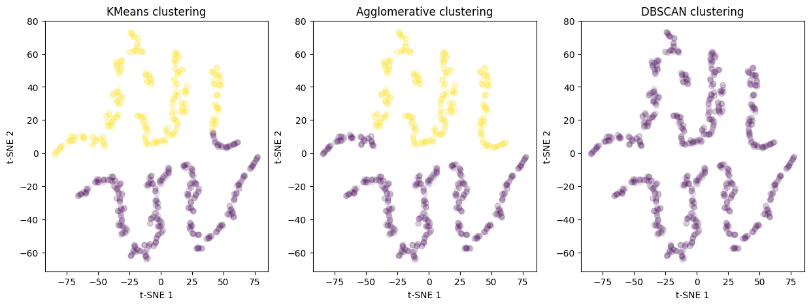

BMEG 424 Assignment 5 - SEPEHR NOURI
================

- [BMEG 424 Assignment 5: Machine Learning for Genome
  Informatics](#bmeg-424-assignment-5-machine-learning-for-genome-informatics)
  - [Introduction:](#introduction)
    - [Goals and Objectives](#goals-and-objectives)
    - [Data](#data)
    - [Submission:](#submission)
  - [Experiment and Analysis:](#experiment-and-analysis)
    - [1. Supervised Learning: Predicting Gene Expression from Promoter
      Sequence (4
      pts)](#1-supervised-learning-predicting-gene-expression-from-promoter-sequence-4-pts)
      - [a. MPRA Data:](#a-mpra-data)
      - [b. Preprocessing:](#b-preprocessing)
      - [c. Training a Simple Neural Network on our
        data](#c-training-a-simple-neural-network-on-our-data)
      - [d. Training a Convolutional Neural Network on our
        data](#d-training-a-convolutional-neural-network-on-our-data)
      - [e. Baseline: Linear Regression](#e-baseline-linear-regression)
    - [2. Unsupervised Learning: Clustering Single-Cell RNA-seq Data (4
      pts)](#2-unsupervised-learning-clustering-single-cell-rna-seq-data-4-pts)
      - [a. RNA-seq Data:](#a-rna-seq-data)
      - [b. Preprocessing/Dimensionality
        Reduction](#b-preprocessingdimensionality-reduction)
      - [d. Clustering (K-means, Hierarchical Clustering,
        DBSCAN)](#d-clustering-k-means-hierarchical-clustering-dbscan)
  - [Discussion (10 pts):](#discussion-10-pts)
- [Contributions](#contributions)
  - [This assignment was done by SEPEHR NOURI (97912356) alone. ChatGPT
    or other AI assistant tools were not
    used!](#this-assignment-was-done-by-sepehr-nouri-97912356-alone-chatgpt-or-other-ai-assistant-tools-were-not-used)

# BMEG 424 Assignment 5: Machine Learning for Genome Informatics

## Introduction:

### Goals and Objectives

The goal of this assignment is to introduce you to various applications
of machine learning in genome informatics. In the first part you will
use two approaches to predict the expression of a gene based on the
sequence of its promoter. In the second part you will use a variety of
unsupervised ML techniques to cluster cells based on their gene
expression profiles.

### Data

The data for this assignment are available on the server at
`/projects/bmeg/A5`: - `MPRA_data.txt` contains the sequences of 10,000
promoters used in an MPRA experiment. The first column contains the
promoter sequence and the second column contains the expression of the
reporter gene - `scRNA_counts.h5` contains the gene expression profiles
of 1500 cells across 2000 genes in a single-cell RNA-seq experiment.
Each row contains the expression profile of a single cell and each
column contains the expression of a single gene.

### Submission:

Submit your assignment as a knitted RMarkdown document. *Remember to
specify the output as github_document* You will push your knitted
RMarkdown document to your github repository (one for each group).
Double check that all files (including figures) necessary for your
document to render properly are uploaded to your repository. **Note**:
In this assignment we are also asking you to upload your .ipynb file
from Google colab (go to file\>download\>download .ipynb) and push it
along with your RMarkdown document.

You will then submit the link, along with the names and student numbers
of all students who worked on the assignment to the assignment 3 page on
Canvas. Your assignment should be submtited, and your last commit should
be made, before 11:59pm on the day of the deadline. Late assignments
will will be deducted 10% per day late. Assignments will not be accepted
after 3 days past the deadline.

## Experiment and Analysis:

### 1. Supervised Learning: Predicting Gene Expression from Promoter Sequence (4 pts)

#### a. MPRA Data:

In the first part of this assignment you will use two approaches to
predict the expression of a gene based on the sequence of its promoter.
These data are from a massively parallel reporter assay (MPRA)
experiment. You will learn more about MRPA’s next week, for now all you
need to know is that in an MPRA, a library of DNA sequences is cloned
upstream of a reporter gene and the expression of the reporter gene is
measured. The sequences in the library are typically designed to test
the effect of mutations or sequence variation on gene expression. The
data for this part of the assignment are in the file `promoters.txt`.
The first column contains the promoter sequence and the second column
contains the expression of the reporter gene.

Our aim is to predict the expression of the reporter gene based on the
sequence of the promoter using machine learning. We will use two
approaches to do this: a simple approach using linear regression and a
more complex approach using a neural network.

#### b. Preprocessing:

The first step is to preprocess the data. As you know, DNA is encoded in
A’s, T’s, G’s and C’s, and our data are in the form of a string
consisting of these nucleotides. Unfortunately our machine learning
models cannot work with strings, so we need to convert the DNA sequences
into a format that can be used for machine learning. We will use a
technique called one-hot encoding to convert the DNA sequences into a
matrix of 0’s and 1’s. In this matrix each column will represent a
nucleotide (A, T, G, C) and each row will represent a position in the
promoter sequence. The value of each element in the matrix will be 1 if
the nucleotide at that position is the same as the column and 0
otherwise.

Our data is stored in a simple text file, so we will need to write a
some code to process our data. Copy and run this code in Google colab:

``` python
import pandas as pd
from sklearn.preprocessing import LabelBinarizer
from sklearn.model_selection import train_test_split

# read in the MPRA data
data = pd.read_csv("/content/drive/MyDrive/PATH/TO/YOUR/DATA", sep='\t', header=None)
# rename the columns
data.columns = ['sequence', 'expression']
# set up the label binarizer from sklearn
lb = LabelBinarizer()
lb.fit(list('ACGT'))
# function for one hot encoding the data
def one_hot_encode(sequence):
    return lb.transform(list(sequence))
# one hot encode the sequence
data['ohc_sequence'] = data['sequence'].apply(one_hot_encode) # this line is using the pandas apply function to run the one_hot_encode function on each row of the dataframe
# preview result
print("Preprocessed data preview: ")
print(data.head())
```

This will read in the data and one-hot encode the sequences. This code
doesn’t save your one-hot-encoded data as we still have some processing
to do.

\#?# 1. What is the purpose of the `LabelBinarizer` class from the
`sklearn.preprocessing` module? (0.5 pts). Would our model work the same
without such a preprocessing step? (0.5pts)

    LabelBinarizer is a machine learning algorithm that converts multi-class labels to binary (0,1) labels. It does it in two steps: 
    1) apply .fit() to teach our localbinarizer instance object that the MPRA data has 4 classes (ACGT), then 
    2) apply .transform() to create the 1-hot-encoding matrix

    Our model wouldn't work the same without this step, because machine learning algorithms rely on numerical data. 

\#?# 2. What are the dimensions of a single one-hot encoded sequence in
your data? Is this what you expected? Why or why not? (1 pts)

    using single_ohc_sequence = data['ohc_sequence'].iloc[0], Dimensions of a single
    one-hot encoded sequence:  (200, 4).it makes sense, in our case, our promoters are
    200 bps in length, with each nucleotide classified as one of the x4 bases.
    So each base of promoter, example T, is represented as a 4x1 matrix [0,0,0,1]. 
    with 200 bps we should expect a matrix of 200 rows, 4 columns. 

Generally in machine learning your data are split into X and y, where X
is the data containing the features you will use to make predictions and
y is the data containing the target you are trying to predict. In this
case, X will be the one-hot encoded matrix and y will be the expression
of the reporter gene. We also need to split the data into a training
set, validation set and test set. The training set is used to fit the
model, the validation set is used to tune the hyperparameters of the
model and the test set is used to evaluate the performance of the model.
We will use the `train_test_split` function from the
`sklearn.model_selection` module to do this. Here is some code to get
you started:

``` python
import numpy as np
from sklearn.model_selection import train_test_split

# split the data into X and y
X = np.stack(data['ohc_sequence'])
y = data['expression'].values

# split the data into training, validation and test sets
X_train, X_test, y_train, y_test = train_test_split(X, y, test_size=0.2, random_state=24)
X_train, X_val, y_train, y_val = train_test_split(X_train, y_train, test_size=0.25, random_state=24)

# save the data (if you are working on google colab your variables work across cells so you don't technically need to save the data, you can just use the variables in the next cell)
# however if you run into problems it will be easier for the instructor to help you if you have saved the data
#np.save('X_train.npy', X_train)
#np.save('X_val.npy', X_val)
#np.save('X_test.npy', X_test)
#np.save('y_train.npy', y_train)
#np.save('y_val.npy', y_val)
#np.save('y_test.npy', y_test)
```

You can copy this code into the same script as the one-hot encoding code
and run it. The script will one-hot encode the sequences and split the
data into training, validation and test sets. The data will be saved to
files with the names specified at the end of the last code block. We are
saving the files in `.npy` format, which is a format used by the `numpy`
library to save arrays, this is a good format to use for large arrays of
numerical data.

\#?# 3. What is the purpose of the `random_state` argument in the
`train_test_split` function? What happens if you don’t specify a random
state? (1 pts) \## NO PART MARKS

    it CONTROLS the shuffling applied to the data BEFORE its split. 
    This helps with experiment reproducability everytime we re-run the code. 
    So that the same samples are in our train/val/test sets.

\#?# 4. What are the dimensions of your training, validation and test
sets? Explain why the dimensions are what they are. (1 pts)

    --Distribution
    we first split the data in 4:1 ratio for train:test then applied a second split on the training set 
    (for both X,Y) to allocate some of the training samples to validation;
    so 25% of the original 80% for training is now validation. 
    This makes our data distribution (train/val/test) -> (60%,20%,20%). 

    --Dimensions
    To explain why dimensions are the way they are, we keep in mind that:
    1. We have 10,000 promoter sequences, 
    2. X is features i.e., One-hot encoding matrix
    3. Y is target, i.e., reported Gene Expression level,

                                          X          Y
    Dimensions of training set:    (6000, 200, 4) (6000,)
    Dimensions of validation set:  (2000, 200, 4) (2000,)
    Dimensions of test set:        (2000, 200, 4) (2000,)

#### c. Training a Simple Neural Network on our data

First we are going to train a simple neural network on our data. We will
use the `Sequential` class from the `tensorflow.keras.models` module to
create the model and the `Dense` class from the
`tensorflow.keras.layers` module to create the layers of the model. We
will use the `mean_squared_error` and `r2_score` functions from the
`sklearn.metrics` module to evaluate the model.

First let’s design our neural network:

``` python
from tensorflow.keras.models import Sequential
from tensorflow.keras.layers import Dense, Flatten, Conv1D, MaxPooling1D
def create_simple_nn():
  input_shape = (200, 4)

  simple_nn = Sequential([
      Flatten(input_shape=input_shape),   # Flatten the input
      Dense(512, activation='relu'),      # Fully connected layer with 512 units
      Dense(256, activation='relu'),       # Fully connected layer with 256 units
      Dense(1)                            # Output layer with 1 unit (for regression)
  ])

  return simple_nn
```

This function creates a simple neural network with 3 layers. The first
layer is a `Flatten` layer that flattens the input, the second layer is
a `Dense` layer with 512 units and the third layer is a `Dense` layer
with 256 units. The last layer is a `Dense` layer with 1 unit, which is
the output layer for regression. A “dense” layer is also known as a
fully connected layer, which means that each of the perceptrons in that
layer (here we have 512, then 256, then just one) is connected to every
perceptron in the previous layer. The “relu” activation function is a
simple non-linear function that is often used in neural networks.

We will use the `compile` method of the model to compile the model. We
will use the `SGD` optimizer with a learning rate of 1e-1 and the
`mean_squared_error` loss function. We will use the `ModelCheckpoint`
callback to save the best weights of the model to a file. Here is some
code to get you started:

``` python
#Enable GPU (Runtime->Change runtime type -> GPU)
import tensorflow as tf
assert tf.config.list_physical_devices('GPU')
```

``` python
import tensorflow as tf
import numpy as np
from sklearn.metrics import mean_squared_error, r2_score

# Create the model
simple_nn = create_simple_nn()
simple_nn.summary()
simple_nn.compile(optimizer=tf.keras.optimizers.SGD(learning_rate = 1e-2), loss='mse')

# Setup callbacks
checkpoint = tf.keras.callbacks.ModelCheckpoint('best_simple_nn_model.weights.h5', save_best_only=True, save_weights_only=True, monitor='val_loss', mode='min', verbose=1)

# Train the model
history = simple_nn.fit(X_train, y_train, validation_data=(X_val, y_val), epochs=50, batch_size=1024, callbacks=[checkpoint], verbose=1)

# Evaluate the model
# Load the best weights
simple_nn.load_weights('best_simple_nn_model.weights.h5')
y_pred = simple_nn.predict(X_test)

# Print the R2 score
r2= r2_score(y_test, y_pred)
print("R2 score (simple Neural Network): ", r2)
```

*Note*: Remember to run copy the create_simple_nn function into a code
block **and run it** before running the rest of the code in this cell.
Otherwise you will get an error because the function is not defined.

#### d. Training a Convolutional Neural Network on our data

Now that we have tested the performance of a simple neural network on
our data, we will try a more complex model. Convolutional neural
networks (CNNs) are a type of neural network that are often used for
image data. They are also used for sequence data, such as the DNA
sequences in our data. We will use the `Conv1D` class from the
`tensorflow.keras.layers` module to create the convolutional layers and
the `MaxPooling1D` class to create the pooling layers.

Convolutions are simple mathematical operations where an array (your
data) is multiplied by a filter (another array) to produce a third
array. The filter is then moved across the array and the process is
repeated. This has the effect of extracting features from the data.
Maxpooling is a technique used to reduce the dimensions of the data. It
works by taking the maximum value in a window of the data and discarding
the rest.

If you’d like to read more about how CNN’s work here is a good article
[here](https://towardsdatascience.com/convolutional-neural-networks-explained-9cc5188c4939).

Run the code below in Colab to train the CNN model and evaluate its
performance.

``` python
import tensorflow as tf
import numpy as np
from tensorflow.keras.models import Sequential
from tensorflow.keras.layers import Dense, Flatten, Conv1D, MaxPooling1D
from sklearn.metrics import mean_squared_error, r2_score

def create_CNN_model():
    model = Sequential([
    Conv1D(filters=32, kernel_size=17, activation='relu', input_shape=(X_train.shape[1], 4)),
    MaxPooling1D(pool_size=2),
    Conv1D(filters=64, kernel_size=17, activation='relu'),
    MaxPooling1D(pool_size=2),
    Flatten(),
    Dense(64, activation='relu'),
    Dense(1)
  ])
    return model

# Create the model
CNN_model = create_CNN_model()
CNN_model.summary()
CNN_model.compile(optimizer=tf.keras.optimizers.Adam(learning_rate = 1e-4), loss='mse')

# Set up callbacks
checkpoint = tf.keras.callbacks.ModelCheckpoint('best_CNN_model.weights.h5', save_best_only=True, save_weights_only=True, monitor='val_loss', mode='min', verbose=1)

# Train the model
CNN_model.fit(X_train, y_train, validation_data=(X_val, y_val), epochs=50, batch_size=1024, callbacks=[checkpoint], verbose=1)

# Evaluate the model
# Load the best weights
CNN_model.load_weights('best_CNN_model.weights.h5')
y_pred = CNN_model.predict(X_test)

# Print the R2 score
r2 = r2_score(y_test, y_pred)
print("R2 score (Conv Neural Network): ", r2)
```

#### e. Baseline: Linear Regression

A good sanity check for any machine learning model is to compare its
performance to a simple baseline model. In this case we will use linear
regression as our baseline model. Linear regression is a simple model
that assumes a linear relationship between the features and the target.
We will use the `LinearRegression` class from the `sklearn.linear_model`
module to fit a linear regression model to our data. Here is some code
to get you started:

``` python
# again you can copy this code into the same google colab session in a new cell and run it to get the results
import numpy as np
from sklearn.linear_model import LinearRegression
from sklearn.metrics import r2_score

# Create the model
reg = LinearRegression().fit(X_train.reshape(X_train.shape[0], -1), y_train)

# Evaluate the model
y_pred = reg.predict(X_test.reshape(X_test.shape[0], -1))
# Save predictions to an npy file
np.save('y_pred_linearRegressor.npy', y_pred)
# Print the R2 score
r2 = r2_score(y_test, y_pred)
print("R2 score: ", r2)
```

### 2. Unsupervised Learning: Clustering Single-Cell RNA-seq Data (4 pts)

#### a. RNA-seq Data:

#### b. Preprocessing/Dimensionality Reduction

Our aim is to cluster the cells based on their gene expression profiles.
However, our data is currently is in the form of a counts matrix with
dimensions 1500x2500 where each row represents a single cell and each
column represents a single gene. To make the clustering easier we will
first reduce the dimensionality of the data using principal component
analysis (PCA). PCA is a technique that finds the directions in which
the data varies the most and projects the data onto these directions.
This has the effect of reducing the number of dimensions in the data
while preserving as much of the variance in the data as possible. We
will use the `PCA` class from the `sklearn.decomposition` module to do
this. You can run the following code to load the data and perform PCA:

``` python
import h5py
import pandas as pd
from sklearn.preprocessing import StandardScaler
from sklearn.decomposition import PCA
# import h5 data
with h5py.File("/content/drive/MyDrive/PATH/TO/DATA", 'r') as f:
    X = f['X'][:]
print(X[:5])

X = StandardScaler().fit_transform(X)
# Perform PCA
pca = PCA(n_components=2)
pca.fit(X)
X = pca.transform(X)
```

We can easily visualize the results of the PCA using a scatter plot. We
can use the `matplotlib` library to do this. Here is some code to get
you started:

``` python
import matplotlib.pyplot as plt
# Plot the PCA
plt.scatter(X[:, 0], X[:, 1], alpha=0.1)
plt.xlabel('PC1')
plt.ylabel('PC2')
plt.title('PCA')
plt.show()
```

\#?# 5. Visually inspect the PCA plot. How many clusters do you think
there are in the data? Include a screenshot below. (1 pt)

<figure>

<figcaption aria-hidden="true">pca-scatterplot</figcaption>
</figure>

    There seems to be two distinct groups:
    one in the +ve PC2 region, one in the -ve PC2 region 

#### d. Clustering (K-means, Hierarchical Clustering, DBSCAN)

Now we will attempt to cluster our data using three different clustering
algorithms: K-means, hierarchical clustering and DBSCAN.

The first clustering algorithm we are going o use is K-means. K-means is
a simple and fast clustering algorithm that is often used as a first
step in clustering. It works by randomly initializing k cluster
centroids and then iteratively updating the centroids to minimize the
distance between the points and the centroids. The trick is that K-means
expects you to specify the number of clusters in advance (K is a
hyperparameter, not a learned parameter). Use the plot you made above to
set K to the number of clusters you think are in the data.

``` python
from sklearn.cluster import KMeans

# Perform KMeans clustering
kmeans = KMeans(n_clusters=2)
kmeans.fit(X)
labels_kmeans = kmeans.labels_
```

The next algorithm is hierarchical clustering. Hierarchical cluster is a
bottom-up approach that starts with each point as its own cluster and
then merges the closest clusters until a stopping condition is met. We
will use the `AgglomerativeClustering` class from the `sklearn.cluster`
module to do hierarchical clustering.

``` python
from sklearn.cluster import AgglomerativeClustering
agglomerative = AgglomerativeClustering(n_clusters=2)
labels_agglomerative = agglomerative.fit_predict(X)
```

Our final algorithm is DBSCAN. DBSCAN is a density-based clustering
algorithm that is often used when the clusters are not well separated.
It works by finding the points that are within a certain distance of
each other and then expanding the clusters from these points. We will
use the `DBSCAN` class from the `sklearn.cluster` module to do DBSCAN
clustering.

``` python
from sklearn.cluster import DBSCAN
# Perform DBSCAN clustering
dbscan = DBSCAN(eps=0.1).fit(X)
labels_dbscan = dbscan.labels_
```

We can visualize our clusters using a scatter plot. You can use the
following code to do this:

``` python
fig, ax = plt.subplots(1, 3, figsize=(15, 5))
ax[0].scatter(X[:, 0], X[:, 1], c=labels_kmeans, alpha=0.1)
ax[0].set_xlabel('PC1')
ax[0].set_ylabel('PC2')
ax[0].set_title('KMeans clustering')
ax[1].scatter(X[:, 0], X[:, 1], c=labels_agglomerative, alpha=0.1)
ax[1].set_xlabel('PC1')
ax[1].set_ylabel('PC2')
ax[1].set_title('Agglomerative clustering')
ax[2].scatter(X[:, 0], X[:, 1], c=labels_dbscan, alpha=0.1)
ax[2].set_xlabel('PC1')
ax[2].set_ylabel('PC2')
ax[2].set_title('DBSCAN clustering')
plt.show()
```

\#?# 6. Include an image of the clustering results. How many clusters
were identified by each algorithm? (1 pt)


    Hierarchical and Kmeans clustering techniques both identified two groups (purples and yellows) whereas
    DBSCAN identifies the entire datapoints as a single dense cluster with light-colored points
    indicating noise.

    Although Hierarchical and Kmeans have same #_groups, we can observe the cutoff/boundaries 
    of the two groups are different for each clustering model. 

\#?# 7. Which algorithm do you think did the best job of clustering the
data? Why? (1 pt)

    i would say Agglomerative (Hierarchical) method. although similar to kmeans where 
    we have the option to define num_clusters, the bottom-up approach of agglomerative
    has a more accurate separation of cluster boundaries, given its calculating L2 distance 
    of each points with neighbors to converge to an optimal distance-threshold. 

    Whereas in k-means, we are doing a point-to-cluster distance measurement, 
    as opposed to point-to-point (where each point is treated as its own cluster). 
    Because of this, I believe Agglomerative can give us more defined cluser boundaries!

## Discussion (10 pts):

\#?# 8. The linear regression model was able to outperform the much more
complex deep learning models (neural networks). This indicates that
there is a linear bias in the data. What is the linear bias present in
our sequence data? How can you tell? **Support your answer with evidence
in the form of a plot.** (4 pts) \## NO PART MARKS ARE GIVEN, YOU MUST
PROVIDE ATLEAST SEMI-QUALITATIVE EVIDENCE (i.e. a plot) – you can use R
or Python for plotting


    -- Quick Summary of Gene Expression Prediction Results:
    R2 score (simple Neural Network): 0.59 
    R2 score (Conv Neural Network): 0.95 
    R2 score (Linear Regression) : 1.0

    --- Explaining the Linear bias
    By separately plotting the nucleotide content of promoter sequence with respect 
    to gene expression levels, we can see that nucleotides A,T have positive linear correlation
    to gene expression levels, and inversly, GC content have the inverse linear relationship.
    This means regions with more AT content had more genes expressed, 
    and regions with more GC content had less genes expressed. 

    The same conclusion is observed when we visualize the relationship between promoter nucleotides 
    and predicted gene expression level based on the Linear Regression Model. 

    I think our plots confirm the linear bias in our data, which are the distribution of AT and CG
    content at promoter regions.

\#?# 9. Why did we perform dimensionality reduction on the single-cell
RNA-seq data before clustering? What are the advantages and
disadvantages of this approach? (1 pt)

    The RNA-seq data contains gene expression levels of 1500 cells across 2000 genes. 
    So each gene acts as a feature, creating a high-dimensional dataset. To distinguish 
    cell types based on gene expression variability, we reduce dimensionality to focus 
    on the most informative patterns. PCA helps by transforming the original 2000-dim
    gene space into a smaller set of principal components that capture the highest 
    variance across cells. This improves clustering efficiency and removes noise.

    The disadvantage however is that we risk losing information and biological-interpretability
    of our data, because PCA components are combinations of multiple genes; this makes it harder
    to interpret individual gene contributions. Also, PCA assumes a linear structure in the data,
    which may not always hold for complex gene interactions.

\#?# 10. You can use the following code to perform t-SNE dimensionality
reduction on your single-cell RNA-seq data. Do so and repeat your
clustering analysis using the t-SNE reduced data. How do the results
compare to the PCA reduced data (reproduce the clustering plots but now
done on TSNE) and what does this imply about the data? (2 pts)

``` python
# perform t-SNE
perplexity = 12 # Note that the perplexity is a hyperparameter that you can tune, you should look into what it does and how to tune it
tsne = TSNE(n_components=2, perplexity=perplexity, random_state=0)
X_tsne = tsne.fit_transform(X)
```

<figure>

<figcaption aria-hidden="true">tsne_cluster_12</figcaption>
</figure>

    both t-SNE and PCA yield same number of clusters for the three different methods.
    the clustering data points from PCA are more pact, but for t-SNE, the within cluster
    data-points are spatially more apart, I think this is because we have defined
    a perplexity parameter that adjusts the sensitivity of t-SNE model on how much
    local and global structure we want to preserve. 

\#?# 11. Do some digging in literature: should researchers use PCA or
TSNE (or an alternative dim reduction algorithm) for (a) performing
clustering on and (b) visualization tasks **in single-cell RNAseq
data**? You must appropriately reference a scientific publication to
support your answer. (2pts) \## For (a) we are not asking for the
clustering algorithm, but the embedding you would cluster on

    from what i learned from other courses (BMEG400Q), tSNE is recommended as a first step,
    to have a visualization of the high-dimensionality data. The algorithm is capable of
    maintaining the local features and uncover non-linear patterns for visualizing 
    clusters of similar cells.

    After t-SNE we can apply PCA to reduce dimensionality and noise for doing k-means
    clustering. As mentioned in the scientific publication linked bellow, PCA
    won't give us a robust visualizaiton of relationship between cells, because it can't
    account for complex patterns and non-linearity.

    Scientific Publication: 
    https://rnajournal.cshlp.org/content/early/2023/02/03/rna.078965.121.full.pdf

\#?# 12. Do you think any of your models from Part 2 were underfit the
data? Why or why not? (1 pt)

    yes, i do feel there is underfitting. The k_means clusters and hierarchical cluster for example,
    the separation of yellow and purple clusters is not defined well and in DBSCAN
    those clusters are merged together. Furthermore, there is a clear gap and separation
    of cluster points of the same group. We have a pruple and yellow cluster at the top,
    then another at the bottom. Some might accidently think there are 4 clusters in total.
    I think a couple reasons is that we only used 2-PCA components for clusters (befoe t-SNE).
    Using more components would have given the models more information to work with.
    Also PCA dont account for non-linearity. In t-SNE plots, we do see alot more
    sparsity of cluster points, whereas in PCA they all mainly grouped together. 

# Contributions

### This assignment was done by SEPEHR NOURI (97912356) alone. ChatGPT or other AI assistant tools were not used!

**Reminder**: For this assignment we are also asking you to upload your
.ipynb file from Google colab (go to file\>download\>download .ipynb)
and push it along with your RMarkdown document. Please note here the
team members and their contributions to this assignment.
